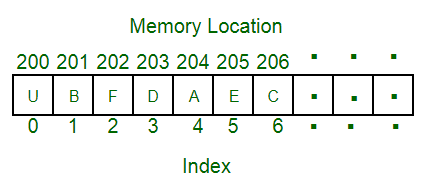

# Array

* Overview
* Applications
* Design & Implementation

## Overview

An array is a collection of items storeda t contiguous memory locations. The idea is to store multiple items of the same type together. This makes it easier to calculate the position of each element by simply adding an offset to a base value (i.e., the memory location of the first element of the array).

## Applications

1. Store data elements of the same data type.
2. CPU Scheduling
3. Implement other data structures like Stacks, Queues, Heaps, Hash tables, etc.

## Design & Implementation

### Java

* In Java all arrays are **dynamically allocated**.
* Size of an array must be specified by an `int` or `short` value.
* Length can be found using the object property `length`.
* Declared as `<type>[]`
* The direct superclass is `Object`.
* Every array type implements the interfaces `Cloneable` and `java.io.Serializable`.
