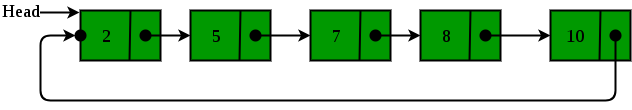

# Circular Linked List

* Overview
  * Advantages

## Overview

*Circular Linked List* is a linked list where all nodes are connected to form a circle. There is no `null` at the end. It can be a *Singly* or *Doubly* Circular Linked List.

### Advantages

1. **Any node can be a starting point**. We can traverse the whole list by starting from any point.

2. **Efficient queue**. We can maintain a pointer to the last inserted node and *front* can always be obtained as `next` or `last`.

3. **Repeatedly go around the list**. For example, when multiple applications are running on a PC, it is common for the OS to use a list and then to cycle through them, giving each of them a slice of time to execute. By using a *Circular List*, when it reaches the end of the list it can cycle aroudn to the front of the list.

4. **Implementation of advanced data structures** like *Fibonacci Heap*.
