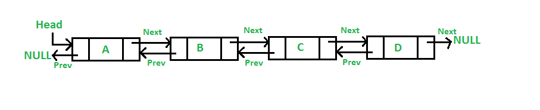

# Doubly Linked List

- Overview
  - Advantages
  - Disadvantages

## Overview

A _Doubly Linked List_ contains an extra pointer, typically called _previous pointer_, toghether with the _next pointer_ and data which are there in _Singly Linked List_.

### Advantanges

- Can be traversed in both forward and backward direction.

- **Delete is more efficient** if pointer to the node to be deleted is given. In a _Single Linked List_, you would need to get the pointer to the previous node, and sometimes that means traversing the list.

- **Can quickly insert a new node before a given node**.

### Disadvantages

- Every node requires **extra space for an previous pointer**.

- All **operations require an extra pointer** (_previous_) to be maintained.
