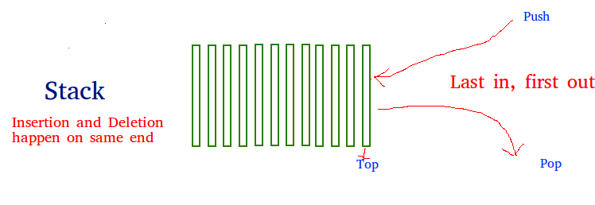

# Stack

* Overview
* Applications
* Common Procedures
* Design & Implementation

> [Java examples](https://github.com/herrera-ignacio/datastructures-in-java/tree/master/src/main/java/linear/stack)

## Overview

Stack is a linear data structure which follows a LIFO/FILO order for operations.



> In a __stack__, the element deleted from the set is the one most recently inserted.

## Applications

* Balancing of symbols.
* Infox to Postfix/Prefix Conversion.
* Redo-undo features.
* Forward and backward feature in web browsers.
* Used in many algorithms
  * Tower of Hanoi
  * Tree Traversals
  * Stock Span Problem
  * Histogram Problem
* Backgtracking for algorithm design.
  * Knight-Tour problem
  * N-Queen problem
  * Find your way through maze
  * Chess/Checkers
* Graph algorithms like *Topological Sorting* and *Strongly Connected Components*.
* Memory Management.
* String reversal.

## Common Procedures

```
STACK-EMPTY(S)
  if S.top == 0
    return TRUE
  else return FALSE

PUSH(S,x)
  S.top = S.top + 1
  S[S.top] = x

POP(S)
  if STACK-EMPTY(S)
    error "underflow"
  else S.top = S.top - 1
    return S[S.top + 1]
```

## Design & Implementation

The two most common ways to implement a stack are using *array* or using *linked list*.
