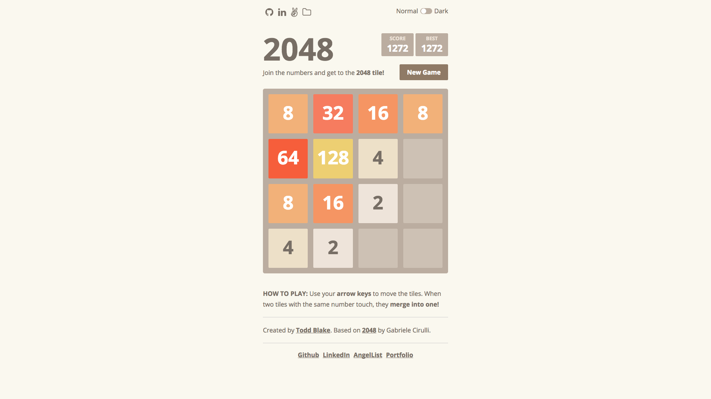

# 2048

[Play](http://toddkblake.com/2048)

2048 is a sliding-block puzzle game inspired by the original 2048 by Gabrielle Cirulli.

## Features & Implementation

In order to enable for consistent gameplay and an interactive UI, 2048 separates the game logic from the game rendering.

### Game Logic

The game logic is handled in vanilla JavaScript using object-oriented design. A `game`, `grid` and `tile` class are responsible for maintaining the current state of the game's logic.

### Game Rendering

In rendering the game state to the DOM, 2048 implements a `GameContainer` React Component which links the game logic state to three functional React Components `Header`, `Tiles` and `Tile` which are responsible for displaying the current game state.

The `GameContainer` is responsible for listening to key events from the user, updating the game state and only re-rendering when the state of the game has changed.

By leveraging React's virtual DOM 'diffing' algorithm, only those `Tiles` whose state (position or value) have been modified are modified and re-rendered.

```javascript
const Tile = ({ tile }) => {
  const merged = tile.merged ? 'merged' : '';
  return (
    <div className={ `tile pos-${tile.row}-${tile.col} value-${tile.value} ${ merged }` }>
      <span>{ tile.value }</span>
    </div>
  );
}
```

## User Interface (UI) and User Experience (UX)
Part of what makes 2048 so addicting is it's incredibly interactive UI/UX. In order to slide tiles up, down, left or right, the user simply presses the corresponding arrow key, or swipes in the corresponding direction on mobile.


### CSS Transitions & Animations

From tiles merging together to new ones appearing, 2048 utilizes CSS transitions, animations and ReactCSSTransitionGroup for an engaging and intuitive user experience.

```css
/* ANIMATIONS */

.merged {
  animation: merge 100ms linear;
}

@-webkit-keyframes merge {
  0%    { transform: scale(1, 1) }
  50%   { transform: scale(1.2, 1.2) }
  100%  { transform: scale(1, 1) }
}

@keyframes merge {
  0%    { transform: scale(1, 1) }
  50%   { transform: scale(1.2, 1.2) }
  100%  { transform: scale(1, 1) }
}
```

### Touch swiping gestures

In order for mobile users to be able to play, 2048 implements touch event handlers to track whether a mobile users swipes up, down, left or right. Both touch and keydown events are bound in an `InputHandler` class that calls relevant methods to update the game state.

```javascript
bindTouchEvents(game, updateGame) {
  let startX;
  let startY;
  let endX;
  let endY;

  document.addEventListener('touchstart', event => {
    let touchObj = event.changedTouches[0];
    startX = touchObj.pageX;
    startY = touchObj.pageY;
  });

  document.addEventListener('touchmove', event => {
    event.preventDefault();
    event.stopPropagation();
  }, { passive: false });

  document.addEventListener('touchend', event => {
    let touchObj = event.changedTouches[0];
    endX = touchObj.pageX;
    endY = touchObj.pageY;

    let dx = endX - startX;
    let dy = endY - startY;

    if (Math.abs(dx) > 25 || Math.abs(dy) > 25) {
      this.handleSwipe(dx, dy);
    }
  });
}
```

### Color Mode

For even more beautiful gameplay, 2048 includes a dark mode that allows users to switch the UI color scheme dynamically during game play using a toggle switch.

#### Normal Mode


#### Dark Mode

