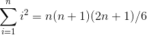
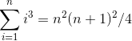
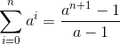
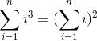

### Finding Counterexamples

1-1:&nbsp; &nbsp; &nbsp; &nbsp;[3] Show that _a + b_ can be less than _min(a, b)_

1-2:&nbsp; &nbsp; &nbsp; &nbsp;[3] Show that _a x b_ can be less than _min(a, b)_

1-3:&nbsp; &nbsp; &nbsp; &nbsp;[5] Design/draw a road network with two points _a_ and _b_ such that the fastest route between _a_ and _b_ is not the shortest route

1-4:&nbsp; &nbsp; &nbsp; &nbsp;[5] Design/draw a road network with two points _a_ and _b_ such that the shortest route between _a_ and _b_ is not the route with the fewest turns

1-5:&nbsp; &nbsp; &nbsp; &nbsp;[4] The knapsack problem is as follows: given a set of integers _S_ = {_S₁, S₂,...Sⁿ_}, and a target number _Tᵢ_, find a subset of _S_ which adds up exactly to _Tᵢ_. For example, there exists a subset within _S = {1, 2, 5, 9, 10}_ that adds up to _T=22_ but not _T=23_

&nbsp; &nbsp; &nbsp; &nbsp;Find counterexamples to each of the following algorithms for the knapsack problem. That is, given an _S_ and _T_ where the algorithm does not find a solution which leaves the knapsack completely full, even though a full-knapsack solution exists.

&nbsp; &nbsp; &nbsp; &nbsp;&nbsp; &nbsp; &nbsp; &nbsp;a) Put the elements of _S_ in the knapsack in left to right order if they fit, i.e., the first-fit algorithm

&nbsp; &nbsp; &nbsp; &nbsp;&nbsp; &nbsp; &nbsp; &nbsp;b) Put the elements of _S_ in the knapsack from smallest to largest, i.e., the best-fit algorithm

&nbsp; &nbsp; &nbsp; &nbsp;&nbsp; &nbsp; &nbsp; &nbsp;c) Put the elements of _S_ in the knapsack from largest to smallest

1-6:&nbsp; &nbsp; &nbsp; &nbsp;[5] The set cover problem is as follows: given a set of subsets _S₁, S₂,...Sⁿ_ of the universal set _U = {1, ...n}_, find the smallest subset of subsets _T ⊂ S_ such that . For example, there are the following subsets, _S₁_ = {1, 3, 5}, S₂ = {2, 4}, _S₃_ = {1, 4} and _S₄_ = {2, 5}. The set cover would then be _S₁_ and _S₂_. Find a counterexample for the following algorithm: Select the largest subset for the cover, and then delete all its elements from the universal set. Repeat by adding the subset containing the largest number of uncovered elements until all are covered.

### Proofs of Correctness

1-7:&nbsp; &nbsp; &nbsp; &nbsp;[3] Prove the correctness of the following recursive algorithms to multiply two natural numbers, for all integer constants *c*≥2

&nbsp; &nbsp; &nbsp; &nbsp;function multiply(_y, z_)

&nbsp; &nbsp; &nbsp; &nbsp;&nbsp; &nbsp; &nbsp; &nbsp;comment Reaturn the product _yz_

&nbsp; &nbsp; &nbsp; &nbsp;1. If z = 0 then return (0) else

&nbsp; &nbsp; &nbsp; &nbsp;2. return(multiply(_cy_, ⌊_z/c_⌋) + y · (_z_ mod _c_))

1-8:&nbsp; &nbsp; &nbsp; &nbsp;[3] Prove the correctnhess of the following algorithm for evaluating a polynomial.

&nbsp; &nbsp; &nbsp; &nbsp;function horner(A, _x_)

&nbsp; &nbsp; &nbsp; &nbsp;&nbsp; &nbsp; &nbsp; &nbsp;_p_ = An

&nbsp; &nbsp; &nbsp; &nbsp;&nbsp; &nbsp; &nbsp; &nbsp;for _i_ from _n_ - 1 to 0

&nbsp; &nbsp; &nbsp; &nbsp;&nbsp; &nbsp; &nbsp; &nbsp;&nbsp; &nbsp; &nbsp; &nbsp;_p_ = _p_ \* _x_ + Ai

1.9:&nbsp; &nbsp; &nbsp; &nbsp;[3] Prove the correctness of the following sorting algorithm:

&nbsp; &nbsp; &nbsp; &nbsp;function bubblesort(A: list[1...n])

&nbsp; &nbsp; &nbsp; &nbsp;&nbsp; &nbsp; &nbsp; &nbsp;var int _i_, _j_

&nbsp; &nbsp; &nbsp; &nbsp;&nbsp; &nbsp; &nbsp; &nbsp;for _i_ from _n_ to 1

&nbsp; &nbsp; &nbsp; &nbsp;&nbsp; &nbsp; &nbsp; &nbsp;&nbsp; &nbsp; &nbsp; &nbsp;for _j_ from 1 to _i - 1_

&nbsp; &nbsp; &nbsp; &nbsp;&nbsp; &nbsp; &nbsp; &nbsp;&nbsp; &nbsp; &nbsp; &nbsp;&nbsp; &nbsp; &nbsp; &nbsp;if (A[_j_] > A[j+1])

&nbsp; &nbsp; &nbsp; &nbsp;&nbsp; &nbsp; &nbsp; &nbsp;&nbsp; &nbsp; &nbsp; &nbsp;
&nbsp; &nbsp; &nbsp; &nbsp;&nbsp; &nbsp; &nbsp; &nbsp;swap the values of A[_j_] and A[_j+1_]

### Induction

1-10:&nbsp; &nbsp; &nbsp; &nbsp;[3] Prove that  for _n_ ≥ 0, by induction

1-11:&nbsp; &nbsp; &nbsp; &nbsp;[3] Prove that  for _n_ ≥ 0, by induction

1-12:&nbsp; &nbsp; &nbsp; &nbsp;[3] Prove that  for _n_ ≥ 0, by induction

1-13:&nbsp; &nbsp; &nbsp; &nbsp;[3] Prove that 

1-14:&nbsp; &nbsp; &nbsp; &nbsp;[5] Prove by induction on _n_ ≥ 1 that for every _a_ ≠ 1,

&nbsp; &nbsp; &nbsp; &nbsp;&nbsp; &nbsp; &nbsp; &nbsp;&nbsp; &nbsp; &nbsp; &nbsp;

1-15:&nbsp; &nbsp; &nbsp; &nbsp;[3] Prove by induction that for _n_ ≥ 1,

&nbsp; &nbsp; &nbsp; &nbsp;&nbsp; &nbsp; &nbsp; &nbsp;&nbsp; &nbsp; &nbsp; &nbsp;

1-16:&nbsp; &nbsp; &nbsp; &nbsp;[3] Prove by induction that _n_3 + 2*n* is divisible by 3 for all _n_ ≥ 0

1-17:&nbsp; &nbsp; &nbsp; &nbsp;[3] Prove by induction that a tree with _n_ vertices has exactly _n_ - 1 edges

1-18:&nbsp; &nbsp; &nbsp; &nbsp;[3] Prove by mathematical induction that the sum of the cubes of the first _n_ positive integers is equal to the square of the sum of these integers, i.e.

&nbsp; &nbsp; &nbsp; &nbsp;&nbsp; &nbsp; &nbsp; &nbsp;&nbsp; &nbsp; &nbsp; &nbsp;

### Estimation

1-19:&nbsp; &nbsp; &nbsp; &nbsp;[3] Do all the books you own total at least one million pages? How many total pages are stored in your school library?

1-20:&nbsp; &nbsp; &nbsp; &nbsp;[3] How many words are there in this textbook?

1-21:&nbsp; &nbsp; &nbsp; &nbsp;[3] How many hours are one million seconds? How many days? Answer these questions by doing all arithmetic in your head.

1-22:&nbsp; &nbsp; &nbsp; &nbsp;[3] Estimate how many cities and towns there are in the United States

1-23:&nbsp; &nbsp; &nbsp; &nbsp;[3] Estimate how many cubic miles of water flow out of the mouth of the Mississippi River each day. Do not look up any supplemental facts. Describe all assumptions you made in arriving at your answer.

1-24:&nbsp; &nbsp; &nbsp; &nbsp;[3] Is disk drive access time normally measured in milliseconds (thousandths of a second) or microseconds (millionths of a second)? Does your RAM memory access a word in more or less than a microsecond? How many instructions can your CPU execute in one year if the machine is left running all the time?

1-25:&nbsp; &nbsp; &nbsp; &nbsp;[4] A sorting algorithm takes 1 second to sort 1,000 items on your local machine. How long will it take to sort 10,000 items...

&nbsp; &nbsp; &nbsp; &nbsp;a) if you believe that the algorithm takes time proportional to _n_2, and

&nbsp; &nbsp; &nbsp; &nbsp;b) if you believe that the algorithm takes time roughly proportional to _n_ log _n_?

### Implementation Projects

1-26:&nbsp; &nbsp; &nbsp; &nbsp;[5] Implement the two TSP heuristics of Section 1.1 (page 5). Which of them gives better-quality solutions in practice? Can you devise a heuristic that works better than both of them?

1-27:&nbsp; &nbsp; &nbsp; &nbsp;[5] Describe how to test whether a given set of tickets establishes sufficient coverage in the Lotto problem of Section 1.6(page 23). Write a program to find good ticket sets.

### Interview Problems

1-28:&nbsp; &nbsp; &nbsp; &nbsp;[5] Write a function to perform integer division without using either the / or \* operators. Find a fast way to do it.

1-29:&nbsp; &nbsp; &nbsp; &nbsp;[5] There aree 25 horses. At most, 5 horses can race together at a time. You must determine the fastest, second fastest, and third fastest horses. Find the minimum number of races in which this can be done.

1-30:&nbsp; &nbsp; &nbsp; &nbsp;[3] How many piano tuners are there in the entire world?

1-31:&nbsp; &nbsp; &nbsp; &nbsp;[3] How many gas stations are there in the United States?

1-32:&nbsp; &nbsp; &nbsp; &nbsp;[3] How much does the ice in a hockey rink weigh?

1-33:&nbsp; &nbsp; &nbsp; &nbsp;[3] How many miles of road are there in the United States?

1-34:&nbsp; &nbsp; &nbsp; &nbsp;[3] On average, how many times would you have to flip open the Manhattan phone book at random in order to find a specific name?

### Programming Challenges

1-1:&nbsp; &nbsp; &nbsp; &nbsp;"The 3*n* + 1 Problem" - UVA Judge 100

[My solution for The 3n + 1 Problem](./3n+1.c)

1-2:&nbsp; &nbsp; &nbsp; &nbsp;"The Trip" - UVA Judge 10137

1-3:&nbsp; &nbsp; &nbsp; &nbsp;"Australian Voting" - UVA Judge 10142
