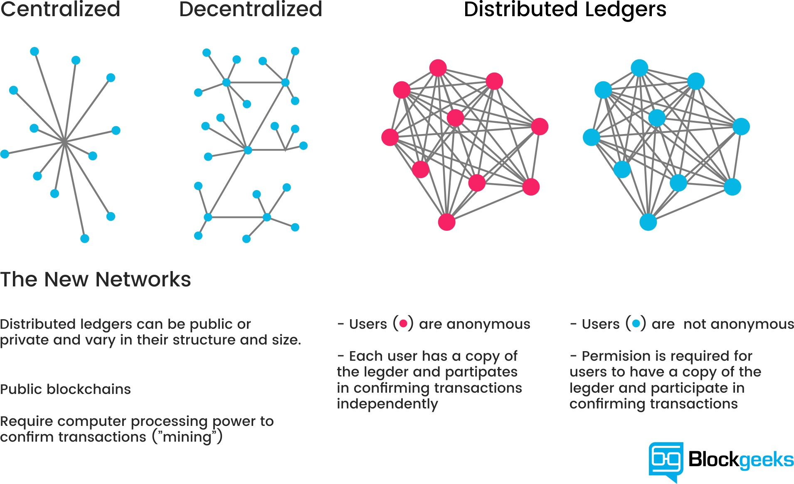
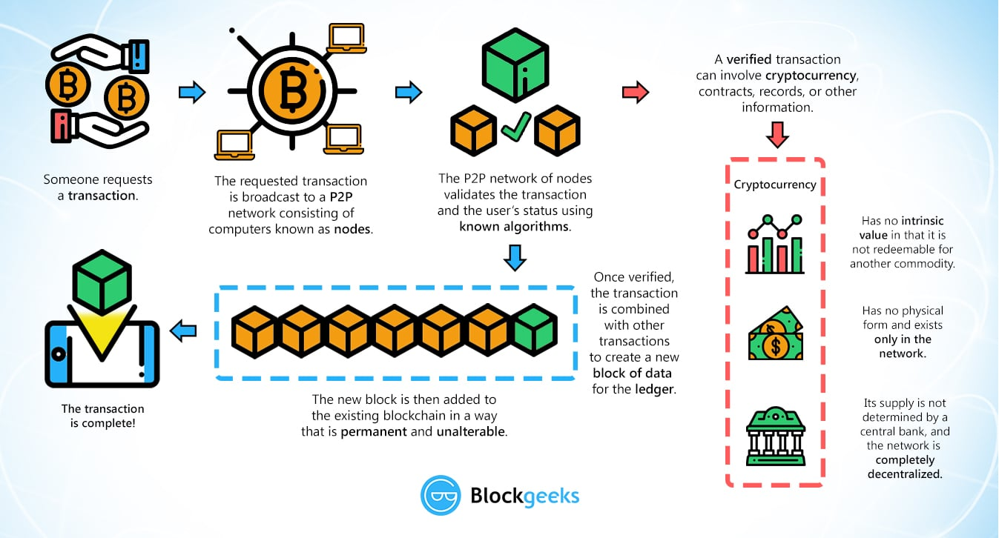
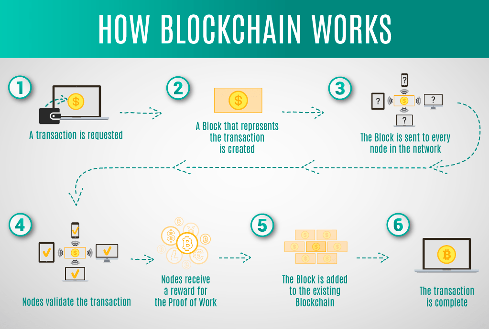
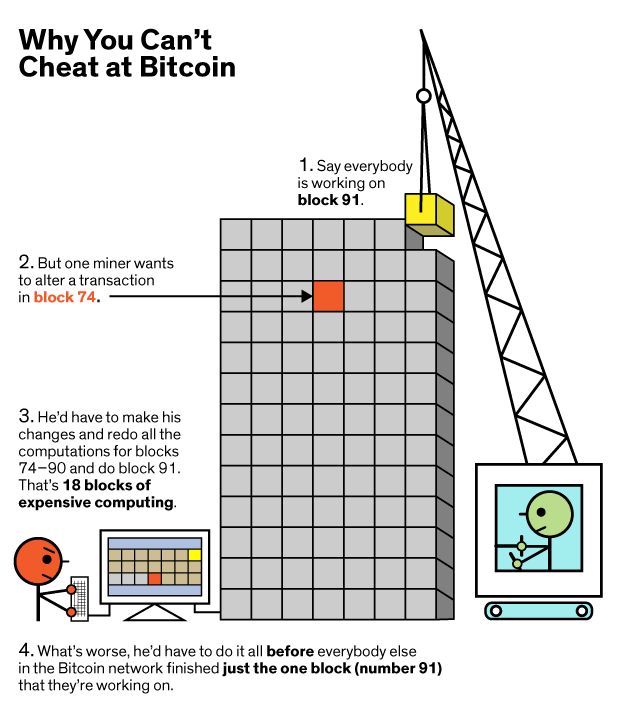

# Blockchain-Notes

[Lecture I](#Lecture-I)  
a. [Bitcoin](#Bitcoin)  
b. [What is a Blockchain](#What-is-a-Blockchain)  
c. [Consensus](#Consensus)  
d. [How does mining work?](#How-does-mining-work)  
e. [Working with Blockchain](#Working-with-BlockChain)  
f. [Show the Chain](#Show-the-Chain)  
g. [Proof of Work](#Proof-of-Work)  
h. [Reward](#Reward)  
i. [Project Tips](#Project-Tips)  


<br>
<br>

[Lecture II](#Lecture-II)  
a. [Adjusting Server Side](#Adjusting-Server-Side)  
b. [Add Endpoint](#Add-Endpoint)  
c. [Adjust Mine.py](#Adjust-Mine.py)  
d. [Client Mining](#Client-Mining)  
e. [Peer to Peer Consensus](#Peer-to-Peer-Consensus)  
f. [Hard Code the Genesis Block](#Hard-Code-the-Genesis-Block)  
g. [Notify Nodes](#Notify-Nodes)  

<br>
<br>

If you found these notes helpful and want to show appreciation to the author, [coffee donations](https://www.buymeacoffee.com/G1stPBuYU) are much loved.  

<br>
<br>


## Pre-Class Resources

[The Trust Machine: The History of Bitcoin](https://youtu.be/ZKwqNgG-Sv4) 

[2 Part Blockchain Demo & Explanation](https://anders.com/blockchain/)  

[Quick Read: Blockchain Explained Simply](https://gardenofcrypto.com/blog/blockchain-explained-simply)  

[Blockchain Project Repo](https://github.com/LambdaSchool/Blockchain)  

[Interactive Visualization of Blockchain](https://symphony.iohk.io)  

<br>
<br>

# Lecture I

[Lecture I Recording with Brian Doyle](https://youtu.be/tBAYSVJNLWI)  




<br>
<br>

## Bitcoin

#### Who is Satoshi Nakamoto?

Nobody knows!

While we don't know individually who or what Satoshi Nakamoto really is, it is the name used by the unknown person or persons who developed bitcoin, authored the bitcoin white paper, and created and deployed bitcoin's original reference implementation. As part of the implementation, they also devised the first blockchain database.  

<br>

Bitcoin is a cryptocurrency that allows us to prove that currency has not been double spent, created in 2008.  

Satoshi currently holds (supposedly) 1 million Bitcoin. As of July 10, 2019, the value of a single Bitcoin is roughly $12,300.  

<br>

We explored the basics of hashing and building hash tables to understand how they work. Hash tables were invented in the 1950's, so while it's an old computer science data structure, it's continually being used in new and unique ways that fundamentally shift how we use computing.  

Every time you use an object in modern languages, that is based on a hash table.  

<br>

Blockchain is another shift in computing that we don't yet understand the implications of.  

Blockchain is made up of nodes, which are a linked list of hash tables. Hashing is key to blockchain technology, as well as Proof of Work.

Bitcoin uses the HashCash Proof of Work system, invented in 1997 to prevent mail gateway abuse, spam, and domain squatting.  

<br>
<br>

## What is a Blockchain?

It's a chain of blocks, or a linked list. Each block contains a cryptographic hash of the previous block, a timestamp and transaction data.  

The _key_ part of blockchain is that it is immutable with reference to the preceding blocks.  

It contains an index, transactions (the data), timestamp, and hash of the previous block.  

<br>

  

  
<br>

When the first block is created, it contains data. The second block contains data and a hash of block one. Block three contains a hash of block two. And so on...   

If we try to change something in Block Two, the hash will be different from the stored Hash on Block Three, that references Block Two. In order to change one Block, you'd have to change all of the subsequent Blocks as well, because each modification would invalidate the stored Hash.  

In Bitcoin, value is created by requiring work -- made up problems that take a computer a long time to solve and immense amounts of electricity. This creates an "expense" for mining. The first person to solve this arbitrarily difficult problem is the one who mines the bitcoin.   

To offset the time required to solve these problems, people pool together to mine coins collectively.  

<br>
<br>

## Consensus

The Bitcoin Blockchain is public. Everyone has a copy of it and there's a network of nodes hosting a copy of it. The person with the longest chain has the "correct" chain -- the longest chain wins.  

<br>



<br>

To cheat the system in a brute force method, you'd have to not only change one block, but all the following blocks _before_ any new block is added to the chain. Due to the substantial computing power and electricity required for mining a single block, it's nearly impossible to attack so many at once.  

<br>
<br>

## How does mining work?

[This explanation from Investopedia](https://www.investopedia.com/terms/b/bitcoin-mining.asp) is helpful:

<br>

>How Does Bitcoin Mining Work?  
>
>Here's the catch. In order for bitcoin miners to actually earn bitcoin from verifying transactions, two things have to occur. First, they must verify 1 megabyte (MB) worth of transactions, which can theoretically be as small as 1 transaction but are more often several thousand, depending on how much data each transaction stores. This is the easy part.
>
>Second, in order to add a block of transactions to the blockchain, miners must solve a complex computational math problem, also called a "proof of work." What they're actually doing is trying to come up with a 64-digit hexadecimal number, called a "hash," that is less than or equal to the target hash. Basically, a miner's computer spits out hashes at a rate of megahashes per second (MH/s), gigahashes per second (GH/s), or even terahashes per second (TH/s) depending on the unit, guessing all possible 64-digit numbers until they arrive at a solution. In other words, it's a gamble.
>
>The difficulty level of the most recent block at the time of writing is about 6,061,518,831,027. That is, the chance of a computer producing a hash below the target is 1 in 6,061,518,831,027 — less than 1 in 6 trillion. That level is adjusted every 2016 blocks, or roughly every 2 weeks, with the goal of keeping rates of mining constant. That is, the more miners competing for a solution, the more difficult the problem will become. The opposite is also true. If computational power is taken off of the network, the difficulty adjusts downward to make mining easier.

<br>
<br>


## Working with BlockChain  

Let's use our `blockchain.py` file from the [project repo](https://github.com/LambdaSchool/Blockchain) to start working with the concept of Blockchain.  

To open this file, we need to install our dependencies using `pipenv install` and start our `pipenv shell`. Now when we `python3 blockchain.py`, the terminal should read: 

<br>

```
 * Running on http://0.0.0.0:5000/ (Press CTRL+C to quit)
```

<br>

We're running [Flask](https://en.wikipedia.org/wiki/Flask_(web_framework)), a simple web framework that calls a function when we hit a server endpoint. 

Since we're using a server, to check that it's live and working, we can use Postman to hit `http://localhost:5000/mine` with a GET request.

It returns:

<br>

```
<!DOCTYPE HTML PUBLIC "-//W3C//DTD HTML 3.2 Final//EN">
<title>500 Internal Server Error</title>
<h1>Internal Server Error</h1>
<p>The server encountered an internal error and was unable to complete your request. Either the server is overloaded or there is an error in the application.</p>
```

<br>

Which tells us that the server is live, but we need to change some code to get things running.

<br>

Our class Blockchain starts with:

```
class Blockchain(object):
    def __init__(self):
        self.chain = []
        self.current_transactions = []
        self.nodes = set()

        self.new_block(previous_hash=1, proof=99)
```

<br>

The nodes are the other servers running this same software with the same chain, so it's decentralized and no one entity holds control.  


`self.new_block(previous_hash=1, proof=100)` is initializing our blockchain with a Genesis Block.  

Our block used to create a new block is expected to be an object like so: 

<br>

```
block = {
    'index': len(self.chain) + 1,
    'timestamp': time(),
    'transactions': self.current_transactions,
    'proof': proof,
    'previous_hash': previous_hash or self.hash(self.chain[-1]),
}
```

<br>

`new_transation` sets a new transaction to the queue to be added to the next mined Block:

<br>

```
self.current_transactions.append({
            'sender': sender,
            'recipient': recipient,
            'amount': amount,
        })

        return self.last_block['index'] + 1
```

<br>

This appends a transaction and how people give money to one another inside of the immutable ledger. We can use this information throughout the blockchain to see who holds what money.

<br>

We also have a hash function:

<br>

```
        block_string = json.dumps(block, sort_keys=True).encode()
        return hashlib.sha256(block_string).hexdigest()
```

<br>

The next item is a decorator:

<br>

```
    @property
    def last_block(self):
        return self.chain[-1]
```

<br>

It wraps the function underneath `@property` with a decorator name so you can access it as a property of the class, like `blockchain.last_block()`.

<br>

Next, we have:

<br>

```
def proof_of_work(self, last_proof):
    """
    Simple Proof of Work Algorithm
    - Find a number p' such that hash(pp') contains 4 leading
    zeroes, where p is the previous p'
    - p is the previous proof, and p' is the new proof
    """

    pass
```

<br>

This function does nothing and returns nothing, but has a description of what it's supposed to do. It's simply a marker of what we _will_ need but have not yet written.

The next decorator is for an also unwritten function: 

<br>

```
@staticmethod
def valid_proof(last_proof, proof):
    """
    Validates the Proof:  Does hash(last_proof, proof) contain 4
    leading zeroes?
    """
    # TODO
    pass
```

<br>

The next function has unwritten portions that we'll need to fill in:

<br>

```
    def valid_chain(self, chain):
        """
        Determine if a given blockchain is valid

        :param chain: <list> A blockchain
        :return: <bool> True if valid, False if not
        """

        last_block = chain[0]
        current_index = 1

        while current_index < len(chain):
            block = chain[current_index]
            print(f'{last_block}')
            print(f'{block}')
            print("\n-------------------\n")
            # Check that the hash of the block is correct
            # TODO: Return false if hash isn't correct

            # Check that the Proof of Work is correct
            # TODO: Return false if proof isn't correct

            last_block = block
            current_index += 1

        return True
```

<br>

How can we verify is a blockchain is valid?

We can check the hash of the previous block, or we can check the proof of work.  

It's easier to check that a solution of a proof of work is correct, than checking the hash of previous bloks -- despite it being expensive to _create_ the solution to the proof of work, it's "cheap" to check that a solution is correct. 

<br>
<br>

## Show the Chain

Since we already have the Genesis Block, the first thing we should fill in is a way to show what is currently in the chain, so we can see the blockchain and easily check later work.

We need to compose a response in Python to visualize the chain: 

<br>

```
@app.route('/chain', methods=['GET'])
def full_chain():
    response = {
        # TODO: Return the chain and its current length
    }
    return jsonify(response), 200
```

<br>

`{ }` means this `response` will be a dictionary (hash table). 

<br>

```
@app.route('/chain', methods=['GET'])
def full_chain():
    response = {
        "currentChain": Blockchain.chain,
        "length": len(Blockchain.chain)
    }
    return jsonify(response), 200
```

<br>

We can test if it works by hitting the `/chain` endpoint in Postman to receive something back like this:

<br>

```
{
    "currentChain": [
        {
            "index": 1,
            "previous_hash": 1,
            "proof": 99,
            "timestamp": 1562781958.428834,
            "transactions": []
        }
    ],
    "length": 1
}
```

<br>

Next let's work on the proof of work.

<br>
<br>

## Proof of Work

```
    def proof_of_work(self, last_proof):
        """
        Simple Proof of Work Algorithm
        - Find a number p' such that hash(pp') contains 4 leading
        zeroes, where p is the previous p'
        - p is the previous proof, and p' is the new proof
        """
```

<br>
<br>

We'll start at 0. In this blockchain, proofs are integers, which we know because the Genesis Block has an integer and the parameter specs indicate so. We'll set it up to increment through numbers until a proof that is successful is found.

<br>

```
proof = 0
while self.valid_proof(last_proof, proof) is False:
    # while we have NOT found a solution, we'll try again
    proof += 1
# This loops exits when we have found a valid proof
return proof
```

<br>

That part is easily written but then requires us to write a good validation proof function:

<br>

```
    @staticmethod
    def valid_proof(last_proof, proof):
        """
        Validates the Proof:  Does hash(last_proof, proof) contain 4
        leading zeroes?
        """
        # TODO
        pass
```

<br>

We need to validate if our guess is correct -- the guess is a hash of last_proof and proof, appended together. We can use f strings to do that:

<br>

```
guess = f"{last_proof}{proof}"
```

<br>

We are going to use the `sha256` hash for this.

<br>

```
guess = f"{last_proof}{proof}".encode()
guess_hash = hashlib.sha256(guess).hexdigest()
```
<br>

_A good research question would be to learn more about how this works and how we arrived at this solution. What does encode() and hexdigest() do?_

<br>

How can we verify that the hash is functioning as expected?

We check if `guess_hash` contains 4 leading zeros. We can use shorthand to slice the first four array elements `[:4]` like so:

<br>

```
return guess_hash[:4] == "0000"
```

<br>

This returns a true/false boolean value depending on if it passes our proof of work (the first four digits are 0000).  

We can test this by commenting out the `response` object data and replacing it with proof:

<br>

```
def mine():
    # We run the proof of work algorithm to get the next proof...
    last_block = blockchain.last_block
    last_proof = last_block['proof']
    proof = blockchain.proof_of_work(last_proof)

    # Send a response with the new block
    response = {
        # 'message': "New Block Forged",
        # 'index': block['index'],
        # 'transactions': block['transactions'],
        # 'proof': block['proof'],
        # 'previous_hash': block['previous_hash'],

        'proof': proof
    }
```

<br>

When we hit the `/mine` endpoint, it should return a successful number that passes our proof of work function, like `74581`.

<br>
<br>

## Reward

We need to fill in the `mine` function to receive a reward for our proof of work. We can use the new transaction function already written to help:

<br>

```
# We must receive a reward for finding the proof.
# The sender is 0, the recipient is node_identifier, and the amount is 1
blockchain.new_transaction(0, node_identifier, 1)
```

<br>

We also have a function for creating a new block, with the proof having been defined in line 145: `proof = blockchain.proof_of_work(last_proof)`. 

We'll use the `hash(last_block)` of the blockchain as the `previous_hash` parameter in the `new_block()` function:

<br>

```
# Forge the new Block by adding it to the chain
block = blockchain.new_block(proof, blockchain.hash(last_block))
```

<br>

Remember, `new_block()` returns the newly created block so we can set the variable `block` equal to the function call.

Now when we hit the `/mine` endpoint in Postman, it shows a new block being forged.

<br>

```
{
    "index": 2,
    "message": "New Block Forged",
    "previous_hash": "c89e42365daa6bd6e08c31abf143568c9411079082d3dfdf2f7e9b0bdc4bbacb",
    "proof": 74581,
    "transactions": [
        {
            "amount": 1,
            "recipient": "9188a5b6107c40d3987d247a36023503",
            "sender": 0
        }
    ]
}
```

<br>

If we check the chain at `/chain`, we can see not just the blocks, but also the transactions that have happened within them.  

<br>

```
{
    "currentChain": [
        {
            "index": 1,
            "previous_hash": 1,
            "proof": 99,
            "timestamp": 1562782943.373497,
            "transactions": []
        },
        {
            "index": 2,
            "previous_hash": "c89e42365daa6bd6e08c31abf143568c9411079082d3dfdf2f7e9b0bdc4bbacb",
            "proof": 74581,
            "timestamp": 1562782953.784697,
            "transactions": [
                {
                    "amount": 1,
                    "recipient": "9188a5b6107c40d3987d247a36023503",
                    "sender": 0
                }
            ]
        }
    ],
    "length": 2
}
```

<br>

If we go to the `transactions/new` endpoint and POST the following object:

<br>

```
{
    "sender": "brian",
    "recipient": "bonder",
    "amount": 1000000
}
```

<br>

That will add a new transaction, as noted in the response: `"message": "Transaction will be added to Block 3"`.

If we `/mine` more blocks and look at the chain, we should be able to find that added transaction recorded.  

<br>

```
{
    "currentChain": [
        {
            "index": 1,
            "previous_hash": 1,
            "proof": 99,
            "timestamp": 1562782943.373497,
            "transactions": []
        },
        {
            "index": 2,
            "previous_hash": "c89e42365daa6bd6e08c31abf143568c9411079082d3dfdf2f7e9b0bdc4bbacb",
            "proof": 74581,
            "timestamp": 1562782953.784697,
            "transactions": [
                {
                    "amount": 1,
                    "recipient": "9188a5b6107c40d3987d247a36023503",
                    "sender": 0
                }
            ]
        },
        {
            "index": 3,
            "previous_hash": "c13fbbb5e6983425f3aee2d34b24d856e50616e797c058cf7a4cac6c39eef9b8",
            "proof": 28441,
            "timestamp": 1562783121.297569,
            "transactions": [
                {
                    "amount": 1000000,
                    "recipient": "bonder",
                    "sender": "brian"
                },
                {
                    "amount": 1,
                    "recipient": "9188a5b6107c40d3987d247a36023503",
                    "sender": 0
                }
            ]
        }
    ],
    "length": 3
}
```

<br>

Because of the chain of hashes, that transaction can't be changed or removed as long as there are enough nodes to keep the chain running in a decentralized manner, to verify any changes to the blockchain.

<br>

#### How does it know which block to place the transaction in?

The transactions are placed in a queue and added to the _next_ block that will be mined. 

With Bitcoin, the complexity of the proof of work problem to be solved to mine a new block is adjusted based on the number of people trying to mine, to ensure that it's difficult enough to have one block being mined roughly every ten minutes, so that transactions are recorded regularly.

<br>

_Unknown: How will that work in the case of there being a finite number of blocks that can be mined?_

_Research question: How are transactions handled? We won't go into this during these lectures but it is an equally complex and important topic to understanding Blockchain._

<br>
<br>

## Project Tips

The mining is done server side currently, so whenever we mine, the server is doing the problem solving, which isn't ideal.

We want clients to be able to mine by spending their own electricity and we'll reward them for doing that work for us by giving them a coin.

In the project repo, there is a `miner.py` file and a `blockchain.py` file. The ReadMe goes over the necessary modifications:

<br>

Try to solve these problems without the help of present solutions for the following days. The process setup forces you to learn how to _build_ blockchain technology, with each day building upon the next.

<br>

_Side note: The project is setup to use port 5000 automatically, but it can also accept a port number after `python3 blockchain.py ----` to indicate the ideal port to run on_


To prevent having to restart your server manually with each file change, you can run this script in the terminal:

<br>

```
export FLASK_DEBUG=1
export FLASK_APP=name-of-your-python-file-here.py
flask run
```

<br>
<br>
<br>

# Lecture II

[Lecture II Recording](https://youtu.be/p65JuVoxQhM)  

<br>

## Adjusting Server Side 

_Today we'll use the files within the [project repo]() in the client mining directory. Remember to start your environment like so:_

<br>

```
pipenv shell
cd project-directory-name
pipenv install flash
pipenv install requests
```

<br>

Following the task list, we need to modify the server to get rid of the proof of work function, adjust what constitutes a valid proof, and modify the mine endpoint to validate or reject a submitted proof.

Remember, to prevent having to restart your server manually with each file change, you can run this script in the terminal:

<br>

```
export FLASK_DEBUG=1
export FLASK_APP=name-of-your-python-file-here.py
flask run
```

<br>

Looking into our `client_mining_miner.py` file, what does this bit of code tell us?

<br>

```
if __name__ == '__main__':
    # What node are we interacting with?
    if len(sys.argv) > 1:
        node = sys.argv[1]
    else:
        node = "http://localhost:5000"
```

<br>

If this file is run, the code will run.

It asks what node we're working with and the default is 5000 where we're running our server.

In `client_mining_blockchain.py`, we have the code built yesterday that we need to modify.

<br>
<br>

## Add Endpoint

First let's create the `/last_proof` endpoint because other things are dependent upon it, but it doesn't depend on anything else to work.

Flask allows us to hit an endpoint to run a function. 

We can mimic line 190's `@app.route()` and copy the pattern, but modify it for our new task.

<br>

```
@app.route('/last_proof', methods=['GET'])
def last_proof():
    response = {
        'last_proof': blockchain.last_block["proof"],
    }
    return jsonify(response), 200
```
<br>

Now we can test this in Postman to ensure it responds with the last proof.

<br>

```
{
    "last_proof": 99
}
```

<br>

Next, let's comment out our `proof_of_work` function.

In the future, we should change the `valid_proof` function to get the first 6 leading zeros, instead of 4. But for now, we'll leave it alone because we know it works and this will make testing faster.

<br>
<br>

## Adjust Mine.py

Next we need to change what happens at the `/mine` endpoint. It needs to become a POST, not GET endpoint.

We can copy the `new_transaction` function pattern to also include error handling for if we don't receive the correct object keys needed.

<br>

```
@app.route('/mine', methods=['POST'])
def mine():
    values = request.get_json()

    required = ['proof']
    if not all(k in values for k in required):
        return 'Missing Value: proof', 400
```

<br>

This requires the client to send in their POST request a key "proof" and will let them know if the POST fails because it's missing.

We could remove the for loop checking for multiple required keys, but if we end up requiring more keys from the client later, it's handy to have it in place.

Now we need to validate the proof:

<br>

```
# We run the proof of work algorithm to get the next proof...
last_block = blockchain.last_block
last_proof = last_block['proof']

if not blockchain.valid_proof(last_proof, values["proof"]):
    response = {
        "message": "Proof is invalid or already submitted."
    }
    return jsonify(response), 200

else:
    # We must receive a reward for finding the proof.
    # The sender is "0" to signify that this node has mine a new coin
    blockchain.new_transaction(
        sender="0",
        recipient=node_identifier,
        amount=1,
    )

    # Forge the new BLock by adding it to the chain
    previous_hash = blockchain.hash(last_block)
    block = blockchain.new_block(values['proof'], previous_hash)

    response = {
        'message': "New Block Forged",
        'index': block['index'],
        'transactions': block['transactions'],
        'proof': block['proof'],
        'previous_hash': block['previous_hash'],
    }
    return jsonify(response), 200
```

<br>


We're checking if the proof is valid -- if it's not, then we return the error that the proof is invalid. However, we send a 200 response instead of a 400 because this is _expected_ behavior. It's doing what it should. The client is just unlikely to get the proof, and be the first.

We can test this in Postman using:

<br>

```
{
    "proof": 99
}
```

<br>

And receive back:

<br>

```
{
    "message": "Proof is invalid or already submitted."
}
```

<br>

We should now be done with the server and write the mining program.

<br>
<br>

## Client Mining

First we want to get the `last_proof` from the server and test for a new one.

Since we might not know how to use GET and POST requests in Python, we can [read about it](https://www.geeksforgeeks.org/get-post-requests-using-python/) to learn how to implement it with `requests` as a dependency.

Following that syntax, we can make a GET request like so:


<br>

```
while True:
        # TODO: Get the last proof from the server and look for a new one
        last_proof = requests.get(f'{node}/last_proof').json()['last_proof']
```

<br>

Now when we run the file, the `last_proof` of 99 should be fetched and printed in the terminal.

We need to add in the `proof_of_work` and `valid_proof` functions to check for valid proof guesses and to send them to the server. 

We'll need to remove references to the `self` instance because we are not building this within a Class.

<br>

```
def proof_of_work(last_proof):
    print("Starting search for new proof")
    proof = 0
    while valid_proof(last_proof, proof) is False:
        proof += 1

    print(f"Found new proof: {proof}")
    return proof


def valid_proof(last_proof, proof):
    guess = f'{last_proof}{proof}'.encode()
    guess_hash = hashlib.sha256(guess).hexdigest()
    return guess_hash[:4] == "0000"
```

<br>


We've added in some print statements as well to tell us when the search for a new proof has started and when it ends with a successfully passing proof.

Now when we run the file, our terminal will endlessly find the same proof, because it isn't yet sending this to the server to update with a new successful block being added to the chain (which would then update `last_proof`, allowing the algorithm to find a new proof).


<br>

```
Starting search for new proof
Found new proof: 74581
74581
```

<br>


So let's send this to the server:

<br>

```
99
Starting search for new proof
Found new proof: 74581
74581
<Response [200]>
74581
Starting search for new proof
Found new proof: 28441
28441
<Response [200]>
28441
```

<br>

And so on. It will now be mining coins extremely quickly. We need to print a success message that new blocks are being forged.

<br>

```
# TODO: If the server responds with 'New Block Forged'
# add 1 to the number of coins mined and print it.  Otherwise,
# print the message from the server.
if proof_data.json()["message"] == "New Block Forged":
    coins_mined += 1
    print(f"Coins mined: {coins_mined}")
```

<br>

Now we're printing the number of coins being mined and endlessly mining. We still need to update our `valid_proof` to only work for 6 leading zeros though.

In both the server and client, we need to change the `valid_proof` function to return:

<br>

```
return guess_hash[:6] == "000000"
```

<br>

Now we notice that the search time is much, much slower due to the complexity. But with patience, we can see that it is still successfully mining.

<br>

```
99
Starting search for new proof
Found new proof: 9250889
9250889
<Response [200]>
Coins mined: 1
9250889
Starting search for new proof
```

<br>


Unfortunately, with more complex mining, it could be much harder to gauge if our solution was working or if we were endlessly waiting. 

We can add more debugging print console statements, or add a timer to let us know that the solution is running.

Also, try to attempt this with an easier solution (like 2 leading 0's, then 4 leading 0's) to ensure that the logic is sound.

You could add a print statement here:

<br>

```
def proof_of_work(last_proof):
    print("Starting search for new proof")
    proof = 0
    while valid_proof(last_proof, proof) is False:
        print(proof)
        proof += 1

    print(f"Found new proof: {proof}")
    return proof
```

<br>

This will slow things down and make finding the useful debugging statements more difficult, but it does also indicate that things are working. Your OS may have a hard time handling this must printing to the console though and stall out.

<br>
<br>

## Peer to Peer Consensus

Another fundamental part of blockchain is that it is decentralized - no one person or entity owns or controls it. But how is that maintained?

This is possible through peer to peer consensus -- many servers are running it. People all over the world can become a peer that is a part of the network, and whoever's chain is the longest is the most up-to-date and "correct" chain. 

Let's look into the `communication_gp` directory from our project repo (copied into this repo for simplicity) to see how we can modify the server to hard code the genesis block, and notify all nodes to receive this validated chain (or query for the full chain if that server is far behind on blocks).

Our to do list is:

<br>

```
*Server*

Modify the server we created to:

* Hard code the genesis block so that all servers using this code can share a chain

* When a new block is mined, alert all nodes in its list of registered nodes to add the new block

* Receive a new block from one of the nodes in its list of registered nodes, *validate it*, and add it to the chain, or, if necessary, query for the entire chain

* Validate the new block by checking the index, previous hash, and proof
```

<br>


Let's open our `blockchain.py` file. We'll also need to be able to run servers on multiple ports to test if this is working.

At the bottom of the file, this code helps with that:

<br>

```
if __name__ == '__main__':
    if len(sys.argv) > 1:
        port = int(sys.argv[1])
    else:
        port = 5000
    app.run(host='0.0.0.0', port=port)
```

<br>

This is a non-robust (no error handling) way of running this file on multiple servers. Since this is development only and for internal use, we don't need an elegant solution.

We would need to change that if we start to add multiple command line arguments that could cause confusion, or if this was a project being deployed.

Let's test out if it works.

<br>

```
pipenv shell
cd communication_gp
python3 blockchain.py 5000
```

<br>

We'll repeat this also starting on `5001`. We can open two tabs in Postman to check that both are up and running.

<br>
<br>

## Hard Code the Genesis Block

Why is it so important to hard code this initial genesis block?

If we try to initialize a genesis block on two separate servers, there will be a conflict with two separate chains that cannot be consolidated.

Due to the timestamp added when a block is created, and two instances not being able to have the same identical timestamp, the hashes will be different, which results in two separate blocks that cannot merge into a single chain.

The genesis block needs to be hard coded into the program, by hard setting the index as 1 and choosing a timestamp of 0, to denote that this is a special case.

There are no transactions, so that key's value is an empty list. The proof will be our base case (99) and our previous hash can be None, 0 or 1.

_Some blockchains start their index at 0, but it has some caveats to do so, so for simplicity, we'll start at 1._

<br>

```
class Blockchain(object):
    def __init__(self):
        self.chain = []
        self.current_transactions = []
        self.nodes = set()

        self.create_genesis_block()

    def create_genesis_block(self):
        """
        Creates the genesis block and add it into the chain.

        This is the anchor of the chain. It must be identical for all nodes, or consensus, will fail.

        It is normally hard coded.
        """        
        block = {
            'index': 1,
            'timestamp': 0,
            'transactions': [],
            'proof': 99,
            'previous_hash': None,
        }

        self.chain.append(block)
```

<br>


Now when we test each server in Postman, the GET `/chain` response matches on each:

<br>

```
{
    "chain": [
        {
            "index": 1,
            "previous_hash": null,
            "proof": 99,
            "timestamp": 0,
            "transactions": []
        }
    ],
    "length": 1
}
```

<br>
<br>

## Notify Nodes

>On Bitcoin, it is up to each individual node to decide how they “trust” other nodes.  
> Some node reject all connections, some accept all.  
> Some are somewhere in between depending on services or version, etc.  
> ALL nodes validate transactions and the blockchain.  

Next we need to:

> When a new block is mined, alert all nodes in its list of registered nodes to add the new block  

> Receive a new block from one of the nodes in its list of registered nodes, *validate it*, and add it to the chain, or, if necessary, query for the entire chain  

> Validate the new block by checking the index, previous hash, and proof  

<br>

Let's start by adding a function that broadcasts when a new block has been added to the chain.


<br>

```
def broadcast_new_block(self, block):
    """
    Alerts neighbors in list of nodes that a new Block has been mined :param block: <Block> the block that has been mined and added to the chain
    """
    post_data = {"block": block}
    # We need to send this to all the nodes so we need to loop through the nodes
    # We'll be making the /new endpoint after this 
    for node in self.nodes:
        response = requests.post(f'http://{node}/new', json=post_data)

        if response.status_code != 200:
            # TODO: Error handling
```

<br>

Typically we would use `https` but since we are working with a local host server, we'll use `http` instead.

We can't test if this works really so we need to write the `/new` endpoint to test them both at once.

When a node receives a new block, we need to both validate that the peer sending it is an approved node _and_ validate the block. We can check the previous block's hash and indexes.

<br>

```
@app.route('/nodes/new', methods=['POST'])
def new_block():
    values = request.get_json()

    # Check that the required block field is in the POST data
    required = ['block']
    if not all(k in values for k in required):
        return 'Missing value: block', 400

    # TODO: Validate that sender is actually an approved peer node

    # Validate the block

    # Make sure that the index is exactly one greater than the last chain
    new_block = values["block"]
    last_block = blockchain.last_block

    if new_block["index"] == last_block["index"] + 1:
        # Make sure that the block's last hash matches our hash of our last block
        if new_block['previous_hash'] == blockchain.hash(last_block):
            # Validate the proof in the new block
            if blockchain.valid_proof(last_block['proof'], new_block['proof']):
                # Block is valid. Add to blockchain.
                blockchain.chain.append(new_block)
                return "Block Accepted", 200

    # TODO: print error message
    # TODO: request the chain from our peers and check for consensus, in case this node is behind the current longest chain and is rejecting it due to outdated data
    return 'Block Rejected', 200
```

<br>

One big difference between JavaScript and Python is that JS is asynchronous, while Python is synchronous.

This means that while Server A is awaiting a request to resolve or timeout, all other requests made of it are on hold. Because of this, we need to send a response if we add the block.

<br>

We need to call the broadcast function when we add a new block on the blockchain, like so:

<br>

```
self.chain.append(block)
self.broadcast_new_block(block)
return block
```

<br>

To test if both of these work, we need to register these nodes with each other at the register endpoint.

At `http://localhost:5000/nodes/register`, send a POST request with the following body:

<br>

```
{
	"nodes": ["http://localhost:5001"]
}
```

<br>

And vice versa on the other server. This should result in a confirmation like so:

<br>

```
{
    "message": "New nodes have been added",
    "total_nodes": [
        "localhost:5001"
    ]
}
```

<br>

Now the nodes are connected.

If we run `python3 miner.py`, our client side mining should begin. When a coin is mined, we can run a GET request on each server at `/chain` to view (hopefully) matching records, like so: 

<br>

```
{
    "chain": [
        {
            "index": 1,
            "previous_hash": null,
            "proof": 99,
            "timestamp": 0,
            "transactions": []
        },
        {
            "index": 2,
            "previous_hash": "8b89069344926ce9f90fc13f3518e95630459b81321f747302fd23d1b94f48ea",
            "proof": 241341,
            "timestamp": 1562874886.654986,
            "transactions": [
                {
                    "amount": 1,
                    "recipient": "00341426854640f596f4ba49a64f7c5a",
                    "sender": "0"
                }
            ]
        },
        {
            "index": 3,
            "previous_hash": "6d6a9fe26bc09b9fd0f597121e983fa2348d7aaea5917700b14a736ca0d49827",
            "proof": 526815,
            "timestamp": 1562874887.786051,
            "transactions": [
                {
                    "amount": 1,
                    "recipient": "00341426854640f596f4ba49a64f7c5a",
                    "sender": "0"
                }
            ]
        }
    ],
    "length": 3
```

<br>

The next big step for taking this to production would be better handling transactions and increasing security.

