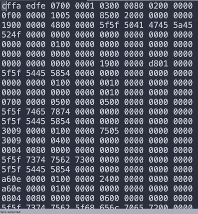

# Lecture 1: Basics, Number Bases

<br> a. [Additional Resources](#Additional-Resources)  
<br> b. [Number Bases](#Number-Bases)  
<br> c. [LS8 Emulator](#LS8-Emulator)  
<br> d. [How to Approach the Project](#How-to-Approach-the-Project)  
<br>   
<br>


## Additional Resources

[CPU and Components](https://www.youtube.com/watch?v=Ae6zRhgMatc)  

[Number Bases and Conversions](https://www.youtube.com/watch?v=umwSs9fNegY)  

[Project Repo](https://github.com/LambdaSchool/Computer-Architecture)  

[Lecture I Recording: Brady Fukumoto](https://youtu.be/E61m_d6BbcU)  

<br>

[How to count binary on your hand](https://www.youtube.com/watch?v=Bke95oWWZII).  

[Binary Explained Simply](http://www.steves-internet-guide.com/binary-numbers-explained/)  

[Counting Systems Explained](https://ryanstutorials.net/binary-tutorial/)  

[Hexadecimal Basics](https://learn.sparkfun.com/tutorials/hexadecimal/all) 

<br> 

This week we'll be working on a [single project repo](https://github.com/LambdaSchool/Computer-Architecture). Tonight's project is working on `ls8` in the repository.

Focus on reading the ReadMe carefully and exploring documentation.

<br>

## Number Bases

`Binary`, `Hexadecimal` and `Decimal` are the three numbers bases we're most concerned with.

> Hexa = base 16  
> Dec = base 10  
> Bi = base 2  

But what does this mean?

If we have 12 apples, we might be looking for a way to _count_ the apples and express them to someone else.

Depending on which base you count with, the final number count may be different, even though the number of apples remains the same. We could also count in letters, returning letter `L` to represent 12. It's still 12 apples, but if we're counting in base _alphabet_, we'd say there are L apples.

It’s important to understand that when you have 12 apples on the table, it’s still the same number of apples regardless of whether or not you say there are “12 apples” (decimal), or “C apples” (hexadecimal), or “1100 apples” (binary).

The count of the number of items doesn’t change just because we refer to it in a numbering system of a different base.

In binary, everything is expressed in 1's and 0's (charge or no charge).

<br>

In base 10, we are used to expressing numbers based on 10s. For example, the number 123 is:

> 100 = 1 one hundreds  
> 20 = 2 tens  
> 3 = 3 1's  

Think of it this way -- we use digits 1-9 to count up to a base of 10. When we reach a base of 10, we move over one digit.

> 09  
> 10  

We could also think of the tens place as 10^1 (ten to the power of one), and the hundreds place as 10^2 (ten to the power of two), etc.
<br> 

Binary is similar, except that our base is 2, so we only use the digits 0 and 1 as placeholders. Computers use binary because 0 or 1 indicates either passing a charge or not.

In binary, we write it like so:

> 0b00 = 0  
> 0b01 = 1  
> 0b10 = 2  
> 0b11 = 3  
> 0b100 = 4  

Each digit place holds up to 1, so we count by increasing from 0 to 1 with each number. 00 to 01 to 10, much like we count in base 10 from 08 to 09 to 10.

The places are similar to base 10, in that the 1's place is 2^0, the 2's place is 2^1, the 4's place is 2^2, and the 8's place is 2^3.

<br>

Let's compare how we build the number 7352 in binary and decimal:

> 0b11100011  
> 128 place, 64 place, 32 place, 16 place, 8 place, 4 place, 2 place, 1 place  
> 128 + 64 + 32 + 0 + 0 + 0 + 2 + 1  

> 7352  
> 1000 place, 100 place, 10 place, 1 place  
> 7000 + 300 + 50 + 2  

Base 10 tells us that we have 7 1000's, 3 100's, etc..

Base 2 (Binary) tells us that we have 1 128, 1 64, 1 32, 0 16s, etc..

In Hexadecimal...

Hexadecimal is a base-16 number system. That means there are 16 possible digits used to represent numbers. 10 of the numerical values you're probably used to seeing in decimal numbers: 0, 1, 2, 3, 4, 5, 6, 7, 8, and 9.

Those values still represent the same value you're used to. The remaining six digits are represented by A, B, C, D, E, and F, which map out to values of 10, 11, 12, 13, 14, and 15.

Remember the places are 16^0, 16^1, 16^2, etc..

> 0xA32F  
> 4096 place, 256 place, 16 place, 1 place  
> 40960 + 768 + 32 + 15  
> 41775  

The larger the base, the more compact numbers can be. In hexadecimal, this number looks very small but is in fact quite large.

<br>

[How to count binary on your hand](https://www.youtube.com/watch?v=Bke95oWWZII).  

[Binary Explained Simply](http://www.steves-internet-guide.com/binary-numbers-explained/)  

[Counting Systems Explained](https://ryanstutorials.net/binary-tutorial/)  

[Hexadecimal Basics](https://learn.sparkfun.com/tutorials/hexadecimal/all)  

<br>

```

base 10 (decimal)

+-----1000's place
|+----100's place
||+---10's place
|||+--1's place
||||
abcd

1234

1 * 1000 + 2 * 100 + 3 * 10 + 4 * 1 == 1234

base 2 (binary)

+-----8's place (0b1000's place)
|+----4's place (0b100's place)
||+---2's place (0b10's place)
|||+--1's place (0b1's place)
||||
abcd

1110 (binary)

1 * 8 + 1 * 4 + 1 * 2 + 0 * 1 = 14
```

<br>
<br>

## Practicing Conversions

Hexadecimal is important because 1 digit can be represented by 4 bits (a nibble). 8 bits is a byte.

_Fun Fact: In casual conversation, computer geeks say "kilo" to mean 1024. In documents where accuracy is important, it would be shown as kibibyte for 1024 bytes._

<br>

Let's convert this to hex:

> 0b11100011  

We could split it into two hexadecimal digits (remember, each digit is the same as 4 bits -- or 4 places in binary):

> 0b1110 0b0011  
> 0xE 0x3  

Which reduces down to:

> 0xE3  

<br>

Why do we care about being able to convert between these three bases?

You'll see hexadecimal frequently while working in code, especially when working with colors (written in RGB or _Hex_).

Hex is also cleaner to read and shorter, compared with binary. There are different levels of engagement when working with computers: high level (Python), low level (C) and base level (assembly languages).

_Learn more about [computer language levels](https://thebittheories.com/levels-of-programming-languages-b6a38a68c0f2)_

Low level languages are compiled into bytes. This is what an array looks like when compiled:



<br>

The base only matters when the number is written down, e.g. when you print a number on the screen, when you write it in your code, etc.

Internally, you can think of it as being stored as a pure numeric value, without any base. It's only when you print it that you have to specify a base.

Computers don't understand words -- but they understand these instruction sets written in binary. This week we're learning how to bridge the gap between how humans understand and communicate vs how computers understand and communicate.

<br>
<br>

## LS8 Emulator

We're writing an emulator that needs to be able to read 1's and 0's, like an 8-bit computer.

It should be able to read binary and take instructions from it. The binary numbers are mapped to op-codes (operation code).

Learn more about [operation code](https://www.sciencedirect.com/topics/engineering/operation-code).

We'll work with some basic code in [lectureI.py](lectureI.py).

Let's define some basic instructions.

<br>

```
import sys

# Let's setup two operation instructions for our simple machine: PRINT_BEEJ and HALT
PRINT_BEEJ = 1
HALT = 2

# This sets our program's memory for what it will do, print 4 times and halt
memory = [
    PRINT_BEEJ,
    PRINT_BEEJ,
    PRINT_BEEJ,
    PRINT_BEEJ,
    HALT
]

# Sets a pointer to the instructions we're currently running on

pc = 0

# Tells us our program is running
running = True

while running:
    # Looks at where we are in the memory
    command = memory[pc]

    # Then we process it to handle the command
    if command == PRINT_BEEJ:
        print("BEEJ")
    elif command == HALT:
        running = False
    else:
        print(f"Unknown instruction: {command}")
        sys.exit(1)

    # Increment our program pointer by one
    pc += 1
```

<br>

We've written a very basic computer program! The output is:

<br>

```
BEEJ
BEEJ
BEEJ
BEEJ
```

<br>

If we were to imagine the physical RAM inside of our computer, we would see them as binary values that represent "PRINT_BEEJ" and "HALT". The first binary value would run four times because the HALT binary value runs once.

<br>

Let's consider how to handle arguments that might return a variable output.

How does it know the value is an instruction and not a numerical or ascii value?

We can add a third instruction that will take a numerical value and print it out: `PRINT_NUM = 3`.

Let's change memory to the following, where we want PRINT_NUM to print the next value in memory (a number).

<br>

```
memory = [
    PRINT_BEEJ,
    PRINT_NUM,
    1,
    PRINT_BEEJ,
    PRINT_BEEJ,
    PRINT_NUM,
    12
    PRINT_BEEJ,
    HALT,
    PRINT_NUM,
    37
]
```

<br>


If our code works correctly, it should halt before printing 37. We know that if we hit PRINT_NUM, then the next value is the number we want to print.

<br>

```
    elif command == PRINT_NUM:
        num = memory[pc + 1]
        print(num)
```

<br>

We hit two bugs with this implementation though. It prints out:

<br>

```
BEEJ
1
BEEJ
BEEJ
BEEJ
12
```

<br>


Our bug is that `PRINT_NUM` takes an argument (the next value in memory), but because we are incrementing by only 1 when we hit that command, it tries to read the argument (number) as a command.

In the first instand, it worked because it read '1' as our instruction of 1 (PRINT_BEEJ) rather than as the number to print.

But the second time it hits a number, it reads 12 as an unknown instruction and stops running.


We can fix it by incrementing by 2 instead of 1 when we hit that instruction (to bypass the arguments that are not meant to be read as commands):

<br>

```
    elif command == PRINT_NUM:
        num = memory[pc + 1]
        print(num)
        pc += 2
```

<br>

So now it outputs:

<br>

```
BEEJ
1
BEEJ
12
```

<br>

Let's add some more commands:

<br>

```
PRINT_BEEJ     = 1
HALT           = 2
PRINT_NUM      = 3
SAVE           = 4
PRINT_REGISTER = 5
ADD            = 6
```

<br>

We want to be able to _write_ memory too, so we need to be able to SAVE. This allows us to store values, to make our code less complex.

We want to also be able to print or work with what we've saved using PRINT_REGISTER. Registers are like memory except they are much faster and smaller. It's a scratch place that allows the computer to do fast calculations.

The cache is larger and slower than a register, but faster and smaller than the memory (RAM).

Above the RAM is the hard drive (disc -- as it used to be a physically spinning disc). Reading and writing to the hard drive is much slowed than RAM but it's much cheaper spatially.

The bigger is it, the cheaper and slower it is.

Computers also have virtual memory -- when you run out of RAM, it begins to treat the hard drive as RAM. It prevents the computer from crashing, but does make the computer work _very_ slowly because reading and writing from the hard drive is slow.

<br>

So let's implement a small register with 8 bytes of memory. We're abstracting this concept of a register -- although Python lists can be manipulated in size, we'll pretend this register is immutable, and that we're dealing with 8 bytes of finite memory.

<br>

```
# Creates an array of 8 0's
register = [0] * 8
```

<br>

We can store 8 items in our register. We want to be able to add two numbers using this register, and print anything from the register.

<br>

```
memory = [
    PRINT_BEEJ,
    SAVE, # SAVE 62 to register 2
    65,
    2,
    SAVE, # Save 20 to register 3
    20,
    3,
    ADD, # add register 3 to register 2, R2 += R3
    2,
    3,
    PRINT_REGISTER, # prints value at register 2
    2,
    HALT # We should always halt to prevent memory leaks
]
```

<br>

Now, let's update our handling of each code to add, print and save:

<br>

```
    elif command == SAVE:
        # The number to save is the next value in memory
        num = memory[pc + 1]
        # The register place to save it is the following value in memory
        reg = memory[pc + 2]
        # Sets these to the register
        register[reg] = num
        # Increment by 3 to pass the arguments
        pc += 3
    
    elif command == ADD:
        # Sets first adding register index to the next value in memory
        reg_a = memory[pc + 1]
        # Sets second adding register index to the following value in memory
        reg_b = memory[pc + 2]

        # Adds the second register index value to the first
        register[reg_a] += register[reg_b]
        # Increments by 3 to pass the arguments
        pc += 3
    
    elif command == PRINT_REGISTER:
        # Sets the register index to print to the next value in memory
        reg_index = memory[pc + 1]
        # Prints the register at that place
        print(register[reg_index])
        # Increments by 2 to pass the arguments
        pc += 2
```

<br>
<br>


## How to Approach the Project

Start by looking at the main repo's Task List for Day 1. Focus on understanding today to set a strong foundation for the rest of the week.

Look up all of the terms used in the documentation to fully understand what everything means and does.

The LS-8 project has a more in-depth ReadMe with instructions, as well an LS-8 spec.

It may feel overwhelming but remember that the spec is for the _entire week_. Just focus on day 1's objectives and understanding. An estimated 1-2 hours of reading the docs is recommended.

There is starter code to help get things up and running. Instead of using decimal, we'll be working with binary.

A big part of this project is step 1 of Polya's. Expect to spend some time understanding the problem and seeing what resources you have at your disposal.


<br>


What's the difference between an emulator and a compiler?

A compiler takes human readable code (like Python) and changes it into computer readable code (like Binary).

An emulator is emulating the hardware that the software is running on. For example, our `register` is not _actually_ the 8 bytes of the register on our computer -- it's just emulating the constraints of hardware in software.

Computers are more complicated so this simplified emulation of how the computer works is to improve our understanding of what happens when we work with software.

<br>

At first, people were keying in programs with a hex keypad or binary switches on the front of the computer.

Turn the switches to ON OFF ON OFF ON ON OFF OFF ON and then hit the "STORE" button to load that into memory.

That was a pain. So we put keyboards on there and were able to type things instead. But typing in hex is a pain.

*Machine code:*
> 82  
> 00  
> 08  
> 82  
> 01  

So someone wrote a program (in hex) to take programs written in assembly and convert them to numbers.

*Assembly:*
> LDI R0,8  
> LDI R1,2  
> MUL R0,R1  
> PRN R0  

But writing assembly is a pain, so someone wrote a compiler (in assembly) that would take a higher level language and convert it to assembly for you:

*C:*

```
int main(void)
{
    int x = 8;
    int y = 2;

    x *= y;

    printf("%d\n", x);
}
```

<br>

But, yes, the first assembler was written in machine code. And the first C compiler was written in assembly language.

Eventually they rewrote the assembler in assembly, and rewrote the C compiler in C. Then it could compile itself--this is called self hosting. Way easier to maintain a C compiler written in C.

<br>

From Beej:

>Time to level up in C, roughly, using numbers I made up:  
>  
> 0 hours: noob, what is this sorcery
>  
> 10 hours: beginner, can get basic jobs done, simple pointer tasks by rote.  
>  
> 200 hours: intermediate, understands pointers and pointer arithmetic, can handle single and double indirection without thinking about it, knows the build/link process, knows what undefined behavior is and can avoid it with pointers and arrays, can copy objects by casting to char* and iterating over the bytes.  
>  
> 1000 hours: expert, complete understanding of pointers and arbitrary amounts of indirection, knows all functions in the standard library, understands array-pointer equivalence, knows how to use union, can build shared and static libraries, can write endian-agnostic code, understands the ramifications of numeric type conversions, understands memory alignment and struct padding, never writes code with undefined behavior unless required and documented, understands the difference between undefined and implementation-defined behavior.  
>  
> 2000 hours: wizard, expert plus knows the esoterica in the spec, e.g. comparing items one past the end of an array, what happens with strange casts like floats to pointers, the computational model of expression evaluation, etc.
I'll bet you can get entry-level embedded systems jobs at the intermediate level. But even expert level is "only" 4 months of full time study.  
>  
> C isn't a complicated language. It has a few tough concepts, but that's about it.  


<br>
<br>
