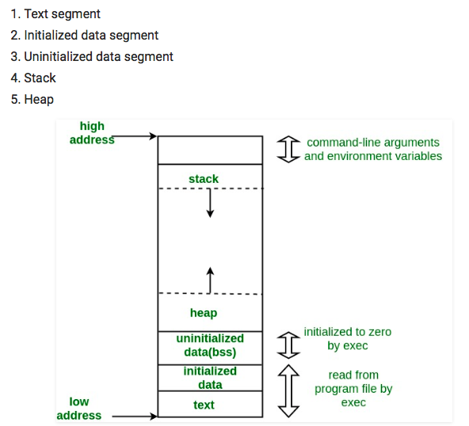

# Lecture III: The System Stack

<br> a. [Additional Resources](#Additional-Resources)   
<br> b. [Stacks](#Stacks)  
<br> c. [Implementing a Stack](#Implementing-a-Stack)    
<br>
<br>


## Additional Resources

[The CPU Stack](https://youtu.be/vAy5rXxUwoc)  

[CPU Interrupts](https://youtu.be/w3gDDg_kORk)  

[CS19 Lecture III: The System Stack Recording: Brady Fukumoto](https://www.youtube.com/watch?v=nCghJadoRYU&feature=youtu.be)

<br>

[Memory Layout of C Programs](https://www.geeksforgeeks.org/memory-layout-of-c-program/)  

[Explain a Call Stack in a Nutshell](https://stackoverflow.com/questions/10057443/explain-the-concept-of-a-stack-frame-in-a-nutshell)  


<br>

## Stacks

_Starts at 18:30 on the recording_

What is a stack?

A structure that holds a collection of items in a FILO structure: first in, last out (unlike a queue). Think of it like a stack of pancakes. The newest ones are eaten first.

It uses push and pop to add and remove items from the stack.

Within the LS8 project, our memory is not a complex data structure - it's simply a 128 long list. We can treat it like a stack by using it as a list with `push()` and `pop()`. An advantage of a stack over a queue is that we don't need to bitshift to add or remove items from the stack.

If you understand how stacks work, it helps you understand how memory, function storage, recursion and compilers work. Thorough knowledge of the processes that go into computing allow us to become excellent debuggers.





When we look at this diagram of how the memory is laid out in a C Program, we notice that the stack and heap grow in opposite directions.

As the program is being run, it reads and writes memory. The Heap is dynamically allocated memory where an array like our RAM in LS8 is stored. Python does this automatically but in C, we manage the memory manually.

The stack is for handling calls and temporarily scoped variables within functions.

While the stack functions like a stack, the Heap is not the same as a heap data structure -- it's also like a stack but with _dynamically_ allocated memory. It can do more than push or pop; but it grows linearly as well.

<br>

This diagram is meant to represent C, but this is how _all_ C-like programs. Although we're writing in a higher level language (Python) that handles this memory allocation under the hood, at a low level, when the code is compiled into a low level language for the computer to run, this memory allocation is happening the same way as if we were writing in C.

That is why it's important to understand how this is working even if we aren't manually _doing_ this allocation in Python.

<br>

What is the difference between scripted and compiled code?

Compiled code needs to be compiled before it is run (like a C program or how the browser runs). Scripted languages do not need to be compiled, but instead interpreted.

Compiled programs run faster because they are converted into native machine code and read once. Interpreted programs are read continuously and halted when they encounter an error.

Some scripted languages are JavaScript, Python and PHP.

Some compiled languages are C or C++.

Read more [here](https://www.geeksforgeeks.org/whats-the-difference-between-scripting-and-programming-languages/).  
<br>
<br>

## Implementing a Stack

Let's keep working with our simple machine in [lectureIII.py](lectureIII.py), where we left off on it yesterday.

Currently it can handle a number of simple commands and read programs from external files by loading them into memory.

Today, let's add a stack!

<br>

We'll need to add PUSH and POP capabilities, as well as understand how to use the stack pointer, which modifies only the specifically allocated portion of memory when pushing or popping.

<br>

Our point counter reads the instructions being loaded into the program in order of being loaded (FIFO). It reads them in order and increments depending on what the instruction was (and how many parameters were passed).

When thinking about our stack, let's say we have the following code:

<br>

```
def mult2(x,y):
    z = x * y
    return z

def main():
    a = 2
    b = mult2(a,7)
    print(b)
```

<br>

`x` and `y` are temporary variables being stored in the stack. They are added to the stack first, to be used until they are no longer needed. Since they are added first, they'll also be removed last.

In recursion for example, each recursive call adds to the top of the stack and has to be handled before the computer can resolve the next item in the stack (First In Last Out).

Our `stack pointer` keeps track of the items in the stack and the order to resolve them.

<br>

PUSH takes a register index and copies the value to the address pointed to by the Stack Pointer.

In the beginning, there is nothing on the Stack. When we call PUSH, our stack pointer will move to the top of the stack. That is where the value at the register index indicated will be copied to. Then the stack pointer moves to the next empty space.

POP takes the value at the stack pointer in memory, and copies it into the register index given. The Stack Pointer is then incremented _back_ one index (because the Stack is now shorter, so it should be at the top item).

<br>

What happens if we try to POP an empty stack?

Stack Underflow -- it will move to an area of memory that it shouldn't be pointing to and can cause problems, like overriding existing data.

Stack Overflow happens when we call PUSH more times than our Stack's memory allows, going into the program memory area. Infinite recursion can cause this.


<br>

Let's create a stack and start coding. How do we implement a stack?

Instead of creating a stack of bytes... we just create a Stack Pointer, and use the address range in memory that is allocated for our Stack.

<br>

```
PUSH           = 7
POP            = 8

register = [0] * 8

memory = [0] * 128 # 128 bytes of RAM

SP = 7 # Because it will live in register spot 7
```

<br>

We've also added references to our PUSH and POP commands. Now we'll add them into our if/else block.

<br>

```
  elif command == PUSH:
      reg = memory[pc + 1] # grabs the value
      val = register[reg]

      register[SP] -= 1 # to decrement the address of SP

      memory[register[SP]] = val # Set the spot in memory indicated by SP to the value given
      pc += 2 # increment to the next command

  elif command == POP:
      reg = memory[pc + 1] # which register to write to
      val = memory[register[SP]] # grabs the value stored at SP

      register[reg] = val # write that val to the register
      register[SP] += 1 # increments the address of SP

      pc += 2
```

<br>

Both PUSH and POP look very similar, but in reverse order. One gets the value first, then puts it in the stack where indicated. The other gets a value from the stack to put into the register.

One thing to note about how PUSH works is _when_ the Stack Pointer is decremented. The Stack Pointer is always pointing to the last item in the stack -- to a filled space in memory. 

Before we write a new value into memory in the stack, we need to _decrement_ the Stack Pointer, to ensure it's at an empty (or unused) space in memory.

Looking again, you'll notice:

<br>

```
      register[SP] -= 1 # to decrement the address of SP

      memory[register[SP]] = val # Set the spot in memory indicated by SP to the value given
```

<br>

On the flip side, we only _increment_ with POP _after_ the item has been written to the register, because then it has been "removed" and that spot in the Stack memory is no longer being used. We increment to go to the last-filled space in the Stack.

In our LS8 project, the stack runs from index 244 in RAM _down_ to index 0. Despite how we might intuitively think to add one means to increase the index, with the stack, we're actually decrementing down towards index 0.

<br>

How do we prevent a stack under or overflow issue from happening? If PUSH or POP were called enough times, it could compromise the safety of the memory by filling the stack too much.

Our software can keep track of this pending issue and prevent it; but the hardware on its own will not protect itself from this problem. This functionality is built into C and other languages.

<br>
<br>


