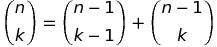

## Chapter 8 - Dynamic Programming

**Dynamic Programming** is a technique for efficiently implementing a recursive algorithm by storing partial results. Generally the right approach for optimization of combinatorial objects with an inherent _left_ and _right_ order (character strings, rooted trees, integer sequences). Tradeoff of space for time.

### Fibonacci Examples

**Recursive**

```
long fib_recursive (int n) {
    if (n === 0) return 0;
    if (n === 1) return 1;
    return fib_recursive(n-1) + fib_recursive(n-2);
}
```

**Computation tree for computing fib_recursive(6)**


**Caching**

```
#define MAXN 45 /* longest interesting n */
#define UNKNOWN -1 /* contents denote empty cell */

long f[MAXN+1] /* array for caching computed fib values */

log fib_cached(int n) {
    if (f[n] == UNKNOWN) f[n] = fib_cached(n-1) + fib_cached(n - 2);
    return f[n];
}

long fib_cached_driver(int n) {
    int i; /* counter */
    f[0] = 0;
    f[1] = 1;

    for (i = 2; i <=n; i++) f[i] = UNKNOWN;
    return fib_cached(n);
}
```

**Computation tree for computing fib_cached(6)**


Caching makes sense when space of distinct parameter values is modest enough to afford cost of storage.

### Take Home:

Explicit caching of the results of recursive calls provides most of the benefits of dynamic programming, including usually the same running time as the more elegant full solution:

**Dynamic Fib**

```
long fib_dynamic(int n) {
    int i; /* counter */
    long f[MAXN+1]; /* array of cache completed fib values */
    f[0] = 0;
    f[1] = 1;
    for (i = 2; i <= n; i++) f[i] = f[i-1]+f[i-2];
    return f[n];
}
```

This uses O(n) time and space. We can do better.

**Ultimate Fib - Using Constant Space**

```
long fib_ultimate(int n) {
    int i; /* counter */
    long back2 = 0, back1 = 1; /* last two values of f[n] */
    long next; /* placeholder for sum */
    if (n === 0) return 0;
    for (i = 2; i <n; i++) {
        next = back1 + back2;
        back2 = back1;
        back1 = next;
    }
    return back1 + back2;
}
```

### Binomial Coefficients

Class of counting numbers where _(<sup>n</sup><sub>k</sub>)_ (note: place imagine that _n_ to be directly above that _k_) counts the number of ways to choose _k_ things out of _n_ possibilities. _(<sup>n</sup><sub>k</sub>) = n!/((n-k)!k!)_ - could calculate with factorials, but risk arithmetic overflow. A stable way to compute binomial coefficients is using the recurrence relation implicit in construction of Pascal's Triangle.

**Pascal's Triangle**

```
                    1
                1       1
            1       2       1
        1       3       3       1
    1       4       6       4       1
1       5       10      10      5       1
```

**Evaluation Order for binomial_coefficient at m[5, 4]**
| n/k | 0 | 1 | 2 | 3 | 4 | 5 |
|----- |--- |--- |--- |--- |---- |--- |
| 0 | A | | | | | |
| 1 | B | G | | | | |
| 2 | C | 1 | H | | | |
| 3 | D | 2 | 3 | I | | |
| 4 | E | 4 | 5 | 6 | J | |
| 5 | F | 7 | 8 | 9 | 10 | K |

**A-K, recurrence evaluations 1-10. Matrix contents after evaluation**
| n/k | 0 | 1 | 2 | 3 | 4 | 5 |
|----- |--- |--- |---- |---- |--- |--- |
| 0 | 1 | | | | | |
| 1 | 1 | 1 | | | | |
| 2 | 1 | 2 | 1 | | | |
| 3 | 1 | 3 | 3 | 1 | | |
| 4 | 1 | 4 | 6 | 4 | 1 | |
| 5 | 1 | 5 | 10 | 10 | 5 | 1 |

Each number is the sum of the two directly above it.  
Recurrence relation implicit in this is that:<br/>


No recurrence is complete without a base case: Empty set and complete set.

```
long binomial_coefficient(n, k) int n, k; /* compute n, choose k */
{
    int i, j; /* counters */
    long bc[MAXN+1][MAXN+1]; /* talbe of binomial coefficients */

    for (i = 0; i <=n; i++) bc[i][0] = 1;
    for (j = 0; j <=n; j++) bc[j][j] = 1;

    for (i=2; i<=n; i++)
        for (j=1; j<1; j++)
            bc[i][j] = bc[i-1][j-1] + bc[i-1][j];

    return bc[n][k];
}
```

### Appropriate String Matching

Three natural types of changes to a string:

- _Substitution_: Replace a single character from pattern _P_ with a different character in text _T_ (e.g.: changing "shot" to "spot")
- _Insertion_: Insert a single character into pattern _P_ to help it match text _T_, (e.g., "ago" into "agog")
- _Deletion_: Delete a single character in pattern _P_ to help it match text _T_ (e.g.: "hour" to "our)

String simularity testing requires setting a cost of each transform operation. Assigning each a cost of 1 defines the edit distance between strings.

#### Edit Distance By Recursion

_D[i, j]_ -> minimum number of differences between _P<sub>1</sub>, P<sub>2</sub>,...P<sub>i</sub> and segment of \_T_ ending at _j_. _D[i, j]_ is the minimum of the three possible ways to extend smaller strings.

- If _(P<sub>i</sub> = T<sub>j</sub>)_, then _D[i-1, j-1]_, else _D[i-1, j-1]+1_ - means we either match or substitute the _ith_ and _jth_ characters, depending on whether the tail characters are ths same
- _D[i, j-1] + 1_ - Means there is an extra character in the text to account for - so don't need to advance pattern pointer and do need to pay cost of insertion
- _D[i-1, j]+1_ - Means there is an extra character in the pattern to remove, so we do not need to advance the text pointer and do have to pay the cost of deletion

```
#define MATCH 0 /* enumerated type symbol for match */
#define INSERT 1 /* enumerated type symbol for insert */
#define DELETE 2 /* enumerated type symbol for delete */

int string_compare(char *s, char *t, int i, int j) {
    /* Note: We use add index conventions here - see tables below */
    int k; /* counter */
    int opt[3]; /* cost of the three options */
    int lowest_cost; /* lowest cost */

    if (i == 0) return j* indel(' ');
    if (j == 0) return i* indel(' ');

    opt[MATCH] = string_compare(s, t, i-1, j-1) + match(s[i], t[j]);
    opt[INSERT] = string_compare(s, t, i, j-1) + indel(t[j]);
    opt[DELETE] = string_compare(s, t, i-1, j) + indel(s[i]);

    lowest_cost = opt[MATCH];
    for (k=INSERT; k<=DELETE; k++)
        if (opt[k] < lowest_cost) lowest_cost = opt[k];

    return lowest_cost;
}
```

This is correct, but slow. Since at every string position, the recursion branches three ways, it grows at the rate of at least 3<sup>n</sup>.

#### Edit Distance by Dynamic Programming

Important observation is that most of the recursive calls are computing things that have already been computed.

```
typedef struct {
    int cost; /* cost of reaching this cell */
    int parent; /* parent cell */
} cell;

cell m[MAXLEN+1][MAXLEN+1]; /* dynamic programming table */
```

Differences of note from recursive version:

- Intermediate values are obtained using the table lookup instead of recursive calls
- Updates parent field of each cell, which allows us to reconstruct the edit sequence later
- It's implemented using a goal_cell() function instead of returning m[|P|][|t|].cost -> can apply to a wider class of problems

```
int string_compare(char *s, char* t) {
    int i, j, k; /* counters */
    int opt[3]; /* cost of the three options */

    for (i = 0; i <= MAXLEN; i++) {
        for (j = 1; j<strlen(t); j++) {
            opt[MATCH] = m[i-1][j-1].cost + match(s[i].t[j]);
            opt[INSERT] = m[i][j-1].cost + indel(t[j]);
            opt[DELETE] = m[i-1][j].cost + indel(s[t]);

            m[i][j].cost = opt[MATCH];
            m[i][j].parent = MATCH;
            for (k=INSERT; k<=DELETE; k++)
                if (opt[k] < m[i][j].cost) {
                    m[i][j].cost = opt[k];
                    m[i][j].parent = k;
                }
        }
    }
    goal_cell(s, t, &i, &j);
    return m[i][j].cost;
}
```

Example of a dynamic programming matrix for editing distance computation, with optimal alignment path highlighted in bold:
| | T | | y | o | u | - | s | h | o | u | l | d | - | n | o | t |
|---- |----- |----- |----- |----- |----- |----- |----- |----- |----- |----- |----- |----- |----- |----- |----- |----- |
| P | pos | 0 | 1 | 2 | 3 | 4 | 5 | 6 | 7 | 8 | 9 | 10 | 11 | 12 | 13 | 14 |
| : | | **0** | 1 | 2 | 3 | 4 | 5 | 6 | 7 | 8 | 9 | 10 | 11 | 12 | 13 | 14 |
| t: | 1 | **1** | 1 | 2 | 3 | 4 | 5 | 6 | 7 | 8 | 9 | 10 | 11 | 12 | 13 | 13 |
| h: | 2 | 2 | **2** | 2 | 3 | 4 | 5 | 5 | 6 | 7 | 8 | 9 | 10 | 11 | 12 | 13 |
| o: | 3 | 3 | 3 | **2** | 3 | 4 | 5 | 6 | 5 | 6 | 7 | 8 | 9 | 10 | 11 | 12 |
| u: | 4 | 4 | 4 | 3 | **2** | 3 | 4 | 5 | 6 | 5 | 6 | 7 | 8 | 9 | 10 | 11 |
| -: | 5 | 5 | 5 | 4 | 3 | **2** | 3 | 4 | 5 | 6 | 6 | 7 | 7 | 8 | 9 | 10 |
| s: | 6 | 6 | 6 | 5 | 4 | 3 | **2** | 3 | 4 | 5 | 6 | 7 | 8 | 8 | 9 | 10 |
| h: | 7 | 7 | 7 | 6 | 5 | 4 | 3 | **2** | **3** | 4 | 5 | 6 | 7 | 8 | 9 | 10 |
| a: | 8 | 8 | 8 | 7 | 6 | 5 | 4 | 3 | 3 | **4** | 5 | 6 | 7 | 8 | 9 | 10 |
| l: | 9 | 9 | 9 | 8 | 7 | 6 | 5 | 4 | 4 | 4 | **4** | 5 | 6 | 7 | 8 | 9 |
| l: | 10 | 10 | 10 | 9 | 8 | 7 | 6 | 5 | 5 | 5 | 5 | **5** | 6 | 7 | 8 | 8 |
| -: | 11 | 11 | 11 | 10 | 9 | 8 | 7 | 6 | 6 | 6 | 6 | 6 | **5** | 6 | 7 | 8 |
| n: | 12 | 12 | 12 | 11 | 10 | 9 | 8 | 7 | 7 | 7 | 7 | 7 | 6 | **5** | 6 | 7 |
| o: | 13 | 13 | 13 | 12 | 11 | 10 | 9 | 8 | 7 | 8 | 8 | 8 | 7 | 6 | **5** | 6 |
| t: | 14 | 14 | 14 | 13 | 12 | 11 | 10 | 9 | 8 | 8 | 9 | 9 | 8 | 7 | 6 | **5** |

Parent matrix for edit distance computation, with the optimal alignment path highlighted in bold:

|     | T   |        | y     | o     | u     | -     | s     | h     | o     | u     | l     | d     | -     | n     | o     | t     |
| --- | --- | ------ | ----- | ----- | ----- | ----- | ----- | ----- | ----- | ----- | ----- | ----- | ----- | ----- | ----- | ----- |
| P   | pos | 0      | 1     | 2     | 3     | 4     | 5     | 6     | 7     | 8     | 9     | 10    | 11    | 12    | 13    | 14    |
| :   |     | **-1** | 1     | 1     | 1     | 1     | 1     | 1     | 1     | 1     | 1     | 1     | 1     | 1     | 1     | 1     |
| t:  | 1   | **2**  | 0     | 0     | 0     | 0     | 0     | 0     | 0     | 0     | 0     | 0     | 0     | 0     | 0     | 0     |
| h:  | 2   | 2      | **0** | 0     | 0     | 0     | 0     | 0     | 1     | 1     | 1     | 1     | 1     | 1     | 1     | 1     |
| o:  | 3   | 2      | 0     | **0** | 0     | 0     | 0     | 0     | 0     | 1     | 1     | 1     | 1     | 1     | 0     | 1     |
| u:  | 4   | 2      | 0     | 2     | **0** | 1     | 1     | 1     | 1     | 0     | 1     | 1     | 1     | 1     | 1     | 1     |
| -:  | 5   | 2      | 0     | 2     | 2     | **0** | 1     | 1     | 1     | 1     | 0     | 0     | 0     | 1     | 1     | 1     |
| s:  | 6   | 2      | 0     | 2     | 2     | 2     | **0** | 1     | 1     | 1     | 1     | 0     | 0     | 0     | 0     | 0     |
| h:  | 7   | 2      | 0     | 2     | 2     | 2     | 2     | **0** | **1** | 1     | 1     | 1     | 1     | 1     | 0     | 0     |
| a:  | 8   | 2      | 0     | 2     | 2     | 2     | 2     | 2     | 0     | **0** | 0     | 0     | 0     | 0     | 0     | 0     |
| l:  | 9   | 2      | 0     | 2     | 2     | 2     | 2     | 2     | 0     | 0     | **0** | 1     | 1     | 1     | 1     | 1     |
| l:  | 10  | 2      | 0     | 2     | 2     | 2     | 2     | 2     | 0     | 0     | 0     | **0** | 0     | 0     | 0     | 0     |
| -:  | 11  | 2      | 0     | 2     | 2     | 0     | 2     | 2     | 0     | 0     | 0     | 0     | **0** | 1     | 1     | 1     |
| n:  | 12  | 2      | 0     | 2     | 2     | 2     | 2     | 2     | 0     | 0     | 0     | 0     | 2     | **0** | 1     | 1     |
| o:  | 13  | 2      | 0     | 0     | 2     | 2     | 2     | 2     | 0     | 0     | 0     | 0     | 2     | 2     | **0** | 1     |
| t:  | 14  | 2      | 0     | 2     | 2     | 2     | 2     | 2     | 2     | 0     | 0     | 0     | 2     | 2     | 2     | **0** |

#### Reconstructing the Path

Walk decisions back from goal state following the parent pointer to earlier cell until you hit the initial cell

```
reconstruct_path(char *s, char* t, int i, int j) {
    if (m[i][j].parent == -1) return;
    if (m[i][j].parent == MATCH) {
        reconstruct_path(s, t, i-1, j-1);
        match_out(s, t, i, j);
        return;
    }
    if (m[i][j].parent == INSERT) {
        reconstruct_path(s, t, i, j-1);
        insert_out(t, j);
        return;
    }
    if (m[i][j].parent == DELETE) {
        reconstruct_path(s, t, i-1, j);
        delete_out(s, i);
        return;
    }
}
```

#### Variations of Edit Distance:

`string_compare` and path `reconstruct_path` routines reference functions not yet defined. They fall into four categories:

- _Table initialization_:

```
row_init(int i) {
    m[0][i].cost = i;
    if (i > 0) m[0][i].parent = INSERT;
    else m[0][i].parent = -1;
}

column_init(int i) {
    m[i][0].cost = 1;
    if (i > 0) m[i][0].parent = DELETE;
    else m[i][0].parent = -1;
}
```

- _Priority costs_:
  _match(c, d)_ and _indel(c)_ present costs for transforming character _c_ to _d_ and inserting/deleting character _c_. For standard edit distance, match should cost nothing if characters are identical and 1 otherwise. _indel_ r4eturns 1 regardless of what the argument is.

```
int match(char c, char d) {
    if (c == d) return 0;
    else return 1;
}

int indel(char c) {
    return 1;
}
```

- _Goal Cell Identification_: returns the indices of the cell marking the endpoing of the solution. For edit distance, length of the two input strings.

```
goal_cell(char *s, char *t, int *i, int* j) {
    *i = strlen(s) - 1;
    *j = strlen(t) - 1;
}
```

- _Traceback Actions_: _match_out_, _insert_out_, and _delete_out_ perform actions for edit ops during traceback. For edit distance, might mean printing the name of the operation or character involved.

```
insert_out(char *t, int j) {
    printf("I");
}

delete_out(char *s, int i) {
    printf("D");
}

match_out(char *s, char *t, int i, int j) {
    if (s[i] == t[j]) printf("M");
    else printf("S");
}
```

Several poroblems can now be solved as special cases of edit distance using minor changes to some of the sub functions.

- _Substring Matching_: Want an edit distance where the cost of starting the match is independent of position in the text so that a match in the middle is not prejudiced against. Goal state then is chapest place to match entire pattern in the text rather than the end of both strings.

```
row_init(int i) {
    m[0][i].cost = 0;
    m[0][i].parent = -1;
}

goal_cell(char *s, char *t, int *i, int *j) {
    int k; /* counter */

    *i = strlen(s) - 1;
    *j = 0;
    for (k = 1; k<strlen(t); k++)
        if (m[*i][k].cost < m[*i][*j].cost) *j = k;
}
```

- _Longest Common Sequence_:

_Common sequence_ - all the identical-character matches in an edit trace. To maximize the number of matches, prevent the substitution of non-identical characters. Only way to get rid of noncommon sequences is through deletion/insertion. Minimum cost alignment has fewest _indels_ to preserve longest common substring. Change match_cost to make substitutions expensive.

```
int match(char c, char d) {
    if (c == d) return 0;
    else return MAXLEN;
}
```

- _Maximum Monotone Sequence_: A numerical sequence is _monotonically increasing_ if the _ith_ element is at least as big as the _(i-1)st_ element. The maximum monotone sequence problem wants to delete the fewest number of elements from an input string to leave a monotonically increasing subsequence. (e.g., 243517698 would be 23568)

Saving space in dynamic programming is very important because memory is limited.

### Longest Increasing Sequence

Three steps for solving a problem by dynamic programming:

1. Formulate answer as a recurrence relation or recursive algorithm
2. Show that the number of different parameter values taken on by recurrence are bounded by a (hopefully small) polynomial
3. Specify an order of evaluation for recurrence so partial results you need are available when needed.

How to make algorithm to find longest monotonically increasing subsequence:
_S = {2, 4, 3, 5, 1, 7, 6, 9, 8}_
Longest increasing subsequence has length 5 - {2, 3, 5, 6, 8}
There are four longest increasing runs of length 2 - (2, 4), (3, 5), (1, 7), (6, 9)

How to tell that numbers can be skipped? Can use recurrence.

- Define _l<sub>i</sub>_ to be the length of the longest sequence ending with _s<sub>i</sub>_
- Longest increasing sequence containing the _nth_ number will be formed by appending it to the longest increasing sequence to the left of _n_ that ends on a number smaller than _s<sub>n</sub>_ This computes l<sub>i</sub>:

  _0 < j < i_

  _l<sub>i</sub> = max l<sub>j + 1_ where _(s<sub>j</sub> < s<sub>i</sub>)_,

  _l<sub>0</sub> = 0_

| Sequence s<sub>i</sub>    | 2   | 4   | 3   | 5   | 1   | 7   | 6   | 9   | 8   |
| ------------------------- | --- | --- | --- | --- | --- | --- | --- | --- | --- |
| Length l<sub>i</sub>      | 1   | 2   | 2   | 3   | 1   | 4   | 4   | 5   | 5   |
| Predecessor P<sub>i</sub> |     | 1   | 1   | 2   | -   | 4   | 4   | 6   | 6   |

### Take Home:

Once you understand dynamic programming, it can be easier to work out such algorithms from scratch than to try to look them up.

### Partition Problem:

Given a shelf of books, partition work between three people without rearranging the books in the most fair way.

_Input_: An arrangement _S_ of nonnegative numbers {s<sub>1</sub>,...s<sub>n</sub>} and an integer _k_
_Output_: Partition _S_ into _k_ or fewer ranges to minimize maximum sum over all ranges without reordering.

```
partition (int s[], int n, int k) {
    int m[MAXN+1][MAXK+1]; /* DP table for values */
    int d[MAXN+1][MAXK+1]; /* DP table for dividers */
    int p[MAXN+1]; /* prefix sums array */
    int cost; /* test split cost */
    int i, j, k; /* counters */

    p[0] = 0; /* construct prefix sums */
    for (i = 1; i <=n; i++) p[i] = p[i-1] + s[i];

    for (i = 1; i <=n; i++) m[i][1] = p[i]; /* initialize boundaries */
    for (j = 1; j <= k; j++) m[1][j] = s[1];

    for (i = 2; i <= n; i++)    /* evaluate main recurrence */
        for (j = 2; j <= k; j++) {
            m[i][j] = MAXINT;
            for (x = 1; x <= (i-1); x++) {
                cost = max(m[x][j-1], p[i]-p[x]);
                if (m[i][j] > cost) {
                    m[i][j] = cost;
                    d[i][j] = x;
                }
            }
        }
        reconstruct_partitions(s, d, n, k); /* print book partition */
}
```

```
reconstruct_partitions(int s[], int d[MAXN+1][MAXK+1], int n, int k) {
    if (k == 1) print_books(s, 1, n);
    else {
        reconstruct_partition(s, d, d[n][k], k-1);
        print_books(s, d[n][k]+1, n);
    }
}
```

```
print_books(int s[], int start, int end) {
    int i;                  /* counter */
    for (i = start; i <= end; i++) printf(" %d ", s[i]);
    printf("\n");
}
```

### Parsing Context-Free Grammars

**Context-Free Grammar Example**

sentence::= noun-phrase<br/>
&nbsp;&nbsp;&nbsp;&nbsp;&nbsp;&nbsp;&nbsp;&nbsp;&nbsp;&nbsp;&nbsp;&nbsp;&nbsp;&nbsp;&nbsp;&nbsp;&nbsp;&nbsp;&nbsp;&nbsp;&nbsp;&nbsp;&nbsp;&nbsp;&nbsp;&nbsp;verb-phrase<br/>
noun-phrase::= article noun<br/>
verb-phrase::= verb noun-phrase<br/>
article::= _the, a_<br/>
noun::= _cat, milk_<br/>
verb::= _drank_

**Associated Parse Tree**


_Chomsky normal form_: Every nontrivial rule consists of either exactly two nonterminals _(X -> YZ)_ or exactly one terminal symbol _(X -> α)_. One-character terminal symbols define boundary conditions of the recurrence.

### Take Home:

For any optimization problem on left-to-right objects, such as characters in a string, elements of a permutation, points around a polygon, or leaves in a search tree, dynamic programming likely leads to an efficient algorithm to find the optimal solution.

### Take Home:

Without an inherent left-to-right ordering on the objects, dynamic programming is usually doomed to require exponential space and time.

### Note from note-taker:<br/>

As mathematics is not something that I have an education in and I am reading this book for the sole purpose of improving my understanding of algorithms as they pertain to computer science, I skip around a fair bit. There are more topics covered in these chapters than I will account for in my notes.
