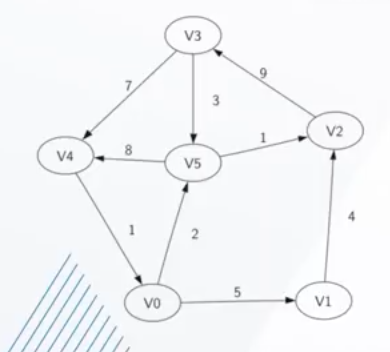
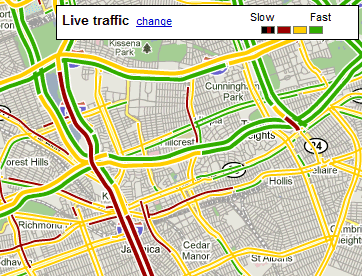
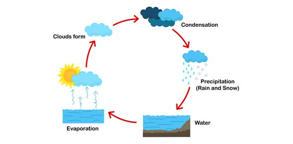
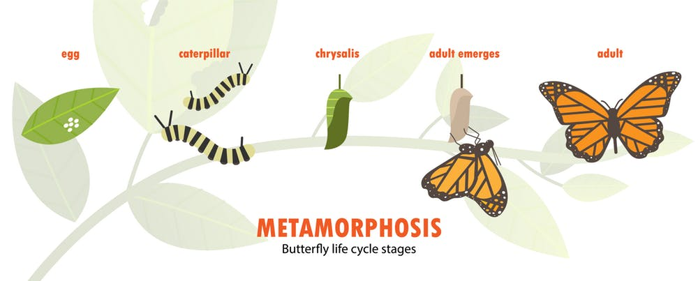
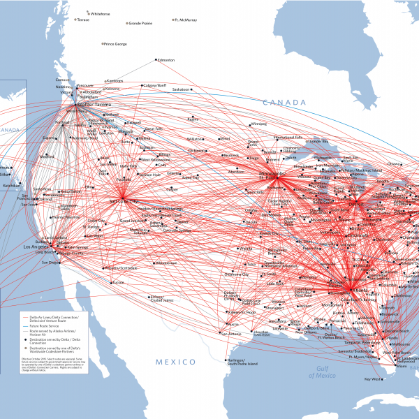
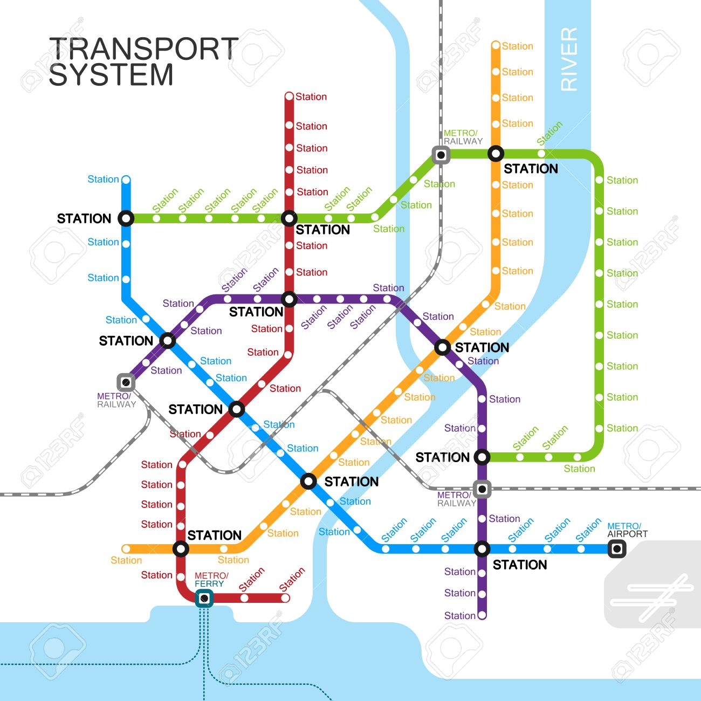
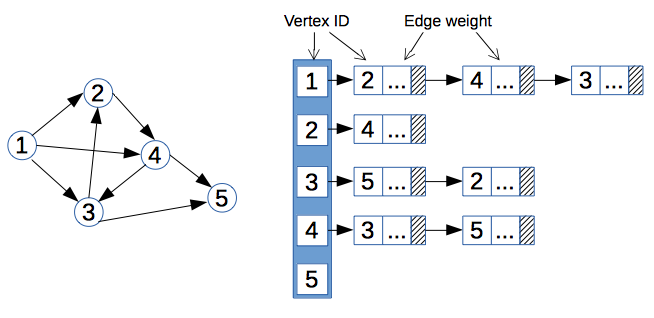
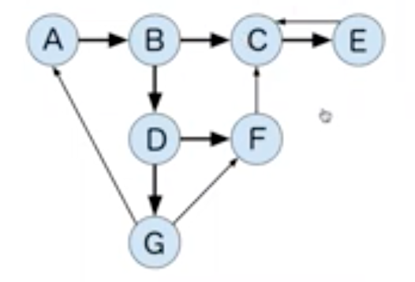
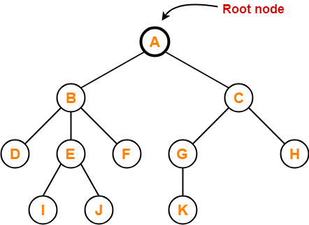
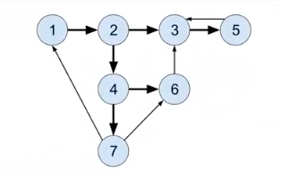

1. [Lecture I: Graphs Intro, Representation & BFS/DFS](#Lecture-I-Notes:-Graphs-Intro,-Representations-&-BFS/DFS)
    <br>a. [What are Graphs?](#What-are-Graphs)
        <br> - [Graph Types and Terms](#Graph-Types-and-Terms)
        <br>
    <br>b. [What will we be learning?](#What-will-we-be-learning?)
    <br>
    <br>c. [How to Represent a Graph](#How-to-Represent-a-Graph)
    <br> - [Adjacency List](#Adjacency-List)
    <br> - [Adjacency Matrix](#Adjacency-Matrix)
    <br> - [When Do We Use a List v a Matrix?](#When-do-we-use-a-list-v-a-matrix?)
    <br>
    <br>d. [Space and Time Complexity](#Space-and-Time-Complexity)
    <br>e. [Queue and Stack](#Queue-and-Stack)
    <br>f. [Breadth-First Traversal](#Breadth-First-Traversal)
    <br>g. [Depth First Search](#Depth-First-Search)
    <br>h. [Implementing BFT](#Implementing-BFT)
    <br>i. [Implementing Depth First Traversal](#Implementing-Depth-First-Traversal)
    <br>j. [Implementing Searches](#Implementing-Search)
    <br>
    <br>


# Lecture I Notes: Graphs Intro, Representations & BFS/DFS

## Pre-Class Resources

[Intro to Graphs - Components, Uses & Types](https://youtu.be/Etva3hOjGMU)

[Depth First Search](https://youtu.be/VTLI7l-Ah-8)

[Breadth First Search](https://youtu.be/BK_8-XVp5XA)

[Article: A Gentle Introduction to Graph Theory](https://medium.com/basecs/a-gentle-introduction-to-graph-theory-77969829ead8)

[CS18 Lecture Recording: Brady Fukumoto](https://youtu.be/QZlXUo-ovBs)  

[CS19 Lecture Recording: Brian Doyle](https://youtu.be/3aGdP0QgZjg)

<br>
<br>

## What are Graphs

Graphs are a generalized data structure that represent relationships between data like linked lists or a binary tree. Anything you can do in those data structures, you can do in a graph.

The components that make up a graph are:

- Nodes of Vertices: these represent objects in a data set (like cities, animals, web pages, etc)

- Edges: the connections between vertices, they can be bi-directional

- Weight: the cost to travel across an edge

<br>

Maps, social media, the internet -- these are all commonly used graphs.

<br>

For example, cities could be vertices, with roads as the edges that connect all the cities. Not all edges are created equally so it may take more time or resources to go from one node to another.



A real time application of adding weight to edges is showing a traffic map, where different colors correspond to higher or lower weights of traveling along the edges:



In video games, different types of terrain often slow down or hinder character movement. That is another use case of edge weights.

A literal edge weight cost might be money when considering flight costs -- some distances cost more, or some non-stop flights may be more expensive than layovers.

<br>
<br>

## Graph Types and Terms

They allow us to understand data and the relationship between the data better. For example, we might use a subway graph to understand to go from one station to another.

There are several types of graphs:

- `Directed Graph`: can only move in one direction along edges, like a single linked list. All the edges are directed from one vertex to another in a directed manner.

Some social networks are considered directed, because you can follow someone on Twitter but that doesn't mean they follow you. It is one directional. However, on Facebook, when you befriend someone, they become your friend too. This is bi-directional.

<br>

- `Undirected Graph`: allows movement in both directions along edges, like a doubly linked list. The edges have a two way relationship without a direction.

<br>

- `Cyclic Graph`: edges allow you to revisit at least one vertex, like a graph demonstrating the water cycle. There are states that water can revisit multiple times.



<br>


- `Acyclic Graph`: vertices can only be visited once. A recipe turned into a graph might be acyclic because some steps should only be done _once_. Or the lifespan of an animal -- each stage of life only occurs once.



The relationship between two nodes might be acyclic, but if within the entire graph there exists even one cyclical relationship between nodes, then it is a cyclic graph.

<br>

If there are no weights on the edges, it's considered an `Unweighted Graph`.

<br>

`Dense` graphs means that for the number of nodes that exist, there are a high number of edges -- like a flight hub map:



<br>


A `sparse` graph has a lower ratio of nodes to edges, like a subway map:



<br>


- `Directed Acyclic Graphs` (DAGs): a one directional, non-circular graph. Moving node-to-node, one way, without encountering the same node again. Trees are often DAGs but not all DAGs are trees.

GitHub uses DAGs for branching and then merging. It is one directional and there are no loops (it's not cyclical). If something is further down the commit change, it can't be moved to be earlier without breaking the chain of commits between both data points.

_Further reading: Introduction to DAGs and How They Differ From Blockchains: https://medium.com/fantomfoundation/an-introduction-to-dags-and-how-they-differ-from-blockchains-a6f703462090_


<br>
<br>


## What will we be learning?

We'll work with traversals and searches - breadth first search v depth first search. These are two search types that _should_ be memorized in their most basic form; but depending on your graph implementation and data, those searches will need to be adjusted and tweaked.

You can turn almost any code challenge into a graph - because everything can be turned into a graph that shows the relationship between data. Graphs also come up frequently when interviewing and doing take home challenges.

We'll use _translation_ techniques to turn an algorithm into a graph.

<br>

Handling graph problems follow the same three steps each time:

1. Translate into Graph terminology
2. Build Your Graph
3. Traverse the Graph

_Further learning: Dijkstra's's Algorithm (shortest path first) is a form of Breadth First Search. Once you learn BFS, learning that would be easier._


When drawing out graphs, be sure to be specific with your arrows to properly visualize directions that data flow (for direct or undirected graphs, identifying cyclical graphs, etc.)

<br>
<br>

### But seriously, do graphs matter?

From Steve Yegge's article on [Get That Job At Google](https://steve-yegge.blogspot.com/2008/03/get-that-job-at-google.html):

```
Graphs

Graphs are, like, really really important. 
More than you think. Even if you already think 
they're important, it's probably more than you think.

There are three basic ways to represent a graph in 
memory (objects and pointers, matrix, and adjacency 
list), and you should familiarize yourself with each
representation and its pros and cons.

You should know the basic graph traversal algorithms:
breadth-first search and depth-first search. 
You should know their computational complexity, 
their tradeoffs, and how to implement them in real code.

You should try to study up on fancier algorithms, 
such as Dijkstra and A*, if you get a chance. 
They're really great for just about anything, 
from game programming to distributed computing to 
you name it. You should know them.

Whenever someone gives you a problem, think graphs. 
They are the most fundamental and flexible way of 
representing any kind of a relationship, so it's about 
a 50-50 shot that any interesting design problem has a 
graph involved in it. Make absolutely sure you can't think 
of a way to solve it using graphs before moving on to other
solution types. This tip is important!
```

Short answer: yes.

<br>
<br>


## How to Represent a Graph

There are several ways to represent graphs:

### Adjacency List



Looking at the above graph, we can see that it is a directed, unweighted, cyclical graph.

An adjacency list is a way to represent that graph by listing out the vertices/nodes and showing both their directions and weights (if there are any).

This adjacency list shows a relationship from Vertex 1 to 2, 4 and 3. It then shows Vertex 2 to 4. 

We can think of each of these as _sets_.

If it were an undirected graph, we would need to list each edge twice, to represent each direction of the relationship between vertices.

<br>
<br>

### Adjacency Matrix

This is a chart that holds one column and one row for each vertex on the graph.


If there is a 0, that means there is no edge between the two vertices; if there is a 1, then they do have a shared edge.

Why do we use 1's and 0's on the adjacency matrix?

Currently the 0 represents no edge, and 1 indicates an edge exists, but with no weight. If we wanted to add weight to the edge, we could change the number there to the weight of that edge. (I.e. change it from 1 to 8.) See in the example image above.

<br>
<br>

### When do we use a list v a matrix?

We need to consider both our time and space complexity when deciding.

Let's go back to dictionaries v sets. A dictionary contains key value pairs for the data, whereas a set only contains the data. Sets are somewhat like dictionaries without the keys.

What are the drawbacks? Sets cannot have duplicates and are unordered (you're not guaranteed to get them in any particular order). 

<br>

With binary trees, order mattered. But with graphs, there is no "first", just references to the directions, so it's fine to use a set for representation because we don't care about order.

The time complexity of seeing if something is in a set is `O(1)` vs if it's in a list is `O(n)` time. A sorted list is `O(log n)` but that's still slower than `O(1)`.

Sets use extra space because they store both a value _and_ a pointer, which means they take up more space in memory.

In most cases, the extra memory is not a big deal on sets until we start using extremely large data sets -- but it's a consideration to keep in mind.

Time complexity is good as a tool but it's not the _only_ tool we shoud use to evaluate the ideal solution to pursue.

<br>

An adjacency matrix is best used when there are a lot of edges - if there aren't that many, they aren't memory efficient. Dense graphs are good for matrices.

A sparse graph is better for an adjacency list.

We also want to consider how often data changes when deciding between a list v matrix, given the time complexity of adding/removing vertices.

But remember, sifting through a matrix is `O(n^2)` time complexity because it requires going row by row, and then column by column.

<br>

For now, we'll be focusing on adjacency lists mostly on this sprint because it's easier for our time constraints and is most readable.

<br>
<br>

### Space and Time Complexity

Assuming `n` = total number of vertices in the graph, `E` = total number of edges in the graph, and `e` is the total number of edges per vertex....   

<br>

The space complexity of both a matrix and list are:

Adjacency Matrix: `O(n^2)` --> the number of nodes * number of nodes, because it's creating a column _and_ row for each node

Adjacency List: `O(n + E)` --> n for each entry, plus a list for every edge related to that entry


<br>


The Time Complexity of adding a vertex...

Adjacency Matrix: `O(n)`
Because we are having to add a column of 0s and 1s for each new vertex (aka adding to eat set) - so O(n) where n is the number of nodes.

Adjacency List: `O(1)`
Because adding a new key to a dictionary is a constant time equation.

<br>

The Time Complexity of removing a vertex...

Adjacency Matrix: `O(n^2)`
On the matrix, we'll simply remove the vertex reference on each row, then moving all the remaining vertex points in the set over one spot; and we do this one _every_ column. So it's the same as n*n, O(n^2)

Adjacency List: `O(n)`
On the adjacency list, we first have to remove B and its corresponding list of edges; but we also have to go through the remaining vertices and search their lists, to remove B as a referenced vertex as well.

<br>

The Time Complextiy of adding or removing an edge...

Adjacency Matrix: `O(1)`

Adjacency List: `O(1)`

Both of these are constant time operations because we are simply adding a reference in our list's set, or we are changing a 0 to a 1 in a column on the matrix.

<br>

The Time Complexity of 'Get All Edges From Vertex'...

This is a common use case. Say we want to find all the edges that originate from a specific vertex.

Adjacency Matrix: `O(n)`

Adjacency List: `O(1)`
With an adjacency list, we can easily fetch all the edges from the dictionary like so:

<br>

```
return self.vertex[v]
```

<br>

But with the adjacency Matrix, we have to iterate through each row to populate a list based on the results, like so:

<br>

```
# Where v2 is the row we need to check:
v_edges = []
for v2 in self.edges[v]:
    if self.edges[v][v2] > 0:
        v_edges.append(v2)
return v_edges
```

<br>

This is clearly more efficiently done with an adjacency list instead of an adjacency matrix.

<br>
<br>

## Queue and Stack

In our [project for this Sprint](https://github.com/LambdaSchool/Graphs), within the Projects --> graphs --> Util.py file, there are two pre-defined classes: `Queue()` and `Stack()`

<br>

```
class Queue():
    def __init__(self):
        self.queue = []
    def enqueue(self, value):
        self.queue.append(value)
    def dequeue(self):
        if self.size() > 0:
            return self.queue.pop(0)
        else:
            return None
    def size(self):
        return len(self.queue)

class Stack():
    def __init__(self):
        self.stack = []
    def push(self, value):
        self.stack.append(value)
    def pop(self):
        if self.size() > 0:
            return self.stack.pop()
        else:
            return None
    def size(self):
        return len(self.stack)
```

<br>

What is sub-optimal about this queue?

It uses an array, specifically `pop(0)` that causes our entire array to shift over one, leading to an `O(n)` run time.

We could instead increment the index of the "next" item if we don't care about space; or use a linked list; or add to the end of the array to make this more efficient (but then our additions are at the front of the array which runs into the same time complexity when we add to our queue).

But in this scenario, why are we okay with it?

We're using a small data set so this drawback doesn't affect our actual runtime. If our data set grows, we can go back and adjust.

<br>

Why aren't queues and linked lists implemented natively in Python?

Unsure but Python does offer [collections](https://docs.python.org/2/library/collections.html#collections.deque) which are double ended queues that offer roughly `O(1)` performance running in either direction.

<br>

In Computer Science, there are usually multiple ways to do things, so we should always be considering our tradeoffs for choosing one solution over another. It's okay to have suboptimal code at times. We just want to make sure it's from a conscious decision, not accidental.

Another way of doing this would be to use `dequeue()`, built into Python, which is essentially a doubly linked list and allows us to maintain optimal time complexity. _(Pronounced "deck" not "de-queue")_

Within the same directory, we have a file called `graph.py` with this code, that functions by importing the Queue and Stack utils:

<br>

```
class Graph:
    """Represent a graph as a dictionary of vertices mapping labels to edges."""
    def __init__(self):
        self.vertices = {}
    def add_vertex(self, vertex):
        """
        Add a vertex to the graph.
        """
        pass  # TODO
    def add_edge(self, v1, v2):
        """
        Add a directed edge to the graph.
        """
        pass  # TODO
    def bft(self, starting_vertex):
        """
        Print each vertex in breadth-first order
        beginning from starting_vertex.
        """
        pass  # TODO
    def dft(self, starting_vertex):
        """
        Print each vertex in depth-first order
        beginning from starting_vertex.
        """
        pass  # TODO
    def dft_recursive(self, starting_vertex):
        """
        Print each vertex in depth-first order
        beginning from starting_vertex.
        This should be done using recursion.
        """
        pass  # TODO
    def bfs(self, starting_vertex, destination_vertex):
        """
        Return a list containing the shortest path from
        starting_vertex to destination_vertex in
        breath-first order.
        """
        pass  # TODO
    def dfs(self, starting_vertex, destination_vertex):
        """
        Return a list containing a path from
        starting_vertex to destination_vertex in
        depth-first order.
        """
        pass  # TODO
```

<br>

First, let's tackle how to add a vertex by filling this code in:

<br>

```
    def add_vertex(self, vertex):
        """
        Add a vertex to the graph.
        """
        pass  # TODO
```

<br>

We're going to initialize an empty set that will represent our newly added vertex, but there are no edges yet to put into that set.

We need to know what kind of identifier it will have -- is it an integer, name, string?

Our vertices are stored in a dictionary, and each vertex needs an identifier that when called upon in the dictionary, has a list of edges. Because we don't want the list to hold duplicates, we should use a set.

Sets are not accessible by index because sets are like a dictionary that contain keys but no values. Indices are found using a hash function. Sets are efficient but have drawbacks.

<br>

```
if not vertex in self.vertices:
    self.vertices[vertex] = set()
else:
    print("Warning: vertex exists.")
```

<br>

This throws a warning to let the developer/user know that edge is already listed (even though a set won't add a duplicate -- this is user friendly practice).

Next, we'll add a new directed edge to the graph:

<br>

```
    def add_edge(self, v1, v2):
        """
        Add a directed edge to the graph.
        """
        pass  # TODO
```

<br>

First, we want to check if the vertices both exist. If they do, we'll add to the set of vertex one, the reference to vertex two. If they do not both exist, we'll return an error message.

<br>

```
if v1 in self.vertices and v2 in self.vertices:
    self.vertices[v1].add(v2)
else:
    raise IndexError("That vertex does not exist!")
```

<br>

Remember, right now we're only adding v2 to v1's set of edges because we cannot (and should not) assume that this graph is undirected (that each relationship goes both ways). An edge might exist one-directionally between to vertices.

A better user experience might be to change the variable names from v1 and v2 to something more explicit that explains the direction, like vertex_from and vertex_to.

Below this Graph class, there is code that will add vertices and edges to our graph:

<br>

```
if __name__ == '__main__':
    graph = Graph()
    graph.add_vertex(1)
    graph.add_vertex(2)
    graph.add_vertex(3)
    graph.add_vertex(4)
    graph.add_vertex(5)
    graph.add_vertex(6)
    graph.add_vertex(7)
    graph.add_edge(5, 3)
    graph.add_edge(6, 3)
    graph.add_edge(7, 1)
    graph.add_edge(4, 7)
    graph.add_edge(1, 2)
    graph.add_edge(7, 6)
    graph.add_edge(2, 4)
    graph.add_edge(3, 5)
    graph.add_edge(2, 3)
    graph.add_edge(4, 6)
```

<br>

If we run `python3 graph.py` in our terminal, it will return:

<br>

```
{1: {2}, 2: {3, 4}, 3: {5}, 4: {6, 7}, 5: {3}, 6: {3}, 7: {1, 6}}
None
None
```

<br>

This prints out an Adjacency List of the created graph (and two test results).

It should match the example graph below:




<br>
<br>


## Breadth-First Traversal

What is Breadth-First Traversal v Depth First Traversal?

A tree is a directed, acyclic graph that start from a single root note, from which all other nodes descend.




<br>


Often times we might use Traversal and Search interchangeably but a `traversal` means we start from a node and visit each node in an order. `Search` finds a path from one node to another specific node.

With Breadth First Traversal, you'll start at the root node and visit each child node, then each grandchild node, and so on. You'll visit every node that is 1 link away first, then every node that is 2 links away, etc...


<br>

Since graphs don't have any order, we could visit the above graph in the order `A, B, C` but equally acceptable would be `A, C, B`; or `A, C, B, E, G, D, F, H` or `A, B, C, D, E, F, G, H`. Order does not matter but distance from the node _does_. They must be traversed in order _by level_.

Keeping this in mind, on non-tree graphs, there is no "first" or "root" node. _Any_ node can be treated as the first node. To keep things simple, we still often work with 1 first, but we could use 6 as an example.

Because of this lack of order, we might refer to nodes as neighbors instead of children.

Breadth First Search will always return the _shortest_ path to the node being found, because it searches level by level. 


<br>
<br>

## Depth First Search

`Depth First Search` starts from a child and is called recursively on each child. Instead of going level by level, you might go `A, B, D` or `A, C, G, K`, traveling down the line of each child's child.

If you were searching for a path from A to F, the search would go like this: `A, B, D, E, I, J, F`. It would travel down one line of children to the bottom level, then go down the next possible path from the lowest level branch, until it finds the match.

You start from a node, mark it as visited, and then call Depth First Search on each of its children.

Depth First Search will not always return the _shortest_ path, just a viable path.

<br>

It's important to remember that when iterating through an object or list, order is not guaranteed -- which means it can be difficult to reproduce results using DFS, because the starting node could be different each time it's run. In that vein, writing tests for DFS can be tricky because it requires accounting for all possible correct answers because there is not one _single_ right answer, and we may find that colleagues who solve the same problem find a different (but equally correct) answer.


<br>
<br>

## Implementing BFT

Next, let's try to implement Breadth First Traversal (BFT).

<br>

```
    def bft(self, starting_vertex):
        """
        Print each vertex in breadth-first order
        beginning from starting_vertex.
        """
        pass  # TODO
```

<br>

First, let's think about how we will go about solving this problem in pseudocode. This set of steps is what we should memorize for implementing BFT in any variation.

<br>

```
# Create an empty set to store visited nodes
# Create an empty Queue and enqueue the starting vertex
# While the queue is not empty...
    # Dequeue the first vertex from the queue
    # If that vertex has not been visited...
        # Mark it as visited
        # Then add all of its neighbors to the back of the queue
```

<br>

Thinking about this from our graph:



<br>

As we step through, we'd create an empty set and the queue:

<br>

```
visited = {}
queue = [1]
```

<br>

Since our queue is not empty, we will dequeue the first vertex from the queue (1):

<br>

```
v = 1
```

<br>

Has this been visited? If not, we mark it as visited.

<br>

```
if v not in visited:
    visited = {1}
```

<br>

And then we need to add all of its neighbors into the queue:

<br>

```
queue = [2]
```

<br>

Now we loop and dequeue the starting node, mark it as visited and add its neighbors into the queue:

<br>

```
queue = []
visited = [1, 2]
queue = [4, 3]
```

<br>

And continue to repeat this process so long as the queue is not empty...

<br>

```
queue = [4, 3]
queue = [3]
visited = [1, 2, 4]
queue = [3, 7, 6]

queue = [7, 6]
visited = [1, 2, 4, 3]
queue = [7, 6, 5]

queue = [6, 5]
visited = [1, 2, 4, 3, 7]
# We add 6 to the queue because it's a neighbor of 7
queue = [6, 5, 6, 1]

queue = [5, 6, 1]
visited = [1, 2, 4, 3, 7, 6]
queue = [5, 6, 1, 3]

queue = [6, 1, 3]
visited = [1, 2, 4, 3, 7, 6, 5]
queue = [1, 3, 3]

queue = [3, 3]
# Because 1 has already been visited, we move on
queue = [3]
# Because 3 has already been visited we move on
queue = []
# Again, 3 was already visited, so we move on
# Now the queue is empty so the loop ends
```

<br>

Having walked through how this psuedo-code would work, looking at the graph, the solution seems sound. So now we can write the code:


<br>

```
# Create an empty set to store visited nodes
visited = set()

# Create an empty Queue and enqueue the starting vertex
q = Queue()
q.enqueue(starting_vertex)

# While the queue is not empty...
while q.size() > 0:
    # Dequeue the first vertex from the queue
    vertex = q.dequeue()

    # If that vertex has not been visited...
    if vertex not in visited:

        # Mark it as visited
        visited.add(vertex)

        # Then add all of its neighbors to the back of the queue
        for neighbor in self.vertices[v]:
            q.enqueue(neighbor)
```

<br>
<br>

## Implementing Depth First Traversal

Let's make DFT work, starting with the pseudo-code. The main difference is that we'll use a stack instead of a queue.

>> Stack is LIFO - Last In, First Out.
>> Queue is FIFO - First In, First Out.

A queue is like a line: the first person in line is the first person to get served.

A stack is like a stack of pancakes: the last pancake was placed on top, but would be the first to get pulled off to get eaten.


<br>

```
# Create an empty set to store visited nodes
# Create an empty Stack and push the starting vertex
# While the Stack is not empty...
    # Pop the first vertex from the stack
    # If that vertex has not been visited...
        # Mark it as visited
        # Then add all of its neighbors to the top of the Stack
```

<br>

Essentially, the only difference is that we changed from using a queue to a stack, to do Depth First instead of Breadth First.

So remember:

>DFT = LIFO = Stack = last in line, first served
>
>BFT = FIFO = Queue = first in line, first served

Our code would simply change like so:


<br>

```
# Create an empty set to store visited nodes
visited = set()

# Create an empty Stack and push the starting vertex
s = Stack()
s.push(starting_vertex)

# While the Stack is not empty...
while s.size() > 0:

    # Pop the first vertex from the stack
    vertex = s.pop()

    # If that vertex has not been visited...
    if vertex not in visited:

        # Mark it as visited
        visited.add(vertex)

        # Then add all of its neighbors to the top of the Stack
        for neighbor in self.vertices[vertex]:
            s.push(neighbor)
```

<br>

Let's walk through how this works with our graph as an example again:


We start with our visited as an empty set and put 1 into our stack:

<br>

```
visited = {}
stack = []
```

<br>

Because 1 has not been visited, we add it to visited and then add it's neighbors to the Stack:

<br>

```
visited = {1}
stack = [2]
```

<br>

2 also has not been visited, so we pop it off of the Stack, add it to visited, and then add its neighbors into the Stack:

<br>

```
visited = {1, 2}
stack = [3,4]
```

<br>

Because we're popping off the next one (LIFO), we'll handle 4 next:

<br>

```
visited = {1, 2, 4}
stack = [3, 6, 7]
```

<br>

And continue looping, so the process looks like...

<br>

```
visited = {1, 2, 4, 7}
stack = [3, 6, 1, 6]

visited = {1, 2, 4, 7, 6}
stack = [3, 6, 1, 3]

visited = {1, 2, 4, 7, 6, 3}
stack = [3, 6, 1, 5]

visited = {1, 2, 4, 7, 6, 3, 5}
stack = [3, 6, 1, 3]

# 3 has been visited so we don't add it to visited or its neighbors to the stack
visited = {1, 2, 4, 7, 6, 3, 5}
stack = [3, 6, 1]

# 1 has also been visited, so we move on
visited = {1, 2, 4, 7, 6, 3, 5}
stack = [3, 6]

# Same for 6
visited = {1, 2, 4, 7, 6, 3, 5}
stack = [3]

# And 3 again
visited = {1, 2, 4, 7, 6, 3, 5}
stack = []
# Now the stack is empty so the loop ends
```

<br>

Does it matter which node we start with? Yes, depending on the starting node, we'll receive a different return (or print) value.

We can also implement this recursively, but we'll touch on that in the next lecture.


<br>
<br>

## Implementing Search

_Note: CS18 Lecture I goes into Search Implementation but CS19 does not touch on this until Lecture II_

<br>

A search is like a traversal, except you stop when you find the target node and return the path to that node.

How can we implement this with our current algorithm?

Instead of storing nodes, we want to store a _path_ to the node.


<br>

```
# Create an empty set to store visited nodes

# Create an empty Queue and enqueue A PATH to the starting vertex

# While the queue is not empty...

    # Dequeue the first PATH
    # Grab the vertex from the end of the path!

    # IF VERTEX = TARGET
        # Return path

    # If that vertex has not been visited...
        # Mark it as visited
        # Then add A PATH TO all of its neighbors to the back of the queue
        
            # Copy the path
            # Append neighbor to the back of the copy
            # Enqueue copy
```

<br>

How do we queue a path?

We need a path from the starting node and to store it in a list:

<br>

```
q = [ [1] ]
visited = {}
```

<br>

Now we dequeue this ([1]) and get our vertex by grabbing the last element of the path:

<br>

```
q = []
visited = {}
path = [1]
v = path[-1] # which is 1
```

<br>

1 has not been visited so we need to enqueue a path to all of its neighbors:

<br>

```
path = [1]
v = 1
path_copy = [1]

# Enqueue a path to 2
path_copy = [1,2]

# Enqueue this copy to the queue
q = [ [1,2] ]
visited = {}
```

<br>

Now we'll dequeue the next item in our queue and re-run the process:

<br>

```
q = []
path = [1,2]

# We take the LAST element of the path

v = 2
visited = {1, 2}

# Make a copy of the path and enqueue a path to its neighbor
path_copy = [1, 2, 3]

# Enqueue the copy to the queue
q = [ [1, 2, 3] ]

# But there's another neighbor, 4 so...
path_copy = [1, 2, 4]
q = [ [1, 2, 3], [1, 2, 4] ]
```

<br>

This will continue to loop until we find our target node. Let's say our target is 4. 

<br>

```
q = [ [1, 2, 4] ]
path = [1, 2, 3]
v = 3
visited = {1, 2, 3}
path_copy = [1, 2, 3, 5]
q = [ [1, 2, 4], [1, 2, 3, 5] ]

q = [ [1, 2, 3, 5] ]
path = [1, 2, 4]
v = 4
# TARGET FOUND
return path
```

<br>

So this Breadth First Search will return `[1, 2, 4]`, which is the shortest path to our target.

If we want to implement Depth First Search, it will be the same, except using a Stack instead of a Queue.

<br>
<br>
