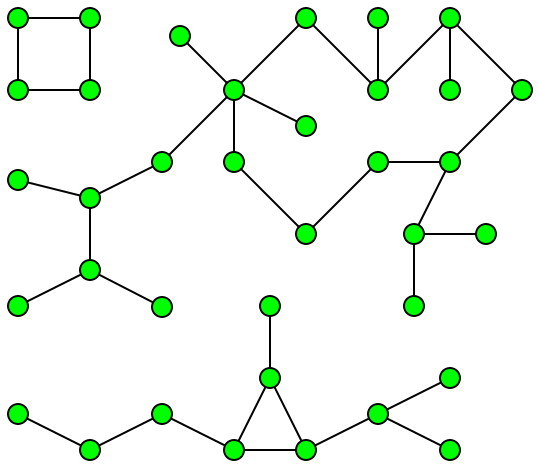
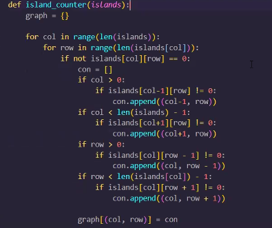
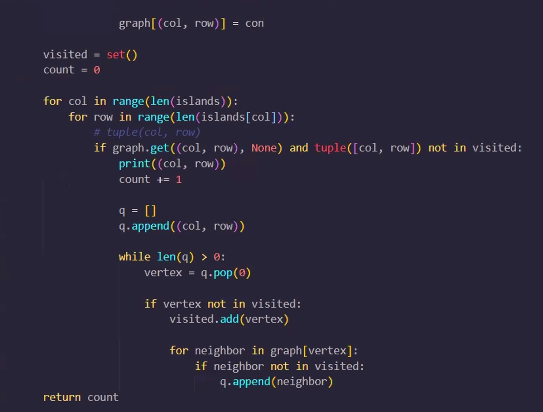
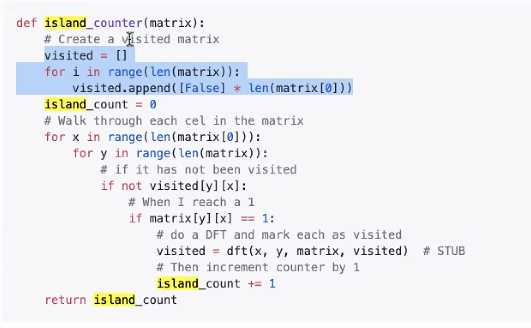
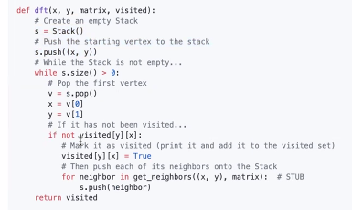
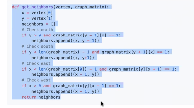

3. [Lecture III: Random Social Network](#Lecture-III-Random-Social-Network)  
    <br>a. [Pre-Class Resources](#Pre-Class-Resources)  
    <br>b. [Social Connections](#Social-Connections)  
    <br>c. [Populate Graph](#Populate-Graph)  
    <br>d. [Get Social Paths](#Get-Social-Paths)  
    <br>e. [Islands Algorithm](#Islands-Algorithm)   
    <br>
<br>

# Lecture III Random Social Network

_Note: these notes do not follow the CS18 lecture but instead, the CS19 lecture._

## Pre-Class Resources

[Graphs: Connected Components](https://youtu.be/EsyLzGWlsA8)  

[Follow Along Lecture Repo](https://github.com/LambdaSchool/Graphs/tree/master/objectives/randomness)  

[CS18 Earliest Ancestor, Island Matrix: Brady Fukumoto](https://www.youtube.com/watch?v=RPWUmNEOxpk)  

[CS19 Social Networks: Brian Doyle](https://youtu.be/g4HB6d1IhKk)  

<br>


## Social Connections

_CS19 Brian Doyle covers this at the end of Lecture II, while CS18 Brady Fukumoto covers this in Lecture IV_

We're tasked with building a bi-directional graph full of the connections between people, to determine the degrees of separation.

In our project repo, there are thorough directions. For now, the base file is copied into [here](lecture3.py). It starts with a Queue class, as well as a User and Social Graph, with some pre-made methods.

<br>

A `connected component` is a set of nodes that are all connected to one another but not the rest of the graph, like this isolated square:



<br>

Sometimes we'll need to find the sets of data that are connected components.

<br>

When we think about `random`, as people, we inherently try to apply patterns to keep things "even". But truly random data still has clusters and is unlikely to be evenly randomized.

When flipping a coin, there is a high liklihood of repetitive heads and tails -- even 6 in a row. If we were to mimic the flipping of a coin, we would tend to randomize _away from_ repetition, to keep a 50-50 pattern.

<br>
<br>

## Populate Graph

The file asks us to implement the populate graph method:

<br>

```
def populateGraph(self, numUsers, avgFriendships):
    """
    Takes a number of users and an average number of friendships
    as arguments

    Creates that number of users and a randomly distributed friendships
    between those users.

    The number of users must be greater than the average number of friendships.
    """
    # Reset graph
    self.lastID = 0
    self.users = {}
    self.friendships = {}
    # !!!! IMPLEMENT ME

    # Create friendships
    # numUsers * average number of friendships is how many we should create
    # n = total users * average friendships / 2

    # First generate all possible friendships (if user 1 is friends with everyone, 2-10; then, user 2 doesn't need to add user 1, but 3 -10, etc.. until every possible friendship that could be created is generated)
```

<br>

First, let's add our users:

<br>

```
# Add users
    for i in range(numUsers):
        self.addUser(f"User {i + 1}")
```

<br>

Next, let's generate all the possible friendships that could be created:

<br>

```
possibleFriendships = []

for userID in self.users:
    # range is inclusive (+1: start after ourselves) and exclusive (+1: must make range go to one beyond our final to add)
    for friendID in range(userID + 1, self.lastID + 1):

        # this creates a list of all possible friendships without duplicates
        possibleFriendships.append((userID, friendID))

        # we can see how many this is by printing the length
        print(len(possibleFriendships))
```

<br>

To imitate randomness, we should shuffle up the list:

<br>

```
# let's randomize this list. random.shuffle() randomizes the list and returns None
random.shuffle(possibleFriendships)
```

<br>

Let's now make a list of friendships to create that are randomly chosen out of our randomized list of _possible_ friendships. 

<br>

```
# Now we need to actually create users and assign them friendships at random
# random.sample(list, k) chooses k unique elements from list
friendshipsToCreate = random.sample(possibleFriendships, (numUsers * avgFriendships) // 2)
```

<br>

Finally, let's actually create the friendships:

<br>

```
# loop through possible friends and create the friendships
for friendship in friendshipsToCreate:
    # grabs person 1 and person 2 of the possible friendship tuples
    self.addFriendship(friendship[0], friendship[1])
```

<br>

An alternate way that could be written is like so:

<br>

```
for i in range(0, math.floor((numUsers * avgFriendships)//2)):
    friendship = possibleFriendships[i]
    self.addFriendship(friendship[0], friendship[1])
```

<br>

This results in roughly 2 average friendships per user, even though the friendships are randomly assigned (so some will have 3 or 4, and others only 1 or 2)

We also want to add a `repr` method so that we can view the friendships being added properly (otherwise they show as `set()` which isn't useful).

<br>

```
def __repr__(self):
    return f"Friendships: {self.friendships}"
```

<br>
<br>

## Get Social Paths

Given a userID, how can we find their extended friend network and the average degree of separation between them and their extended network?

We want to return a dictionary that contains the shortest path to each friend in their extended network. We are returning our connected componenets by seeking out the network of one user, that may show any isolated networks within the social graph.

When we hear _shortest path_, we know that we need to use BFS.

Using a dictionary, we can store the visited user as the key and the shortest path to them as the value.

First we need a queue, so let's grab the code and add it in (or import it, ideally).

<br>

```
class Queue():
    def __init__(self):
        self.queue = []
    def enqueue(self, value):
        self.queue.append(value)
    def dequeue(self):
        if self.size() > 0:
            return self.queue.pop(0)
        else:
            return None
    def size(self):
        return len(self.queue)
```

<br>

Our starting code looks like:

<br>

```
def getAllSocialPaths(self, userID):
    """
    Takes a user's userID as an argument

    Returns a dictionary containing every user in that user's
    extended network with the shortest friendship path between them.

    The key is the friend's ID and the value is the path.
    """
    visited = {}

    q = Queue()
    q.enqueue( [userID] )
```

<br>

Next, we need to add the BFS. It can be helpful to drop in the pseudocode outline to help fill it in, keeping in mind that we're working with a dictionary instead of a list.

While the queue is not empty, we'll dequeue the last item from the queue as the path. If that new user is not in visited, we'll set it as a key with the value set to the current path.

Next, we'll loop through the friends for that ID in self.friendships, checking if those IDs are already in visited. If it is not, we'll create a copy of the path, append that friendID to the path, and then enqueue the new path.

<br>

```
while q.sizze() > 0:
    path = q.dequeue()
    newUserID = path[-1]

    if newUserID not in visited:
        visited[newUserID] = path

        for friendID in self.friendships[newUserID]:
            if friendID not in visited:
                new_path = list(path)
                new_path.append(friendID)
                q.enqueue(new_path)
```

<br>


Now our dictionary is filling with the extended network and associated paths.

<br>

To create 100 users with an average of 10 friends each, how many times would you need to call `addFriendship()`? Why?

We could add a debug counter to check. It should run 500 times. 

> (100 users * 10 average friendships) // 2 = 500  

...which is the number of times the current solution calls addFriendship out of the possible pool of friendships.

<br>

If you create 1000 users with an average of 5 random friends each, what percentage of other users will be in a particular user's extended social network? What is the average degree of separation between a user and those in his/her extended network?

Again, we could add some debugging print statements and counters to check this:

<br>

```
debug_friendship = 0
for key in visited:
    debug_friendship += len(visited[key])

return f"Average degree of separation: {debug_friendship - 1 // len(visited)}. Number in extended network: {len(visited)}"
```

<br>

The length of visited tells us how many friends are in the user's extended network, which comes out to be 990+ each time, and the degree of separation is the length of each path to each extended friend, in total, divided by the number of friends in the extended network (minus themselves).

> Average degree of separation: 5415 // 993 = 5. Number in extended network: 993
>
> Average degree of separation: 5521 // 993 = 5. Number in extended network: 993
>
> Average degree of separation: 6324 // 994 = 6. Number in extended network: 994
>
> Average degree of separation: 5115 // 990 = 5. Number in extended network: 990
>

If we run this a few times, we see that the number of people in the extended network is always above 990 (99%) and the average degree of separation tends to be 5. Of course, because of the randomization of data, this will vary.

<br>
<br>


## Islands Algorithm

Let's tackle a problem:

<br>

```
Write a function that takes a 2D binary array and returns the number of 1 islands. 
An island consists of 1s that are connected to the north, south, east or west. 
Diagonals do not count.

For example:

islands = [[0, 1, 0, 1, 0],
           [1, 1, 0, 1, 1],
           [0, 0, 1, 0, 0],
           [1, 0, 1, 0, 0],
           [1, 1, 0, 0, 0]]

island_counter(islands) # returns 4
```

<br>

This is not an adjacency matrix. How can we go about solving this?

We can iterate through the matrix by rows and columns, checking for 1's (land). When a 1 is found, we'll look for neighbors that are also 1's and add them as connections, building a graph:



Then traverse the graph to find all "visited" land points, until all were found, incrementing the island counter once an island was fully traversed, like so:



The code is like so:

<br>

```
islands = [[0, 1, 0, 1, 0],
           [1, 1, 0, 1, 1],
           [0, 0, 1, 0, 0],
           [1, 0, 1, 0, 0],
           [1, 1, 0, 0, 0]]

def island_counter(islands):
    graph = {}

    for col in range(len(islands)):
        for row in range(len(islands[col])):
            if not islands[col][row] == 0:
                con = []
                if col > 0:
                    if islands[col-1][row] != 0:
                        con.append((col-1, row))
                if col < len(islands) - 1:
                    if islands[col+1][row] != 0:
                        con.append((col+1, row))
                if row > 0:
                    if islands[col][row - 1] != 0:
                        con.append((col, row - 1))
                if row < len(islands[col]) - 1:
                    if islands[col][row + 1] != 0:
                        con.append((col, row + 1))
                graph[(col, row)] = con

    visited = set()

    count = 0

    for col in range(len(islands)):
        for row in range(len(islands[col])):
            # tuple(col, row)
            if graph.get((col, row), None) and tuple([col, row]) not in visited:
                print((col, row))
                count += 1
                q = []
                q.append((col, row))
                while len(q) > 0:
                    vertex = q.pop(0)
                    if vertex not in visited:
                        visited.add(vertex)
                        for neighbor in graph[vertex]:
                            if neighbor not in visited:
                                q.append(neighbor)
    return count

print(island_counter(islands))
```

<br>

Brady Fukumoto also offered a DFS solution that creates a "visited" matrix using a nested for loop to traverse the rows and columns of the islands matrix. On each "found" land (1), he calls a DFS search to find the rest of the island, and increments the island counter.








<br>

See a tutorial that walks through DFS and BFS solutions [here](https://colorfulcodesblog.wordpress.com/2018/09/06/number-of-islands-tutorial-python/).  

<br>
<br>
