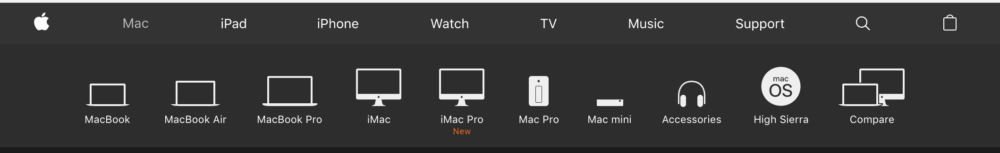

# React Router Apple Nav - Stretch Assignment

- [ ] Lets build out a navigation app that mimics `Apple's Slick Navigation` from their marketing website. At this point you have all the knowledge you'll need to be able to complete this stretch assignment.

## **NOTE** This repository is to be used as a Stretch Assignment

- [ ] Now that you have played around with Routing and have been building out some nested routes etc. It's time to get you into a little more practice. Remember that repetition is key.
- [ ] The idea here is to build out a replica of Apple's navigation.
- [ ] Build out a menu similar to the one on https://www.apple.com with a top level navigation.

## Project

- [ ] Use _create-react-app_ to make an application, name it `apple-nav`.
- [ ] You'll need to build out a few components here. Some variation of a `NavWrapper` component which will be your navigation header.
- [ ] Lastly you're going to need some sort of `SubNav` component, that will be reusable and display your sub-navigation links for each category.

### Stretch Problem

- [ ] Once you are finished with the Navigation and SubNavigation components you'll be able to look into ways to extend this application by adding some smooth transitions. Look into [this article](https://hackernoon.com/animated-page-transitions-with-react-router-4-reacttransitiongroup-and-animated-1ca17bd97a1a) for an example of how this can be achieved.

This example shows the sub-navigation for the `/mac` route.

