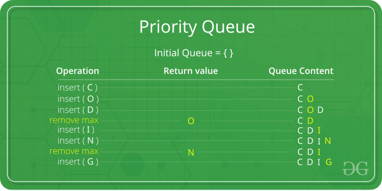

# Priority Queue

* Overview
* Applications
* Common Procedures
* Design & Implementation
* Implementation Examples

## Overview

*Priority Queue* is an extension of queue with the following properties:

1. Every item has a priority associated with it.
2. An element with high priority is dequeued before an element with low priority.
3. If two elements have the same priority, they are served according to their order in the queue.

> In this example, element with maximum ASCII value will have the highest priority.

## Applications

* CPU Scheduling
* Graph algorithms
  * Dijkstra's Shortest Path
  * Prim's Minimum Spanning Tree
  * etc...
* All queue applications where priority is involved.

## Common Procedures

* insert(item, priority)
* getHighestPriority()
* deleteHighestPriority()

## Design & Implementation

* Array Implementation
* Heap Implementation

### Array Implementation

* Simple implementation
* `insert` can be implemented by adding an item at end of array in `O(1)` time.

### Heap Implementation

* Better performanced compared to arrays or linked list.
* With a *Binary Heap*, `getHighestPriority()` can be implemented in `O(1)` time, `insert` in `O(log n)` time and `deleteHighestPriority()` can also be implemented in `O(log n)` time (**most common implementation**).
* With a *Fibonaci Heap*, `insert` and `getHighestPriority` can be implemented in `O(1)` amortized time and `deleteHighestPriority` in `O(log n)` amortzed time.

## Implementation Examples

### Java

`java.util` provides `PriorityQueue<E>` class that implements `Serializable`, `Iterable<E>`, `Collection<E>`, `Queue<E>` interfaces.

Some important points:

* It provides `O(log n)` time for `add` and `poll` methods.
* Doesn't permit `null`.
* Can't create PriorityQueue ob Objects that are non-comparable.
* Unbound queues.
* If multiple elements are tied for least value, ties are broken arbitrarily.
* Is not thread-safe (Java provides `PriorityBlockingQueue` class that implements the `BlockingQueue` interface).

See more examples in my [Datastructures in Java repository]((https://github.com/herrera-ignacio/datastructures-in-java/tree/master/src/main/java/linear/queue)
