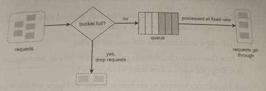

# Leaking Bucket

* Overview
* Pros
* Cons

## Overview

> *Shopify* uses leaky buckets for rate-limiting.

* When a request arrives, the system checks if the queue is full. **If it is not full, the request is added to the queue**. Otherwise, the request is dropped. **Requests are pulled from the queue and processed at regular intervals**.

* It takes two parameters:
  * *Bucket size*: It is equal to the queue size. The queue holds the requests to be processed at a fixed rate.
  * *Outflow rate*: It defines how many requests can be processed at a fixed rate, usually in seconds.

* Similar to the *Token Bucket* algorithm except that **requests are processed at a fixed rate**.

* It is usually implemented with a **FIFO queue**.

## Pros

* Memory efficient given the limited queue size.

* Requests are processed at a fixed rate and therefore it is suitable for use cases that a stable outflow rate is needed.

## Cons

* A burst of traffic fills up the queue with old requests, and if they are not processed in time, recent requests will be rate limited.

* It might not be easy to tune *bucket size* and *outflow rates* parameters properly.
