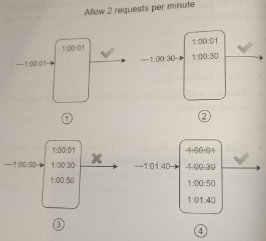

# Sliding Window Log

## Overview

*Sliding Window Log* algorithms solves the major issue if *fixed window counter* that allows more requests to go through at the edges of a window.

* It **keeps track of request timestamps**. Timestamp data is usually kept in cache, such as sorted sets of Redis. **When a new request comes in, remove all the outdated timestamps and add timestamp of the new request to the log**. Outdated timestamps are defined as those older than the start of the current time window. If the log size is the same or lower than the allowed count, a request is accepted. Otherwise, it is rejected.

### Example

1. Log is empty when a new request arrives at 1:00:01. Thus, the request is allowed.

2. A new request arrives at 1:00:30, the timestmap 1:00:30 is inserted into the log. After the insertion, the log size is 2, not larger than the allowed count. Thus, the request is allowed.

3. A new request arrives at 1:00:50, and the timestamp is inserted into the log. After the insertion, the log size is 3, larger than the allowed size 2. Therefore, this request is rejected even though the timestamp remains in the log.

4. A new request arrives at 1:01:40. Requests in the range \[1:00:40, 1:01:40) are within the latest time frame, but requests sent before 1:00:40 are outdated. Two outdated timestamps, 1:00:1 and 1:00:30, are removed from the log. After the remove operation, the log size becomes 2; therefore, the request is accepted.

## Pros

Rate limiting implemented by this algorithm is **very accurate**. In any rolling window, **requests will not exceed the rate limit**.

## Cons

It **consumes al ot of memory** because even if a request is rejected, its timestamp might still be stored in memory.
