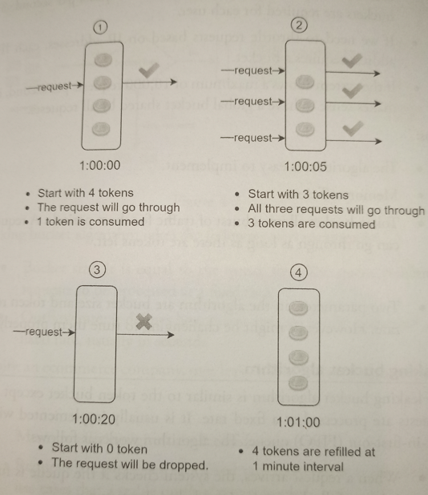

# Token Bucket Algorithm

* Overview
* Pros
* Cons

## Overview

Token Bucket is widely used due to its simplicity.

> Both *Amazon* and *Stripe* use this algorithm to throttle their API requests.

* A token bucket is a **container that has a pre-defined capacity**. The tokens are put in the bucket at preset rates peridocially. Once the bucket is full, no more tokens are added.

* **Each request consumes one token**. When a request arrives, we check if there are enough tokens in the bucket.
  * If there are enough tokens, we take one token out for each request, and the request goes through.
  * If there are not enough tokens, the request is dropped.

* The token bucket **takes two parameters**:
  * *Bucket size*: the maximum number of tokens allowed in the bucket.
  * *Refill rate*: number of tokens put into the bucket every second.

* How many buckets do we need? This varies, and it depends on the rate-limiting rules and use cases. Here are a few examples:
  * It is usually necessary to have different buckets for different API endpoints. For instance, if a user is allowed to make 1 post per second, add 150 friends per day, and like 5 posts per second, 3 bucket are required for each bucket.
  * If we need to throttle requests based on IP addresses, each IP address requires a bucket.
  * If the system allows a maximum of 10,000 requests per second, it makes sense to have a global bucket shared by all requests.

## Pros

* Easy to implement.

* Memory efficient.

* Allows a burst of traffic for short periods. A request can go trough as long as there are tokens left.

## Cons

* Two parameters are bucket size and token refill rate. It might be challenging to tune them properly.
