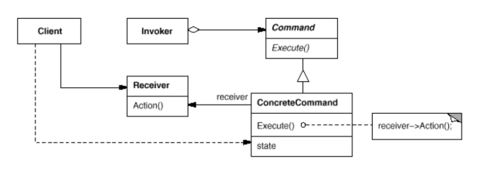
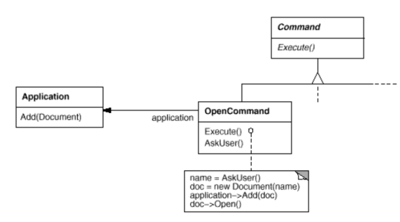
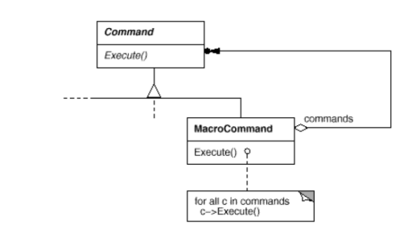

# Command

Also known as __Action__, __Transaction__.

## Intent

Encapsulate a request as an object, thereby letting you parameterize clients with different requests, queue or log requests, and support undoable operations.

## Applicability

Use the __Command__ pattern when you want to:

* Parameterize objects by an action to perform. Commands are an object-oriented replacement for a __callback__ (function that's registered somewhere to be called at a later point) in procedural languages.

* Specify, __queue__, and execute requests at different times.

* Support __undo__. A Command's `Execute` operaiton can store state for reversing its effects in the command itself. The Command interface must have an added `Unexecute` operation that reverses the effects of a previous call to `Execute`.

* Support __logging changes__ so that they can be reapplied in case of a system crash. You can augment Command interface with `load` and `store` operations, so you can keep a persistent log of changes.

* Structure a system around high-level operations built on primitive operations. Such a structure is common in information systems that support __transactions__, which encapsuulates a set of changes to data. The _Command_ pattern offers a way to model transactions.

## Collaboration

* The client creates a `ConcreteCommand` object and specifies its receiver.

* An `Invoker` object stores the `ConcreteCommand` object.

* The `Invoker` object issues a request by calling `Execute` on the command. When commands are undoable, `CocreteCommand` stores state for undoing the command prior to invoking `Execute`.

* The `ConcreteCommand` object invokes operations on its receiver to carry out the request.

## Consequences

1. _Command_ decouples the object that invokes the operation from the one that knows how to peform it.

2. _Commands_ are first-class objects. They can be manipulated and extended like any other object.

3. You can assemble commands into a _Composite Command_. In general, composite commands are an instance of the _Composite_ pattern.

4. It's easy to add new _Commands_, because you don't have to change existing classes.

## Related Patterns

* A _Composite_ can be used to implement _MacroCommands_.

* A _Memento_ can keep state the command requires to undo its effect.

* A _command_ that must be copied before being placed on the history list acts as a _Prototype_.

## Implemenation

1. __How intelligent should a command be?__ At one extreme it merely defines a binding between a receiver and the actions that carry out the request. At the other extreme it implements everything itself without delegating to a receiver at all. The latter extreme is useful when you want to define commands that are independent of existing classes, when no suitable receiver exists, or when a command knows its receiver implicitly. Somewhere in between these extremes are commands that have enough knowledge to find their receiver dynamically.

2. __Supporting undo and redo__. `ConcreteCommand` class might need to store additional state to do so:
  * `Receiver` object, which actually carries out operations.
  * Arguments to the operation performed on the receiver.
  * Any original values in the receiver that can changge as a result of handling the request. Receiver must provide operations that let the command return the receiver to is prior state.

3. __Avoiding error accumulation in the undo process__. Hysteresis can be a problem in ensuring a reliable, semantics-preserving undo/redo mechanism. Errors can accumulate as commands are executed, unexecuted, and reexecuted repeatedly so that an application's state eventually diverges from original values. It may be necessary therefore to store information in the command to ensure that objects are restored to their original state. The _Memento_ pattern can be applied to give the command access to this information without exposing the internals of other objects.

4. __Using C++ templates__. For commands that aren't undoable and don't require arguments, we can use C++ templates to avoid creating a `Command` subclass for every kind of action and receiver.

## Motivation

Sometimes it's necessary to issue requests to objects without knowing anything about the operation being requested or the receiver of the request.

For example, user interface toolkits include objects like buttons and menus that carry out a request in response to user input. But the toolkit can't implement the request explicitly in the button or menu, because only applications that use the toolkit know what should be done on which object. As toolkit designers we have no way of knowing the receiver of the request or the operations that will carry it out.

The _Comamnd_ pattern lets toolkit objects make requests to unsepcified application objects by turning the request itself into an object. This object can be stored and passed around like other objects. The key to this pattern is an abstract `Command` class, which declares an interface for executing operations. In the simplest form this interface includes an abstract `Execute` operation. Concrete `Command` subclasses specify a _receiver-action_ pair by storing the receiver as an instance variable and by implementing `Execute` to invoke the request. The receiver has the knowledge required to carry out the request.

Menus can be implemented easily with `Command` objects. Each choice in a `Menu` is an instance of a `MenuItem` class. An `Application` class creates these menus and their menu items along with the rest of the user interface. The `Application` class also keeps track of `Document` objects that a user has opened.

The application configures each `MenuItem` with an instance of a concrete `Command` subclass. When the user selects a `MenuItem`, the `MenuItem` calls  `Execute` on its command, and `Execute` carries out the operation. `MenuItems` don't know which subclass of `Command` they use. `Command` subclasses store the receiver of the request and invoke one or more operations on the receiver.

For example, `PasteCommand` supports pasting text from the clipboard into a `Document`. `PasteCommand`'s receiver is the `Document` object it is supplied upon instantiated. The `Execute` operation invokes `Paste` on the receiving `Document`.

`OpenCommand`'s `Execute` operation is different: it prompts the user for a document name, creates a corresponding `Document` object, adds the document to the receiving application, and opens the document.

Sometimes a `MenuItem` needs to execute a _sequence_ of commands. For example, a `MenuItem` centering a page at normal size could be constructed from a `CenterDocummentCommand` objewct and a `NormalSizeCommand` object. Because it's common to string commands together in this way, we can define a `MacroCommand` to allow a `MenuItem` to execute an open-ended nubmer of commands. `MacroCommand` is a concrete `Command` aubclass that simply executes a sequence of Commands. `MacroComman` has no explicit receiver, because the commands it sequences define their own receiver.

In each of these examples, notice how the _Command_ pattern decouples the object that invokes the operation from the one having the knowledge to perform it. This gives us a lot of flexibility in designing our user interface. An application can provide both a menu and a push botton interface to a feature just by making the menu and the push button share an instance of the same concrete `Command` subclass. We can replace commands dynamically, which would be useful for implementing context-sensitive menus. We can also support command scripting by composing commands into larger ones. All of this is possible because the object that issues a request only needs to know how to issue it, it doesn't need to know how the request will be carried out.
