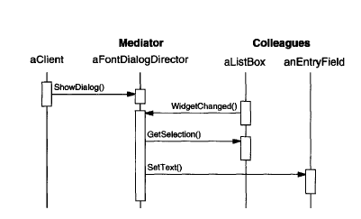
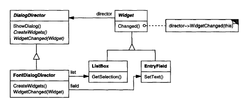

# Mediator

## Intent

Encapsulate how a set of objects interact. Mediator promotes loose coupling by keeping objects from referring to each other explicitly, and it lets you vary their interaction independently.

## Applicability

Use the __Mediator__ pattern when:

* A set of objecs communicate in well-defined but complex ways. The resulting interdependencies are unstructured and difficult to understand.

* Reusing an object is difficult because it refers to and communicates with many other objects.

* A behavior that's distributed between several classes should be customizable without a lot of subclassing.

## Collaborations

* Colleagues send and receive requests from a `Mediator` object.

* The mediator implements the cooperative behavior by routing requests between the appropriate colleague(s).

## Consequences

1. __It limits subclassing__: A mediator localizes behavior that otherwise would be distributed among several objects. Changing this behavior requires subclassing `Mediator` only. `Colleague` classes can be reused as is.

2. __It decouples colleagues__. A mediator promotes loose coupling between colleagues. You can vary and reuse `Colleague` and `Mediator` classes independently.

3. __It simplifies object protocols__. A mediator replaces many-to-many interactions with one-to-many interactions between the mediator and its colleagues. This relation is easier to understand, maintain, and extend.

4. __It abstracts how objects cooperate__. Making mediation an independent concept and encapsulating it in an object lets you focus on how objects interact apart from their individual behavior. That can help you clarify how objects interact in a system.

5. __It centralizes control__. The _Mediator_ pattern trades complexity of interaction for complexity in the mediator. Because a mediator encapsulates protocols, it can become more complex than any individual colleague. This can make the mediator itself a monolith that's hard to maintain.

## Related Patterns

* _Facade_ differs from _Mediator_ in that it abstracts a subsystem of objects to provide a more convenient interface. Its protocol is unidirectional, that is, _Facade_ objects make requests of the subsystem classes but not vice versa. In contrast, _Mediator_ enables cooperative behavior that coleague objects don't or can't provide, and the protocol is multidirectional.

* Colleagues can communicate with the mediator using the _Observer_ pattern.

## Implementation

1. __Omitting the abstract Mediator class__. There's no need to define an abstract `Mediator` class when colleagues work with only one mediator. The abstract coupling that the `Mediator` class provides lets colleagues work with different `Mediator` subclasses, and vice versa.

2. __Colleague-Mediator communication__. Colleagues have to communicate with their mediator when an event of interest occurs. One approach is to implement the _Mediator_ as an _Observer_. Colleague classes act as _Subjects_, sending notifications to the mediator whenever they change state. The mediator responds by propagating the effects of the change to other colleagues. Another approach defines a specialized notification interface in _Mediator_ that lets colleagues be more direct in their communication. Smalltalk/V for Windows uses a form of delegation: when communicating with the mediator, a colleague passes itself as an argument, allowing the mediator to identify the sender.

## Motivation

Object-oriented design encourages the distribution of behavior among objects. Such distribution can result in an object structure with many connections between objects, in the worst case, every object ends up knowing about every other.

> Though partitioning a system into many objects generally enhances reusability, proliferating interconnections tend to reduce it again. Lots of interconnections make it less likely that an object can work without the support of others (the system acts as though it were monolithic). Moreover, it can be difficult to change the system's behavior in any significant way, since behavior is distributed among many objects. As a result, you may be forced to define many subclasses to customize the system's behavior.

As an example, consider the implementation of dialog boxes in a graphical user interface. A dialog box uses a window to present a collection of widgets such as buttons, menus, and entry fields.

Often there are dependencies between the widgets in the dialog. For example, a button gets disabled when a certain entry field id empty. Selecting an entry in a list of chhoices called a _list box_ might change the contents of an entry field. Conversely, typing text into the entry field might automatically select one or more corresponding entries in the list box. Once text appears in the entry field, other buttons may become enabled that let the user do something with the text, such as changing or deleting the thing to which it refers.

Different dialog boxes will have different dependencies between widgets. So even though dialogs display the same kinds of widgets, they can't simply reuse stock widget classes, they have to be customized to reflect dialog-specific dependencies. Customizing them individually by subclassing will be tedious, since many classes are involved.

> You can avoid these problems by encapsulating collective behavior in a separate __mediator object__. A mediator is responsible for controlling and coordinating the interactions of a group of objects. The mediator serves as an intermediary that keeps objects in the group from referring to each other explicitly. The objects only know the mediator, thereby reducing the number of interconnections.

For example, `FontDialogDirector` can be the mediator between the widgets in a dialog box. A `FontDialogDirector` object knows the widgets in a dialog and coordinates their interaction. It acts as a hub of communication for widgets:

The following interaction diagram illustrates how the objects cooperate to handle a change in a list box's section:

1. The list box tells its director that it's changed.

2. The direction gets the selection from the list box.

3. The director passes the selection to the entry field.

4. Now that the entry field contains some text, the director enables button(s) for initiating an action (e.g, "oblique", "bold").

Note how the director mediates between the list box and the entry field. Widgets communicate with each other only indirectly, through the director. They don't have to know about each other, all they know is the director. Furthermore, because the behavior is localized in one class, it can be changed or replaced by extending or replacing the class.

Here's how the `FontDialogDirector` abstraction can be integrated into a class library:

`DialogDirector` is an abstract class that defines the overall behavior of a dialog. Clients call the `ShowDialog` operations to display the dialog on the screen. `CreateWidgets` is an abstract operation for creating the widgets of a dialog. `WidgetChanged` is another abstract operation, widgets call it to inform their director that they have changed. `DialogDirector` subclasses override `CreateWidgets` to create the proper widgets, and they override `WidgetChanged` to handle the changes.
