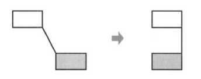

# Memento

Also kwown as __Token__.

## Intent

Without violating encapsulation, capture and externalize an object's internal state so that the object can be restored to this state later.

## Applicability

Use the __Memento__ pattern when:

* A snapshot of an object's state must be saved so that it can be restored later, _and_

* A direct interface to obtaining the state would expose implementation details and break the object's encapsulation.

## Collaborations

* A caretaker requests a memento from an originator, holds it for a time, and passes it back to the originator. Sometimes the caretaker won't pass the memento back to the originator, because the originator might never need to revert to an earlier state.

* Mementos are passive. Only the originator that created a memento will assign or retrieve its state.

## Consequences

1. __Preserving encapsultion boundaries__. Memento avoids exposing information that only an originator should manage but that must be stored nevertheless outside the originator.

2. __Simplifies Originator__. In other encapsulation-preserving designs, `Originator` keeps the versions of internal state that clients have requested. That puts all the storage management burden on `Originator`. Having clients manage the state they ask for simplifies Originator and keeps clients from having to notify originators when they're done.

3. __Using mementos might be expensive__. Mementos might incur considerable overhead if `Originator` must copy large amounts of information to store in the memento or if clients create and return mementos to the originator often enough. Unless encapsulating and restoring Originator state is cheap, this pattern might not be appropriate.

4. __Defining narrow and wide interfaces__. It may be difficult in some languages to ensure that only the originator can access the memento's state.

5. __Hidden costs in caring for mementos__. A caretaker is responsible for deleting the mementos it cares for. However, the caretaker has no idea how much state is in the memento. Hence an otherwise lightweight caretaker might incur large storage costs when it stores mementos.

## Related Patterns

* _Commands_ can use mementos to maintain state for undoable operations.

* _Iterator_: mementos can be used to capture the state of an iteration.

## Implementation

1. __Language support__. Mementos have two interfaces, a wide one for _originators_ and a narrow one for other _objects_. Ideally the implementation language will support two levels of static protection. C++ lets you do this by making the `Originator` a friend of `Memento` and by making `Memento`'s wide interface private. Only the narrow interface should be declared public. This way, `Memento`'s private members are accessible only to `Originator` and its state doesn't break encapsulation.

2. __Storing incremental changes__. When mementos get created and passed back to their originator in a predictable sequence, then `Memento` can save just the _incremental change_ to the originator's internal state.

## Motivation

Sometimes it's necessary to record the internal state of an object. This is required when __implementing checkpoints and undo mechanisms__ that let users back out of tentative operations or recover from errors. You must save state information somewhere so that you can restore objects to their previous states. But objects normally encapsulate some or all of their state, making it inaccessible to other objects and imposible to save externally. Exposing this state would violate encapsulation, which can compromise the application's reliability and extensibility.

Consider for example a graphical editor that supports connectivity between objects. A user can connect two rectangles with a line, and te rectangles stay connected when the user moves either of them. The editor ensures that the line stretches to maintain the connection.

A well-known way to maintain connectivity relationships between objects is with a constraint-solving system. We can encapsulate this functionality in a `ConstraintSolver` object. `ConstraintSolver` records connections as they are made and generates mathematical equations that describe them. It solves these equations whenever the user makes a connection or otherwise modifies the diagram. `ConstraintSolver` uses the results of its calculations to rearrange the graphics so that they maintain the proper connections.

Supporting undo in this application isn't as easy as it may seem. An obvious way to undo a move operation is to store the original distance moved and move the object back an equivalent distance. However, this does not guarantee all objects will appear where they did before. Suppose there is some slack in the connection. In that case, simply moving the rectangle back to its original location won't necessarily achieve the desired effect.

In general, the `ConstraintSolver`'s public interface might be insufficient to allow precise reversal of its effects on other objects. The undo mechanism must work more closely with `ConstraintSolver` to reestablish previous state, but we should also avoid exposing the `ConstraintSolver`'s internals to the undo mechanism.

We can solve this problem with the _Memento_ pattern.

> A __memento__ is an object that stores a snapshot of the internal state of another object (the memento's __originator__). The undo mechanism will request a memento from the originator when it needs to checkpoint the originator's state. The originator initializes the memento with information that characterizes its current state. Only the originator can store and retrieve information from the memento (the memento is "_opaque_" to other objects).

In the graphical editor example just discussed, the `ConstraintSolver` can act as an originator. The following sequence of events characterizes the undo process:

1. The editor requests a memento from the `ConstraintSolver` as a side-effect of the move operation.

2. The `ConstraintSolver` creates and returns a memento, an instance of a class `SolverState` in this case. A `SolverState` memento contains data structures that describe the current state of the `ConstraintSolver`'s internal equations and variables.

3. Later when the user undoes the move operation, the editor gives the `SolverState` back to the `ConstraintSolver`.

4. Basd on the information in the `SolverState`, the `ConstraintSolver` changes its internal structures to return its equations and variables to their exact previous state.

This arrangement lets the `ConstraintSolver` entrust other objects with the information it needs to revert to a previous state without exposing its internal structure and representations.
