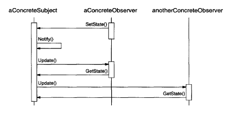
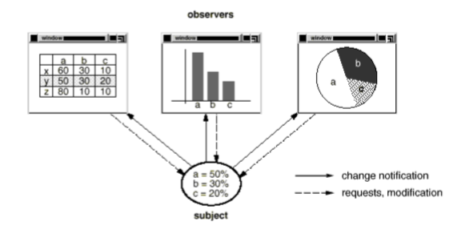

# Observer

Also known as _Dependents_, _Publish-Subscribe_.

## Intent

Define a one-to-many dependency between objects so that when object changes state, all its dependents are notified and updated automatically.

## Applicability

Use the __Observer__ pattern in any of the following situations:

* When an abstraction has two aspects, one dependent on the other. Encapsulating these aspects in separate objects lets you vary and reuse them independently.

* When a change to one object requires changing others, and you don't know how many objects need to be changed.

* When an object should be able to notify other objects without making assumptions about who these objets are.

## Collaborations

* `ConcreteSubject` notifies its observers whenever a change occurs that could make its observers' state incosistent with its own.

* After being informed of a change in the `ConcreteSubject`, a `ConcreteObserver` object may query the subject for information. `ConcreteObserver` uses the information to reconcile its state with that of the subject.

### Change-Manager Implementation

## Consequences

The _Observer_ pattern lets you vary subjects and observers independently. You can use the subjects without reusing their observers, and vice versa. It lets you add observers without modifying the subject or other observers.

1. __Abstract coupling between Subject and Observer__. All a subject knows is that it has a list of observers, each conforming to the simple interface of the abstract _Observer_ class. The subject doesn't know the concrete class of any observer. Thus the coupling between subjects and observers is abstract and minimal. Thus, `Subject` and `Observer` can belong to different layers of abstraction in a system. A lower-level sunject can communicate and inform a higher-level observer, thereby keeping the system's layering intact.

2. __Support for broadcast communication__. Unlike an ordinary request, the notification that a subject sends needn't specify its receiver. The notification is broadcast automatically to all interested objects that subscribed to it. This gives you the freedom to add and remove observers at any time. It's up to the observer to handle or ignore a notification.

3. __Unexpected updates__. Because observers have no knowledge of each other's presence, they can be blind to the ultimate cost of changing the subjcet. A seemingly innocuous operation on the subject may cause a cascade of updates to observers and their dependent objects. Moreover, dependency criteria that aren't well-defined or maintained usually lead to spurious updates, which can be hard to track down. This problem is aggravated by the fact that the simple update protocol provides no details on _what_ changed in the subject. Without additional protocol to help observers discover what changed, they may be forced to work hard to deduct the changes.

## Related Patterns

* _Mediator_: By encasuplating complex update semantics, the `ChangeManager` acts as a mediator between subjects and observers.

* _Singleton_: The `ChangeManager` may use the _Singleton_ pattern to make it unique and globally accessible.

## Implementation

1. __Mapping subjects to their observers__. The simplest way for a subject to keep track of the observers it should notify is to store references to them explicitly in the subject. However, such storage may be too expensive when there are many subjects and few observers. One solution is to trade space for time by using an associative look-up (e.g., a hash table) to maintain the subject-to-observer mapping. Thus a subject with no observers does not incur storage overhead. On the other hand, this approach increases the cost of accessing the observers.

2. __Observing more than one subject__. It might make sense in some situations for an observer to depend on more than one subject. For example, a spreadsheet may depend on mroe than one data source. It's necessary to extend the `Update` interface in such cases to let the observer know _which_ subject is sending the notification. The subject can simply pass itself as a parameter in the `Update` operation, thereby letting the observer know which subject to examine.

3. __Who triggers the update?__ The subject and its observers rely on the notification mechanism to stay consistent. But what object actually calls `Notify` to trigger the update?
    * Have state-setting operations on `Subject` call `Notify` after they change the subject's state. The advantage of this approach is that clients don't have to remember to call `Notify` on the `Subject`. The disadvantage is that several consecutive operations will cause several consecutive updates, which may be inefficient.
    * Make clients responsible for calling `Notify` at the right time. The advantage here is that the client can wait to trigger the update until after a series of state changes has been made, thereby avoiding needless intermediate updates. The disadvantage is that clients have an added responsibility to trigger the update. That makes errors more likely, since clients might forget to call `Notify`.

4. __Dangling references to deleted subjects__. Deleting a subject should not produce dangling references in its observers. One way to avoid dangling references is to make the subject notify its observers as it is deleted so that they can reset their reference to it. In general, simply deleting the observers it not an option, because other objects may reference them, or they may be observing other subjects as well.

5. __Making sure Subject state is self-consistent before notification__. It's important to make sure `Subject` state is self-consistent before calling `Notify`, because observers query the subject for its current state in the course of updating their own state. This self-consistency rule is easy to violate unintentionally when `Subject` subclass operations call inherited operations, that trigger a notification, as part of an own operation, thus updating subclass state after the notification has been sent. You can avoid this pitfall by sending notifications from template methods (see _Template Method_ pattern) in abstract `Subject` classes. Define a primitive operation for subclasses to override, and make `Notify` the last operation in the template method, which will ensure that the object is self-consistent when subclasses override `Subject` operations. __It's always a good idea to document which `Subject` operations trigger notifications__.

6. __Avoiding observer-specific update protocols: the push and pull models__. Implementations of the _Observer_ pattern often have the subject broadcast additional information about the change. The subject passes this information as an argument to `Update`. The amount of information may vary widely. At one extreme, which we call the __push model__, the subject sends observers datailed information about the change, whether they want it or not. At the other extreme is the __pull model__, the subject sends nothing but the most minimal notification, and observers ask for details explicitly thereafter. The __pull model__ emphasizes the subject's ignorance of its observers, whereas the __push model__ assumes subjects know something about their observers' needs. The __push model__ might make observers less reusable, because `Subject` classes make assumptions about `Observer` classes that might not always be true. On the other hand, the __pull model__ may be inefficient, because `Observer` classes must ascertain what changed without help from the `Subject`.

7. __Specifying modifications of interest explicitly__. You can improve update efficiency by extending the subject's registration interface to allow registering observers only for specific events of interest. When such an event occurs, the subject informs only those observers that have registered interest in that event. One way to support this uses the notion of __aspects__ for `Subject` objects. To register interest in particular events, observers are attached to their subject using `void Subject::Attach(Observer*, Aspect& interest);` where `interest` specifies the event of interest. At notification time, the subject supplies the changed aspect to its observers as a parameter to the `Update` operation.

8. __Encapsulating complex update semantics__. When the dependency relationship between subjects and observers is particularly complex, an object that maintains these relationships might be required. We call such an object a __Change-Manager__. Its purpose is to minimize the work required to make observers reflect a change in their subject. For example, if an operation involves changes to several interdependent subjects, you might have to ensure that their observers are notified only after _all_ the subjects have been modified to avoid notifying observers more than once.
    * Maps a subject to its observers and provides an interface to maintain this mapping. This eliminates the need for subjects to maintain references to their observers and vice versa.
    * Defines a particular update strategy.
    * It updates all dependent observers at the request of a subject.

9. __Combining the Subject and Observer classes__. Class libraries written in languages that lack multiple inheritance generally don't define separate `Subject` and `Observer` classes but combine their interfaces in one class. That lets you define an object that acts as both a subject and an observer without multiple inheritance.

## Motivation

> A common side-effect of partitioning a system into a collection of cooperating classes is the need to maintain consistency between related objects. You don't want to achieve consistency by making the classes tightly coupled, because that reduces their reusability.

For example, many graphical user interface toolkits separate the presentational aspects of the user interface from the underlying application data. Classes defining application data and presentations can be reused independently. They can work together, too. Both a spreadsheet object and bar chart object can depict information in the same application data object using different presentations. The spreadsheet and the bar chart don't know about each other, thereby letting you reuse only the one you need. But they _behave_ as though they do. When the user changes the information in the spreadsheet, the bar chart reflects the changes immediately, and vice versa.

This behavior implies that the spreadsheet and bar chart are dependent on the data object and therefore should be notified of any change in its state. And there's no reason to limit the number of dependent objects to two.

> The Observer pattern describes how to establish these relationships. The key objects in this pattern are __subject__ and __observer__. A subject may have any number of dependent observers. All observers are notified whenever the subject undergoes a change in state. In response, each observer will query the subject to synchronize its state whith the subject's state.

> This kind of interaction is also known as __publish-subscribe__. The subject is the publisher of notifications. It sends out these notifications withoug having to know who its observers are. Any number of observers can subscribe to receive notifications.
