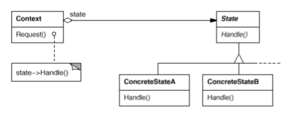

# State

Also known as _Objects for States_.

## Intent

Allow an object to alter its behavior when its internal state changes. The object will appear to change its class.

## Applicability

Use the __State__ pattern in either of the following cases:

* An object's behavior depends on its state, and it must change its behavior at run-time dependending on that sate.

* Operations have large, multipart conditional statements that depend on the object's state. This state isusually represented by one or more enumerated constants. Often, several operations will contain this same conditional structure. The State pattern puts each branch of the conditional in a separate class. This lets you treat the object's state as an object in its own right that can vary independently from other objects.

## Collaborations

* `Context` delegates state-specific requests to the current `ConcreteState` object.

* A context may pass itself as an argument to the `State` object handling the request. This lets the `State` object access the context if necessary.

* `Context` is the primary interface for clients. Clients can configure a context with `State` objects once a context is configured, its clients don't have to deal with the `State` objects directly.

* Either `Context` or the `ConcreteState` subclasses can decide which state succeeds another and under what circumstances.

## Consequences

1. __It localizes state-specific behavior and partitions behavior for different states__. Because all state-specific code lives in a `State` subclass, new states and transitions can be added easily by defining new subclasses. This increases he number of classes and is less compact than a single class, but such distribution is actually good if there are many states, which would otherwise necessitate large conditional statements.

2. __It makes state transitions explicit__. When an object defines its current state solely in terms of internal data values, its state transitions have no explicit representation, they only show up as assignments to some variables. Introducing separate objects for different states makes the transitions more explicit. Also, `State` objects can protect the `Context` from inconsistent internal states, because state transitions are atomic from the `Context`'s perspective, they happen by rebinding _one_ variable, not several.

3. __State objects can be shared__. If `State` objects have no instance variables, that is the state they represent is encoded entirely in their type, then contexts can share a `State` object. When states are shared in this way, they are essentially _Flyweights_ with no intrinsic state, only behavior.

## Related Patterns

* The _Flyweight_ pattern explains when and how _State_ objects can be shared.

* _State_ objects are often _Singletons_.

## Implementation

1. __Who defines the state transitions?__ if the criteria are fiex, then they can be implemented entirely in the `Context`. It is generally more flexbiel and appropriate, however, to let the `State` subclasses themselves specify their successor state and when to make the transition. This requires adding an interface to the `Context` that lets `State` objects set the `Context`'s current state explicitly. Decentralizing the transition logic in this way makes it easy to modify or extend the logic by defining new `State` subclasses. A disadvantage of decentralization is that one `State` subclass will have knowledge of at least one other, which introduces implementation dependencies between subclasses.

2. __A table-based alternative__. A state-driven code can be imposed by using a tables to map inputs to state transitions. For each state, a table maps every possible input to a succeeding state. In effect, this approach converts conditional code (and virtual functions, in the case of the _State_ pattern) into a table look-up. The main advantage of tables is their __regularity__, you can change the transition criteria by modifying data instead of changing program code. There are some disadvantages however:
  * A table look-up is often less efficient than a (virtual) function call.
  * Putting transition logic into a uniform, tabular format makes the transition criteria less explicit and therefore harder to understand.
  * It's usually difficult to add actions to accompany the state transitions. The table-driven approach captures the states and their transitions, but it must be augmented to perform arbitrary computation on each transition.
  * The _State_ pattern models _state-specific behavior_, whereas the _table-driven approach focuses on defining state transitions_.

3. __Creating and destroying State objects__. A common implementation trade-off worth worth considering is whethert to create `State` objects only when they are needed and destroy them thereafter versus creating them ahead of time and never destroying them. The first choice is preferable when the states that will be entered aren't known at run-time, _and_ contexts change state infrequently. This approach avoids creating objects that won't be used, which is important if the `State` objects store a lot of information. The second approach is better when state changes occur rapidly, in which case you want to avoid destroying states, because they may be needed again shortly. Instantiation costs are paid once up-front, and there are no destruction costs at all.

4. __Using dynamic inheritance__. Changing the behavior for a particular request could be accomplished by changing the object's class at run-time, but this is not possible in most object-oriented languages. Exceptions include _Self_ and other delegation-based languages that provide such a mechanism and hence support the _State_ pattern directly. Objects in _Self_ can delegate operations to other objects to achieve a form of dynamic inheritance. Changing the delegation target at run-time effectively changes the inheritance structure. This mechanism lets objects change their behavior and amounts to changing their class.

## Motivation

Consider a class `TCPConnection` that represents a network connection. A `TCPConnection` object can be in one of several different states: _Established, Listening, Closed_. When a `TCPConnection` object receives requests from other objects, it responds differently depending on its current state. For example, the effect of an `Open` request depends on whether the connection is in its _Closed_ state or its _Established_ state. The _State_ pattern describes how `TCPConnection` can exhibit different behavior in each state.

The key idea in this pattern is to introduce an abstract class called `TCPState` to represent the states of the network connection. The `TCPState` class declares an interface common to all classes that represent different operational states. Subclasses of `TCPState` implement state-specific behavior. For example, the classes `TCPEstablished` and `TCPClosed` implement behavior particular to the _Established_ and _Closed_ states of `TCPConnection`.

The class `TCPConnection` maintains a __state object__ (an instance of a subclass of `TCPState`) that represents the current state of the TCP connection. The class `TCPConnection` delegates all state-specific requests to this state object. `TCPConnection` uses its `TCPState` subclass instance to perform operations particular to the state of the connection.

Whenever the connection changes state, the `TCPConnection` object changes the state object it uses. When the connection goes from _Established_ to _Closed_, for example, `TCPConnection` will replace its `TCPEstablished` instance with a `TCPClosed` instance.
