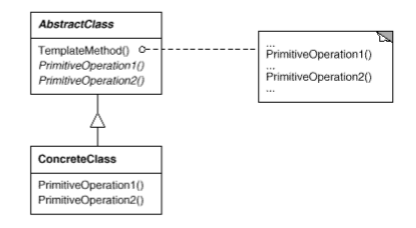
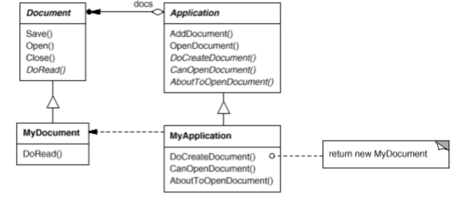

# Template Method

## Intent

Define the skeleton of an algorithm in an operation, deferring some steps to subclasses. Template Method lets subclasses redefine certain steps of an algorithm without changing the algorithm's structure.

## Applicability

The _Template Method_ pattern should be used:

* To implement the invariant parts of an algorithm once and leave it up to subclasses to implement the behavior that can vary.

* When common behavior among subclasses should be factored and localized in a common class to avoid duplication. This is a 

* To control subclasses extensions. You can define a template method that calls _"Hook" Operations_ at specific points, thereby permitting extensions only at those points.

## Collaborations



* `ConcreteClass` relies on `AbstractClass` to implement the invariant steps of the algorithm.

## Consequences

Template methods are a fundamental technique for code reuse. They are particularly important in class libraries, because they are the means for factoring out common behavior in library classes.

Template methods lead to an inverted control structure that's sometimes referred to as __"The Hollywood Principle"__, that is, __"Don't call us, we'll call you"__. This refers to how a parent class calls the operations of a subclass and not the other way around.

Template methods call the following kinds of operations:

* Concrete operations (either on the `ConcreteClass` or on client classes).

* Concrete `AbstractClass` operations (i.e, operations that are generally useful to subclasses).

* Primitive operations (i.e., abstract operations).

* Factory Methods.

* __Hook Operations__, which provide default behavior that subclasses can extend if necessary. Often, a Hook Operationes does nothing by default.

It's important for template methods to specify which operations are hooks (may be overridden) and which are abstract operations (must be overridden). To reuse an abstract class effectively, subclass writers must understand which operations are designed for overriding. 

## Related Patterns

* _Factory Methods_ are often called by template methods.

* _Strategy_: Template methods use inheritance to vary part of an alghorithm. Strategies use delegation to vary the entire algorithm.

## Implementation

1. __Using C++ access control__. In C++, the primitve operations that a template method calls can be declared protected members. This ensures that they are only called by the template method. Primitive operations that _must_ be overriden are declared pure virtual. The template method itself should not be overriden, therefore you can make the template method a nonvirtual member function.

2. __Minimizing primitive operations__. An important goal in designing template methods is to minimize the number of primitive operations that a subclass must override to flesh out the algorithm. The more operations that need overriding, the more tedious things get for clients.

3. __Naming conventions__. You can identify the operations that should be overriden by adding a prefix to their names. For example, using the `Do` prefix.

## Motivation

Consider an application framework that provides `Application` and `Document` classes. The `Application` class is responsible for opening existing documents stored in an external format, such as a file. A `Document` object represents the information in a document once it's read from the file.

Applications built with the framework can subclass `Application` and `Document` to suit specific needs. For example, a drawing application defines `DrawApplication` and `DrawDocument` subclasses, a spreadsheet application defines `SpreadsheetApplication` and `SpreadsheetDocument` subclasses.
 


The abstract `Application` class defines the algorithm for opening and reading a document in its `OpenDocument` operation, which defines each step for opening a document. It checks if the document can be opened, creates the application-specific `Document` object, adds it to its set of document, and reads the `Document` from a file. We call `OpenDocument` a __template method__.

> A template method defines an algorithm in terms of abstract operations that subclasses override to provide concrete behavior.

Application subclasses define the steps of the algorithm that check if the document can be opened (`CanOpenDocument`) and that create the `Document` (`DoCreateDocument`). `Document` classes define the step that reads the document (`DoRead`). The template method also defines an operation that lets `Application` subclasses know when the document is about to be opened (`AboutToOpenDocument`), in case they care.

By defining some of the steps of an algorithm using abstract operations, the template method fixes their ordering, but it lets `Application` and `Document` subclasses vary those steps to suit their needs.

```c++
void Application::OpenDocument (const char* name) {
  if (!CanOpenDocument(name)) {
    // cannot handle this document
    return;
  }

  Document* doc = DoCreateDocument();

  if (doc) {
    _docs->AddDocument(doc);
    AboutToOpenDocument(doc);
    doc->Open();
    doc->DoRead();
  }
}
```
