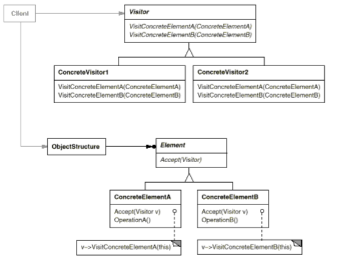
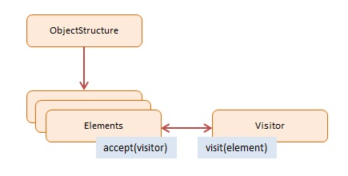

# Visitor

## Intent

Represent an operation to be performed on the elements of an object structure. Visitor lets you define a new operation without changing the classes of the elements on which it operates.

## Applicability

Use the __Visitor__ pattern when:

* An object structure contains many classes of objects with different interfaces, and you want to perform operations on these objects that depend on their concrete classes.

* Many distinct and unrelated operations need to be performed on objects in an object structure, and you want to avoid "polluting" their classes with these operations. Visitor lets you keep related operations together by defining them in one class. When the object structure is shared by many applications, use _Visitor_ to put operations in just those applications that need them.

* The classes defining the object structure rarely change, but you often want to define new operations over the structure. Changing the object structure class requires redefining the interface to all visitors, which is potentially costly. If the object structure classes change often, then it's probably better to define the operations in those classes.

## Collaborations

* A client that uses the _Visitor_ pattern must create a `ConcreteVisitor` object and then traverse the object structure, visiting each element with the visitor.

* When an element is visited, it calls the `Visitor` operation that corresponds to its class. The element supplies itself as an argument to this operation to let the visitor access its state, if necessary.

## Consequences

1. __Visitor makes adding new operationes easy__. You can define a new operation over an object structure simply by adding a new visitor. In contrast, if you spread functionality over many classes, then you must change each class to define a new operation.

2. __A visitor gathers related operations and separtes unrelated ones__. Related behavior isn't spread over the classes defining the object structure, it's localized in a visitor. Unrelated sets of behavior are partitioned in their own visitor subclasses. That simplifies both the classes defining the elements and the algorithms defined in the visitors. Any algorithm-specific data structures can be hidden in the visitor.

3. __Adding new ConcreteElement classes is hard__. TEach new `ConcreteEelement` gives rise to a new abstract operation on `Visitor` and a corresponding implementation in every `ConcreteVisitor` class. Sometimes a default implementation can be provided in `Visitor` that can be inherited by most of the `ConcreteVisitors`. So the key consideration in applying the _Visitor_ pattern is whether you are mostly likely to change the algorithm applied over an object structure or the classes of objects that make up the structure.

4. __Visiting across class hierarchies__. An iterator can visit the objects in a structure as it traverses them by calling their operation but it can't work across object structures with different types of elements. Visitor can visit objects that don't have a common parent class. You can add any type of object to a Visitor interface.

5. __Accumulating state__. Visitors can accumulate state as they visit each element in the object structure. Without a visitor, this state would be passed as extra arguments to the operations that perform the traversal, or they might appear as global variables.

6. __Breaking encapsulation__. Visito 's approach assumes that the `ConcreteElement` interface is powerful enough to let visitors do their job. As a result, the pattern often forces you to provide public operations that access an element's internal state, which may compromise its encapsulation.

## Related Patterns

* _Composite_: Visitors can be used to apply an operation over an object structure defined by the _Composite_ pattern.

* _Interpreter_: Visitors may be applied to do the interpretation.

## Implementation

Each object structure will have an associated `Visitor` class. This abstract visitor class declares a `VisitConcreteElement` operation for each class of `ConcreteElement` defining the object structure. Each `Visit` operation on the `Visitor` declares its argument to be a particular `ConcreteElement`, allowing the `Visitor` to access the interface of it directly. `ConcreteVisitor` classes override each `Visit` operation to implement visitor-specific behavior for the corresponding `ConcreteElement` class.

Each class of `ConcreteElement` implements an `Accept` operation that calls the matching `Visit` operation on the visitor for that `ConcreteElement`. Thus the operation that ends up getting called depends on both the class of the element and the class of the visitor.

There are other implementations issues that arise when you apply the _Visitor_ pattern:

1. __Double dispatch__. Effectively, the _Visitor_ pattern lets you add operations to classes without changing them. Visitor achieves this by using a technique called __double-dispatch__. In single-dispatch languages, two criteria determine which operation will fulfill a request: the name of the request and the type of receiver. For example, in C++, calling `GenerateCode` on an instance of `VariableRefNode` will call `VariableRefNode::GenerateCode`. Double-dispatch means __the operation that gets executed depends on the kind of request and the types of _two_ receivers__. `Accept` is a double-dispatch operation, its meaning depends on two types: the `Visitor`'s and the `Element`'s. This lets visitors request different operations on each class of element, instead of binding operations statically into the `Element` interface, you can consolidate the operations in a `Visitor` and use `Accept` to do the binding at run-time.

2. __Who is responsible for traversing the object-structure?__ A visitor must visit each element of the object structure. The question is, how does it get there? We can put responsbility for the traversal in any of three places: (1) the object structure, (2) in the visitor, or (3) in a separate iterator object. Often the object structure is responsible for iteration. A collection will simply iterate over its elements, calling the `Accept` operation on each. You could use internal or external iterators, with the peculiarity that internal iterators will not cause double-dispatching (it will call an operation on the _visitor_ with an _element_ as an argument as opposed to calling an operation on the element with the visitor as an argument). The main reason to put the traversal strategy in the visitor is to implement a particularly complex traversal that depends on the results of the operatiosn on the object structure.

## Motivation

Consider a compiler that represents programs as abstract syntax trees. It will need to perform operations on abstract syntax trees for "static semantics" analysis lke checking that all variables are defined. It will also need to generate code. So it might define operations for type-checking, code optimization, flow analysis, checking for variables being assigned values before they're used, and so on. Moreover, we could use the abstract syntax trees for pretty-printing, program restructuring, code instrumentation, and computing various metrics of a program.

Most of these operations will need to treat nodes that represent assignment statements differently from nodes that represent variables or arithmetic expressions. Hence there will be one class for assignment statements, another for variable accesses, another for arithmetic expressions, and so on. The set of node classes depends on the language being compiled, of course, but it doesn't change much for a given language.

The diagram shows part of the `Node` class hierarchy. The problem here is that distributing all these operations across the various node classses leads to a system that's hard to understand, maintain, and change. It will be confusing to have type-checking code mixed with pretty-printing code or flow analysis code. Moreover, adding a new operation usually requires recompiling all of these classes.

> It would be better if each new operation could be added separately, and the node classes were independent of the operations that apply to them.

> We can have both by packaging related operations from each class in a separate object, called a __visitor__, and passing it to elements of the abstract syntax tree as it's traversed. When an element "accepts" the visitor, it sends a request to the visitor that encodes the element's class and includes the element as an argument. The visitor will then execute the operation for that element (the operation that used to be in the class of the element).

For example, a compiler that didn't use visitors might type-check a procedure by calling the `TypeCheck` operation on its abstract syntax tree. Each of the nodes would implement `TypeCheck` by calling `TypeCheck` on its components. If the compiler type-checked a procedure using visitors, then it would create a `TypeCheckingVisitor` object and call the `Accept` operation on the abstract syntax tree with that object as an argument. Each of the nodes would implement `Accept` by calling back on the visitor: an assignment node calls `VisitAssignment` operation on the visitor, while a variable reference calls `VisitVariableReference`. What used to be the `TypeCheck` operation in class `AssignmentNode` is now the `VisitAssignment` operation on `TypeCheckingVisitor`.

To make visitors work for more than just type-checking, we need an abstract parent class `NodeVisitor` for all visitors of an abstract syntax tree. `NodeVisitor` must declare an operation for each node class. An application that needs to compute program metrics will define new subclasses of `NodeVisitor` and will no longer need to add application-specific code to the node classes. The _Visitor_ pattern encapsulates the operations for each compilation phase in a visitor associated with that phase.

> With the _Visitor_ pattern, you define two class hierarchies, one for the elements being operated on (the `Node` hierarchy) and one for the visitors that define operations on the elements (the `NodeVisitor` hierarchy). You create a new operation by adding a new subclass to the visitor class hierarchy.

As long as the grammar that the compiler accepts doesn't change (that is, we don't have to add new `Node` subclasses), we can add new functionality by defining new `NodeVisitor` subclasses.
