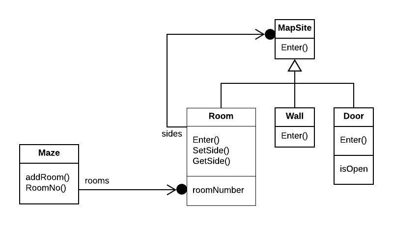

# Creational Patterns

* Definition
* Study case
  * C++ implementation
* Discussion of Creational Patterns

## Definition

> Creational design patterns __abstract the instantiation process__. They help make a system independent of how its objects are created, composed, and represented.

Class creational pattern uses inheritance to vary the class that's instantiated, whereas an object creational pattern will delegate instantiation to another object.

Creational patterns become important as systems evolve to depend more on object composition than class inheritance. As that happens, __emphasis shifts away from hard-coding a fixed set of behaviors toward defining a smaller set of fundamental behaviors that can be composed into any number of more complex ones__.

There are two recurring themes in these patterns:

1. Encapsulate all knowledge about which concrete class the system uses.

2. Hide how instances of these classes are created and put together.

All the system at large knows about the objects is their interfaces as defined by abstract classes. Consequently, the creational patterns give you a lot of flexibility in _what_ gets created, _how_ it gets created, and _when_.

Creational patterns show how to make designs more _flexible_, not necessarily smaller.

## Study case

We'll study a common example, building a maze for a computer game. The maze and the game will vary slightly from pattern to pattern. We'll ignore many details of what can be in a maze and whether a maze game has a single or multiple players. Instead, we'll just focus on how mazes get created. We define a maze as a set of rooms. A room knows its neighbors, possible neighbors are another room, a wall, or a door to another room.

The classes `Room`, `Door`, and `Wall` define the components of the maze used in all our examples. We define only the parts of these classes that are important for creating a maze.



### C++ Base implementation

```c++
enum Direction {North, South, East, West};

class MapSite {
public:
  virtual void Enter() = 0;
};

class Room : public MapSite {
public:
  Room(int roomNo);

  MapSite* GetSide(Direction) const;
  void SetSide(Direction, MapSite*);

  virtual void Enter();

private:
  MapSite* _sides[4]
  int _roomNumber;
};

class Wall : public MapSite {
public:
  Wall();

  virtual void Enter();
};

class Door : public MapSite {
public:
  Door(Room* = 0, Room* = 0);

  virtual void Enter();
  Room* OtherSideFrom(Room*);

private:
  Room* _room1;
  Room* _room2;
  bool _isOpen;
}

class Maze {
public:
  Maze();

  void AddRoom(Room*);
  Room* RoomNo(int) const;
private:
  // ...
}
```

We'll focus on how to specify the components of a maze object.

We define a class `MazeGame`, which creates the maze. One straightforward way to create a maze is with a series of operations that add components to a maze and then interconnect them. For example, the following memeber function will create a maze consisting of two rooms with a door between them:

```c++
Maze* MazeGame::CreateMaze() {
  Maze* aMaze = new Maze;
  Room* r1 = new Room(1);
  Room* r2 = new Room(2);
  Door* theDoor = new Door(r1, r2);

  aMaze->AddRoom(r1);
  aMaze->AddRoom(r2);

  r1->SetSize(North, new Wall);
  r1->SetSize(East, theDoor);
  r1->SetSize(South, new Wall);
  r1->SetSize(West, new Wall);

  r2->setSize(North, new Wall);
  r2->setSize(East, new Wall);
  r2->setSize(South, new Wall);
  r2->setSize(West, theDoor);
}
```

This function is pretty complicated, considering that all it does is create a maze with two rooms. There are obvious ways to make it simpler. The real problem isn't the _size_ but its __inflexibility__. It hard-codes the maze layout. Changing the layout means changing this member function, either by overriding it (which means reimplementing the whole thing), or by changing parts of it (which is error-prone and doesn't promote reuse).

Suppose you wanted to reuse an existing maze layout for a new game containing enchanted mazses. The enchanted maze game has new kinds of components, like `DoorNeedingSpell`, a door that can be locked and open subsequnetly only with a spell, and `EnchantedRoom`, a room that can have unconventional items in it, like magic keys or spells. How can you change `CreateMaze` easily so that it creates mazes with these new classes of objects?

In this case, the biggest barrier to change lies in hard-coding the classes that get instantiated. The __creational patterns provide different ways to remove explicit references to concrete classes__ from code that needs to instantiate them:

* If `CreateMaze` calls virtual functions instead of constructor calls to create the rooms, walls, and doors it requires, then you can change the classes that get instantiated by making a subclass of `MazeGame` and redifining those virtual functions. This approach is an example of the _Factory Method_ pattern.

* If `CreateMaze` is passed an object as a parameter to use to create rooms, walls, and doors, then you can change the instantiated classes by passing a different parameter. This is an example of the _Abstract Factory_ pattern.

* If `CreateMaze` is passed an object that can create a new maze in its entirety using operations for adding rooms, doors, and walls to the maze it builds, then you can use inheritance to change parts of the maze or the way the maze is built. This is an example of the _Builder_ pattern.

* If `CreateMaze` is paramet/creational-patterns.mdtern, _Singleton_, can ensure there's only one maze per game and that all game objects have ready access to it (without resorting to global variables or functions). Singleton also makes it easy to extend or replace the maze without touching existing code.

## Discussion of Creational Patterns

There are two common ways to parameterize a system by the classes of objects it creates:

1. Subclass the class that creates the objects (__Factory Method__). Main drawback is that it can require creating a new subclass just to change the class of the product. Such changes can cascade.

2. __Relying in object composition__. Define an object that's responsible for knowing the class of the product objects, and make it a parameter of the system. This is a key aspect of the __Abstract Factory__, __Builder__ and __Prototype__ patterns. All three involve creating a new "factory object" whose responsibility is to create product objects.
  * __Abstract Factory__ has the factory object producing objects of several classes.
  * __Builder__ has the factory object building a complex product incrementally using a correspondingly complex protocol.
  * __Prototype__ has the factory object building a product by copying a prototype object. In this case, the factory object and the prototype are the same object, because the prototype is responsible for returning the product.

People often use __Factory Method__ as the standard way to create objects, but it isn't necessary when the class that's instantiated never changes or when instantiation takes place in an operation that subclasses can easily override.

Designs that use __Abstract Factory, Prototype or Builder__ are even more flexible than those that use __Factory Method__, but they're also more complex. Often, designs start out using __Factory Method__ and evolve toward the other Creational Patterns as the designer discovers where more flexibility is needed.

Knowing many design patterns gives you more choices when trading off one design criterion against another.

### Examples

Consider the drawing editr framework described in the _Prototype_ pattern:

* By applying _Factory Method_, a subclass of `GraphicTool` will be created for each subclass of `Graphic` in the palette. `GraphicTool` will have a `NewGraphic` operation that each `GraphicTool` subclass will redefine.

* By applying _Abstract Factory_ pattern, there will be a class hiearchy of `GraphicsFactories`, one of each `Graphic` subclass. Each factory creates just one product in this case (`CircleFactory` will create `Cricle`s and so on...). A `GraphicTool` will be parameterized with a factory for creating the appropriate kind of `Graphics`.

* By applying the `Prototype` pattern, each subclass of `Graphics` will implement the `Clone` operation, and a `GraphicTool` will be parameterized with a prototype of the `Graphic` it creates.

Which pattern is best depends on many factors. In this drawing editor framework, the _Factoryh Method) pattern is easiest to use at first as it's easy to define a new subclass for `GraphicTool` and the instances of `GraphicTool` are created only when the palette is defined. The main disadvantage here is that `GraphicTool` subclasses profilerate, and none of them does very much.

_Abstract Factory_ doesn't offer much of an improvement, because it requires an equally large `GraphicsFactory` class hierarchy. _Abstract Factory_ would be preferable to _Factory Method_ only if there were already a _GraphicsFactory_ class hierarch.

Overall, the _Prototype_ pattern is probably the best for this example because it only requires implementing a `Clone` operation on each `Graphic` class. That reduces the number of classes, and `Clone` can be used for purposes other than pure instantiation (e.g., a Duplicate menu operation).
