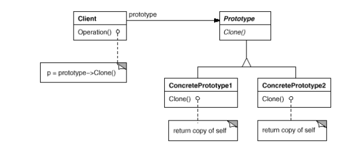
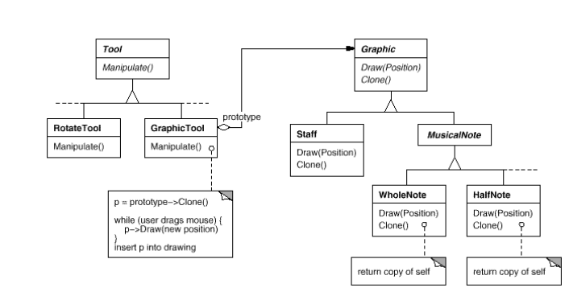

# Prototype

## Intent

Specify the kinds of objects to create using a prototypical instance, and create new objects by copying this prototype.

## Applicability

Use the _Prototype_ pattern when a system should be independent of how its products are created, composed, represented, _and_:

* Classes to instantiate are specified at run-time.

* Avoid buildingh a class hierarchy of factories that parallels the class hiearchy of products.

* Instances of a class can have one of only a few different combinations of state. It may be more convenient to install a corresponding number of prototypes and clone them rather than instantiating the class manually, each time with the appropriate state.

## Collaboration

* A client asks a prototype to clone itself.

## Consequences

1. _Prototype_ has many of the same consequences that _Abstract Factory_ and _Builder_ have. It hides the concrete product classes from the client, thereby __reducing the number of names clients know about__. Moreover, these patterns let a client work with application-specific classes without modification.

2. __Adding and removing products at run-time__. Prototypes let you incorporate a new concrete product class into a system simply by registering a prototypical instance with the client (can be done at run-time).

3. __Specifying new objects by varying values__. Highly dynamic systems let you define new behavior through object composition and not defining new classes. You can do this by registering instances as prototypes of client objects and delegating responsibility to the prototype.

4. __Specifying new objects by varying structure__. Many applications build objects from parts and subparts. For convenience, applications often let you instantiate complex, user-defined structures. As long as `Clone` works as a depp copy, _Prototype_ can work with complex structures as prototypes.

5. __Reduced subclassing__. _Factory Method_ often produces a hiearchy of `Creator` classes that parallels the product class hierarchy. The _Prototype_ pattern lets you clone a prototype instead of asking a factory method to make a new object, hence you don't need a `Creator` class hierarchy at all. This benefit applies primarily to languages like C++ that don't treat classes as first-class objects. Lenguages that do, can always use a class object as a creator.

6. __Configuring an application with classes dynamically__. Some run-time environments let you load classes into an application dynamically. The _Prototype_ pattern is the key to exploiting such facilities in a language like C++. An application that wants to create instances of a dynamically loaded class won't be able to reference its constructor statically. Instead, the run-time environment creates an instance of each class automatically when it's loaded, and it registers the instance with a prototype manager. Then the application can ask the prototype manager for instances of newly loaded classes, classes that weren't linked with the program originally.

7. __Main liability__ is that __each subclass of Prototype must implement the `Clone` operation__, which may be difficult. For example, adding `Clone` is difficult when the classes under consideration already exist, or when internals include objects that don't support copying or have circular references.

## Related Patterns

_Protoype_ and _Abstract Factory_ are competing patterns in some ways. They can also be used together. An _Abstract Factory_ might store a set of prototypes from which to clone and return product objects.

Designs that make heavy use of the _Composite_ and _Decorator_ patterns often can benefit from _Prototype_ as well.

## Implementation

Prototype is particularly useful with static languages like C++, where classes are not object, and little or no type information is available at run-time. It's less important in languages like Smalltalk or Objective C that provide what amounts what amounts to a prototype (i.e, a class object) for creating instances of each class. This pattern is built into prototype-based languages like Self, in which all object creation happens by cloning a prototype.

Consider the following issues when implementing prototypes:

1. __Using a prototype manager__. When the number of prototypes in a system isn't fixed (can be created/destroyed dynamically), keep a registry of available prototypes. Client's won't manage prototypes themselves but will store and retrieve them from registy, and will ask the registry for a prototype before cloning it.

2. __Implementing the Clone operation__. Hardest part of the _Prototype_ pattern is implementing the _Clone_ operation correctly. It's particularly tricky when object structures contain circular references. Also you need to consider _shallow copy versus deep copy_ (cloning an object in turn clone its instance variables, or do the clone and original just share the variables?). Cloning prototypes with complex structures usually requires a deep copy, because the clone and the original must be independent.

3. __Initializing clones__. While some clients are perfectly happy with the clone as is, others will want to initialize some or all of its internal states to values of their choosing. You generally can't pass these values in the `Clone` operation, because their number will vary between classes of prototypes. Some prototypes might need multiple initialization parameters, others won't need any. It might be the case that your prototype classes already define operations for (re)setting key pieces of state. If so, clients may use these operations after cloning. If not, then you may have to introduce an `Initialize` operation that takes initialization parameters as arguments and sets the clone's internal state accordingly.

## Motivation

You could build an editor for music scores by customizing a general framework for graphical editors and adding new objects that represent notes, rests, and staves. The editor framework may have a palette of tools for adding these music objects to the score, for selecting, moving, and otherwise manipulating music objects.

Let's assume the framework provides an abstract `Graphic` class for graphical components, like notes and staves. Moreover, it'll provide an abstract `Tool` class for defining tools like those in the palette. The framework also predefines a `GraphicTool` subclass for tools that create instances of graphical objects and add them to the document.

But `GraphicTool` presents a problem to the framework designer. The classes for notes and staves are specific to our applciation, but the `GraphicTool` class belongs to the framework and doesn't know how to create instances of our music classes to add to the scope. We would subclass `GraphicTool` for each kind of music object but that would produce lots of subclasses that differ only in the kind of music object they instantiate.

The solution lies in making `GraphicTool` create a new `Graphic` by copying or "cloning" an instance of a `Graphic` subclass. We call this instance a __prototype__. `GraphicTool` is parameterized by the prototype it should clone and add to the document. If all `Graphic` subclasses support a `Clone` operation, then the `GraphicTool` can clone any kind of `Graphic`.

So in our music editor, each tool for creating a music object is an instance of `GraphicTool` that's initialized with a different prototype. Each `GraphicTool` instance will produce a music object by cloning its prototype and adding the clone to the score.

We can use the _Prototype_ pattern to reduce the number of classes even further. We have separate classes for whole notes and half notes, but that's probably unnecessary. Instead they could be instances of the same class initialized with different bitmpas and durations. A tool for creating whole notes becomes just a `GraphicTool` whose prototype is a `MusicalNote` initialized to be a whole note. This can reduce the numer of classes in the system dramatically, and it also makes it easier to add new kinds of note to the music editor.
