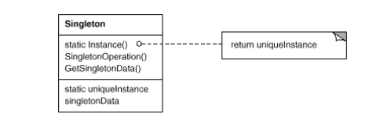

# Singleton

## Intent

Ensure a class only has one instance, and provide a global point of access to it.

## Applicability

Use the _Singleton_ pattern when:

* There must be exactly one instance of a class, and it must be accessible to clients from a well-known access point.

* When the sole instance should be extensible by subclassing, and clients should be able to use an extended instance without modifying their code.

## Collaborations

Clients access a _Singleton_ instance solely through _Singleton_'s Instance operation.

## Consequences

The _Singleton_ pattern has several benefits:

1. __Controlled access to sole instance__. Because the Singleton class encapsulates its sole instance, it can have strict control over how and when client access it.

2. __Reduced name space__. It avoid polluting the name space with global variables that store sole instances.

3. __Permits refinement of operations and representations__. It makes it easy to change your mind and allow more than once instance. Moreover, you can use the same approach to control the number of instances that application uses. Only the operatio nthat grants access to the Singleton instance needs to change.

4. __More flexible than other operations__. Another way to package a singleton's functionality is to use class operations. But this approach make it hard to change a design to allow more than one instance of a class.

## Related Patterns

Many patterns can be implemented using the _Singleton_ pattern, such as _Abstract Factory_, _Builder_ and _Prototype_.

## Implementation

1. __Ensuring a unique instance__. Class is written so that only one instance can ever be created. A common way to do this is to hide the operation that creates the instance behind a class operation that guarantees only one instance is created. This operations has access to the variable that holds the unique instance, and it ensures the variable is initialized with the unique instance before retuning its value.

2. __Subclassing the Singleton class__. The main issue is not so much defining the subclass but installing its unique instance. In essence, the variable that refers to the singleton instance must get initialized with an instance of the subclass.

    * The simplest technique is to determine which singleton you want to use in the Singleton's `Instance` operation. This can be achieved by using a set of conditionals but hard-wires the set of possible Singleton classes.

    * Another way to choose the subclass of Singleton is to take the implementation of `Instance` out of the parent class, and put it in the subclass. This fixes the choice of singleton class at link-time, which makes it hard to choose the singleton class at run-time.

    * A more flexible approach uses a __registry of singletons__, instead of having `Instance` define a set of possible Singleton classes and conditionals, the `Singleton` classes can register their singleton instances by name in a well-known registry that maps between string names and singletons. When `Instance` needs a singleton, it consults the registry, asking for the singleton by name. This approach frees `Instance` from knowing all possible Singleton classes or instances. All it requires is a common interface for all Singleton classes tat includes operations for the registry (i;.e, `Register` and `Lookup`)

## Motivation

It's important for some classes to have exactly one instance. Although there can be many printers in a system, there should be only one printer spooler. There should be only one file system and one window manager.

You can make the class itself responsible for keeping track of its sole instance. The class can ensure that no other instance can be created (by intercepting requests to create new objects), and it can provide a way to access the instance.
