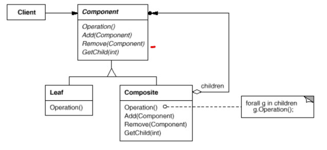

# Composite

## Intent

Compose objects into tree structures to represent part-whole hierarchies. Composite lets clients treat individual objects and compositions of objects uniformly.

## Applicability

Use the __Composite__ pattern when:

* Represent part-whole hierarchies of objects.

* You want clients to be able to ignore the difference between compositions of objects and individual objects. Clients will treat all objects in the composite structure uniformly.

## Collaborations

* Clients use the `Component` class interface to interact with objects in the composite structure. If the recipient is a `Leaf`, then the request is handled directly. If the recipient is a `Composite`, then it usually forwards requests to its child components, possible performing additional operations before and/or after forwarding.

A typical _Composite_ object structure might look like this:

## Consequences

* Defines class hierarchies consisting of primitive objects and composite objects. Primitive objects can be composed into more complex objects, which in turn can be composed, and so on recursively. Wherever client code expects a primitive object, it can also take a composite object.

* Makes the client simple. Clients can treat composite structures and individual objects uniformly. Clients normally don't know (and shouldn't care) whether they're dealing with a leaf or a composite component.

* Makes it easier to add new kinds of components. Newly defined `Composite` or `Leaf` subclasses work automatically with existing structures and client code.

* Can make your design overly general. The disadvantage of making it easy to add new components is that it makes it harder to restrict the components of a composite. Sometimes you want a composite to have only certain components.

## Related Patterns

* Often the component-parent link is used for a _Chain of Responsibility_.

* _Decorator_ is often used with _Composite_. When decorators and composites are used together, they will usually have a common parent class. So decorators will have to support the `Component` interface with operations like `Add`, `Remove`, and `GetChild`.

* _Flyweight_ lets you share components, but they can no longer refer to their parents.

* _Iterator_ can be used to traverse composites.

* _Visitor_ localizes operations and behavior that would otherwise be distributed across `Composite` and `Leaf` classes.

## Implementation

There are many issues to consider when implementing the _Composite_ pattern:

1. __Explicit parent references__. Maintaining references from child components to their parents can simplify the traversal and management of a composite structure. The usual place to define it is in the `Component` class. `Leaf` and `Composite` classes can inherit the reference and the operations that manage it. It's essential to maintain the invariant that all children of a composite have as their parent the composite that in turn has them as children.

2. __Sharing components__. It's often useful to share components, for example, to reduce storage requirements. But when a component can have no more than one parent, sharing becomes difficult. A possible solution is for children to store multiple parents, but that can lead to ambiguities as a request propagates up the structure. See _Flyweight_ pattern.

3. __Maximizing the Component interface__. One of the goals of the _Composite_ pattern is to make clients unaware of the specific `Leaf` or `Composite` classes they're using. To attain this goal, the `Component` class should define as many common operations for `Composite` and `Leaf` classes as possible. However, this goal will sometimes conflict with the __principle of class hierarchy design that says a class should only define operations that are meaningful to its subclasses__. Sometimes a little creativity shows how an operation that would appear to make sense only for `Composites` can be implemented for all `Components` by moving it to the `Component` class.

4. __Declaring the child management operations__. Although the `Composite` class _implements_ the `Add` and `Remove` operations for managing children, an important issue in the _Composite_ pattern is which classes _declare_ these operations in the `Composite` class hierarchy. Should we declare these operations in the `Component` and make them meaningful for `Leaf` classes, or should we declare and define them only in `Composite` and its subclasses? The decision involves a trade-off between safety and transparency.
  
  * Defining the child management interface at the root of the class hierarchy gives you transparency, because you can treat all components uniformly. It costs you safety, however, because clients may try to do meaningless things like add and remove objects from leaves.

  * Defining child management in the `Composite` class gives you safety, because any attempt to add or remove objects from leaves will be caught at compile-time in statically typed languages. But you lose transparency, because leaves and composites have different interfaces.

5. __Should `Component` implement a list of `Components`__? You might be tempted to define the set of children as an instance variable in the `Component` class where the child access and management operations are declared. But putting the child pointer in the base class incurs a space penalty for every leaf, even though a leaf never has children. This is worthwhile only if there are relatively few children in the structure.

6. __Child ordering__. When child ordering is an issue, you must design child access and management interfaces carefully to manage the sequence of children. The _Iterator_ pattern can guide you in this.

7. __Caching to improve performance__. If you need to traverse or search compositions frequently, the `Composite` class can cache traversal or search information about its children. The `Composite` can cache actual results or just information that lets it short-circuit the traversal or search. Changes to a component will require invalidating the caches of its parents. This works best when components know their parents. So if you're using caching, you need to define an itnerface for telling composites that their caches are invalid.

8. __Who should delete components?__ In languages without garbage collection, it's usually best to make a `Composite` responsible for deleting its children when it's destroyed. An exception to this rule is when `Leaf` objects are immutable and thus can be shared.

9. __What's the best data structure for storing components?__ The choice of data structure depends, as always, on efficiency. In fact, it isn't even necessary to use a general-purpose data structure at all.

## Motivation

Graphics applications like drawing editors and schematic capture systems let users build complex diagrams out of simple components. The user can group components to form larger components, which in turn can be grouped to form still larger components. A simple implementation could define classes for graphical primitives such as `Text` and `Lines` plus other classes that act as containers for these primitives.

But there's a problem with this approach: Code that uses these classes must treat primitive and container objects differently, even if most of the time the user treats them identically, thus making the application more complex. The _Composite_ pattern describes how to use recursive composition so that clients don't have to make this distinction.

The key to the _Composite_ pattern is to abstract class that represents _both_ primitives and their containers. For the graphics system, this class is `Graphic`. `Graphic` declares operations like `Draw` that are specific to graphical objects. It also declares operations that all composite objects share, such as operations for accessing and managing its children.

The subclasses `Line`, `Rectangle`, and `Text` define primitive graphical objects. These classes implement `Draw` to draw lines, rectangles, and text, respectively. Since primitive graphics have no child graphics, none of these subclasses implements child-related operations.

The `Picture` class defines an aggregate of `Graphic` objects. Picture implements `Draw` to call `Draw` on its children, and it implements child-related operations accordingly. Because the `Picture` interface conforms to the `Graphic` interface, `Picture` objects can compose other `Pictures` recursively.

The following diagram shows a typical composite object structure of recursively composed `Graphic` objects:

