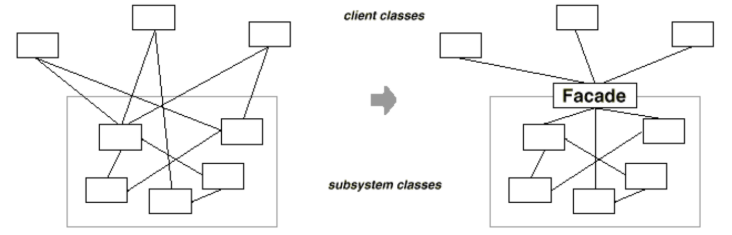
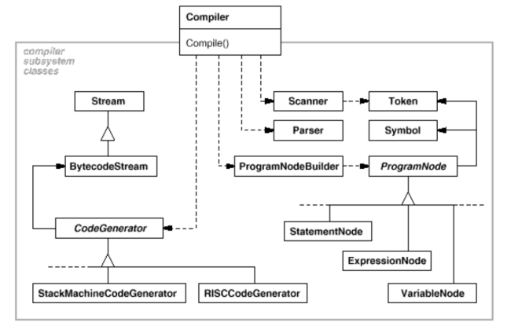

# Facade

## Intent

Provide a unified interface to a set of interfaces in a subsystem. Facade defines a higher-level interface that makes the subsystem easier to use.

## Applicability

Use the _Facade_ pattern when:

* __You want to provide a simple interface to a complex subsystem__. Most patterns, when applied, result in more and smaller classes. This makes the subsystem more reusable and easier to customize, but it also ecomes harder to use for clients that don't need to customize it. A facade can provide a simple default view of the subsystem that is good enough for most clients.

* __There are many dependencies between clients and the implementation classes of an abstraction__. Introduce a facade to decouple the subsystem from clients and other subsystems, thereby promoting subsystem independence and portability.

* __You want to layer your subsystems__. Use a facade to define an entry point to each subsystem level. If subsystems are dependent, then you can simplify the dependencies between them by making them communicate with each other solely through their facades.

## Collaborations

* Clients communicate with the subsystem by sending requests to `Facade`, which forwards them to the appropriate subsystem object(s). Although the subsystem objects perform the actual work, the facade may have to do work of its own to translate its interface to subsystem interfaces.

* Clients that use the facade don't have to access its subsystem objects directly.

## Consequences

The _Facade_ patterns offers the following benefits:

1. __It shields clients from subsystem components__, thereby reducing the number of objects that clients deal with and making the subsystem easier to use.

2. __It promotes weak coupling between the subsystem and its clients__. Often components in a subsystem are strongly coupled. Weak coupling lets you vary the components of the subsystem without affecting its clients. Facade help layer a system and the dependencies between objects. They can eliminate complex or circular dependencies. Reducing compilation dependencies with facades can limit the recompilation needed for a small change in an important subsystem.

3. __It doesn't prevent applications from using subsystem classes if they need to__, thus you can choose between ease of use and generality.

## Related Patterns

* _Abstract Factory_ can be used with _Facade_ to provide an interface for creating subsystem objects in a subsystem-independent way. _Abstract Factory_ can also be used as an alternative to _Facade_ to hide platform-specific classes.

* _Mediator_ is similar to _Facade_ in that it abstracts functionality of existing classes. However, _Mediator_'s purpose is to abstract arbitrary communication between colleague objects, often centralizing functionality that doesn't belong in any of them. A mediator's colleagues are aware of and communicate with the mediator instead of communicating with each other directly. In contrast, a facade merely abstracts the interface to subsystem objects to make them easier to use, it doesn't define new functionality, and subsystem calsses don't know about it.

* Usually only one _Facade_ object is required. Thus _Facade_ objects are often _Singletons_.

## Implementation

1. __Reducing client-subsystem coupling__. The coupling can be reduced even further by making `Facade` an abstract class with concrete subclasses for different implementations of a subsystem. Then clients can communicate with the subsystem through the interface of the abstract `Facade` class. This abstract coupling keeps clients from knowing which implementation of a subsystem is used. An alternative to subclassing is to configure a `Facade` object with different subsystem objects. To customize the facade, simply replace one or more of its subsystem objects.

2. __Public versus private subsystem classes__. The public interface to a subsystem consists of classes that all clients can access, the private interface is just for subsystem extenders. The `Facade` class is part of the public interface, of course, but it's not the only part. Making subsystem classes private would be useful, but few object-oriented languages support it.

## Motivation

Structuring a system into subsystems help reduce complexity. A common design goal is to minimize the communication and dependencies between subsystems. One way to achieve this goal is to introduce a __facade__ object that provides a single, simplified interface to the more general facilities of a subsystem.

Consider for example a programming environment that gives applications access to its compiler subsystem. This subsystem contains classes such as `Scanner`, `Parser`, `ProgramNode`, `BytecodeStream`, and `ProgramNodeBuilder` that implement the compiler. Some specialized applications might need to access these classes directly. But most clients of a compiler generally don't care about details like parsing and code generation, they merely want to compile some code. For them, the powerful but low-level interfaces in the compiler subsytem only complicate their task.

To provide a higher-level interface that can shield clients from these classes, the compiler subsystem also includes a `Compiler` class. This class defines a unified interface to the compiler's functionality. The `Compiler` class acts as a facade: It offers clients a single, simple interface to the compiler subsystem. It glues together the classes that implement compiler functionality without hiding them completely. The compiler facade makes life easier for most programmers without hiding the lower-level functioanlity from the few that need it.

