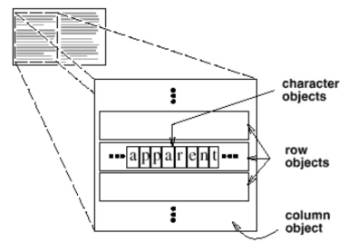
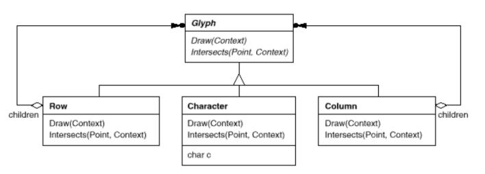

# Flyweight

## Intent

Use sharing to support large numbers of fine-grained objects efficiently.

## Applicability

The __Flyweight__ pattern's effectiveness depends heavily on how and where it's used. Apply the pattern when _all_ of the following are true:

* An application uses a large number of objects.

* Storage costs are high because of the sheer quantity of objects.

* Most object state can be made extrinsic.

* Many groups of objects may be replaced by relatively few shared objects once extrinsic state is removed.

* Application doesn't depend on object identity. Since flyweight objects may be shared, identity tests will return true for conceptually distinct objects.

## Collaborations

* State that a flyweight needs to function must be characterized as either intrinsic or extrinsic. Intrinsic state is stored in the `ConcreteFlyweight` object, extrinsic state is stored or compujted by `Client` objects. Clients pass this state to the flyweight when they invoke its operations.

* Clients should not instantiate `ConcreteFlyweights` directly. Clients must obtain `ConcreteFlyweight` objects exclusively from the `FlyweightFactory` object to ensure they are shared properly.

## Consequences

Flyweights may introduce run-time costs associated with transferring, finding, and/or computing extrinsic state,  especially if it was formerly stored as intrinsic state. However, such costs are offset by space savings, which increase as more flyweights are shared.

Storage savings are a function of several factors:

* The reduction in the total number of instances that comes from sharing.

* The amount of intrinsic state per object.

* Whether extrinsic state is computed or stored.

The more flyweights are shared, the greater the storage savings. The savings increase with the amount of shared state. The greatest savings occur when the objects use substantial quantities of both intrinsic and extrinsic state, and the extrinsic state can be computed rather than stored. Then you save on storage in two ways: Sharing reduces the cost of intrinsic state, and you trade extrinsic state for computation time.

## Related Patterns

* The _Flyweight_ pattern is often combined with the _Composite_ pattern to implement a logically hierarchical structure in terms of a directed-acyclic graph with shared leaf nodes.

* It is often best to implement _State_ and _Strategy_ objects as flyweights.

## Implementation

1. __Removing extrinsic state__. Pattern's applicability is determined largely by how easy it is to identify extrinsic state and remove it from shared objects. Removing extrinsic state won't help reduce storage costs if there are as many different kinds of extrinsic state as there are objects before sharing.

2. __Manging shared objects__.  Because objects are shared, clients shouldn't instantiate them directly. `FlyweightFactory` lets clients locate a particular flyweight.

## Motivation

Some applications could benefit from using objects throughout their design, but a naive implementation would be prohibitivel expensive.

For example, most document editor implementations have text formatting and editing facilities that are modularized to some extent. Object-oriented document editors typically use objects to represent embedded elements like tables and figures. However, they usually stop short of using an object for each character in the document, even though doing so would promote flexibility at the finest levels in the application. Characters and embedded elements could then be treated uniformly with respect to how they are drawn and formatted. The application could be extended to support new character sets without disturbing other functionality.

The drawback of such a design is its cost. Even moderate-sized documents may require hundreds of thousands of character objects, which will consume lots of memory and may incur unacceptable run-time overheade. The _Flyweight_ pattern describes how to share objects to allow their use at fine granularities without prohibite cost.

A __flyweight__ is a shared object that can be used in multiple contexts simultaneously. The flyweight acts as an independent object in each context (it's indistinguishable from an instance of the object that's not shared). Flyweights cannot make assumptions about the context in which they operate. The key concept here is the distinction between __intrinsic__ and __extrinsic__ state. Intrisic state is stored in the flyweight, it consists of information that's independent of the flyweight's context, thereby making it sharable. Extrinsic state depends on and varies with the flyweight's context and therefore can't be shared. Client objects are responsible for passing extrinsic state to the flyweight when it needs it.

Flyweight model concepts or entities that are normally too plentiful to represent with objects. For example, a document editor can create a flyweight for each letter of the alphabet. Each flyweight stores a character code, but its coordinate position in the document and its typograpic style can be determined from the text layout algorithms and formatting commands in effect wherever the character appears. The character code is intrisic state, while the other information is extrinsic.

Logically, there is an object for every occurrence of a given character in the document. Physically, however, there is one shared flyweight object per character, and it appears in different contexts in the document structure. Each occurrence of a particular character object refers to the same instance in the shared pool of flyweight objects.

The class structure for these objects is shown next. `Glyph` is the abstract class for graphical objects, some of which may be flyweights. Operations that may depend on extrinsic state have it passed to them as a parameter. For example, `Draw` and `Intersects` must know which context the glyph is in before they can do thier job.

A flyweight representing the letter "a" only stores the corresponding character code; it doesn't need to store its location or font. Clients supply the context-dependent information that te flyweight needs to draw itself.

Because the number of different character objects is far less than the number of characters in the document, the total number of objects is substantially less than what a naive implementation would use.
