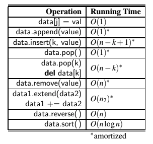

# Array-based sequences

## List Operations



__Amortized complexity__ means that an expensive operation can alter the state, so that the worst case cannot occur again for a long time, thus amortizing its cost.

## Strings

### Pattern Matching

When algorithms depend upon finding a string pattern within a larger string, such as `__contains__`, `find`, `index`, `count`, `replace` and `split`, we refer to _pattern matcing_.

Naive implementations run in O(n.m) time case, because we consider n-m+1 possible starting indices for the pattern, and we spend O(m) time at each starting position, however, we can find a pattern of length m within a longer string of length n in O(n) time.

### Composing Strings

Because strings are immutable, composing strings with concatenation can be terrible inefficient, as series of concatenations would take time to reasign letters to a new string instance everytime, and if we try to concatenate characters for example, we would end up with the familiar sum 1+2+...+n, and therefore O(n^2) time.

A more standard Python idiom to guarantee linear time comoposition of a string is to use a temporary list to store individual pieces, and then to rely on the join method of the `str` class to compose the final result.

```python
temp = []
for c in document:
  if c.isalpha():
    temp.append(c)
letters = ''.join(temp)
```

## Sorting

### Insertion Sort

```python
def insertion_sort(A):
  """
  Sort list of comparable elements into ascendant order
  """
  for k in range(1, len(A)):
    cur = A[k]
    j = k
    while j > 0 and A[j-1] > cur:
      A[j] = A[j-1]
      j -= 1
    A[j] = cur
```


