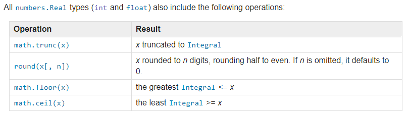
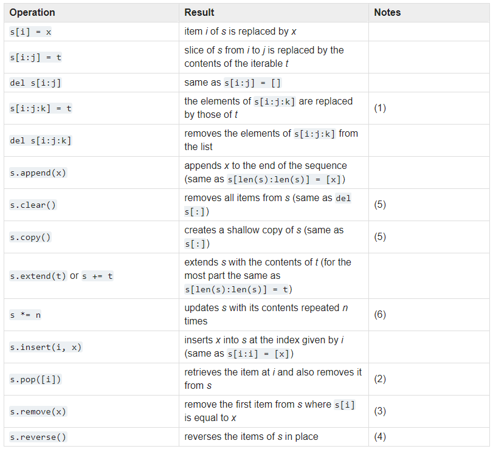

# Basics of Python

## Built-ins


### [Functions](https://docs.python.org/3/library/functions.html)

Python interpreter has a number of functions and types built in that are always available.


### [Constants](https://docs.python.org/3/library/constants.html)

A small number of constants live in the built-in namespace.

* False
* True
* None
* NotImplemented
* Ellipsis
* __debug__
* quit
* exit
* copyright
* credits
* license

### [Types](https://docs.python.org/3/library/stdtypes.html)

Principal built-in types are:

* Numerics
	* `int`
	* `float`
	* `complex`
* Iterator
* Generator
* Sequences
	* `list` (mutable)
	* `tuple` (immutable)
	* `range` (immutable)
* Text Sequence
	* `str` (immutable)
* Binary Sequences
	* `bytes`
	* `bytearray`
	* `memoryview`
* Sets
	* `set` (mutable)
	* `frozenset` (immutable)
* Mappings
	* `dict` (mutable)
* Null (singleton `None`)
* Booleans
* Exceptions
* Classes & Instances

Some collectons classes are mutables.

#### Numerics





#### [Iterator](https://docs.python.org/3/library/stdtypes.html#iterator-types)

Python supports a concept of iteraiton over containers. This is implemented using two distinch methods, that are used to allow user-defined classes to supportiteraiton. Sequences always support the iterations methods.

* `container.__iter__()`
* `iterator.__iter__()`
* `iterator.__next__()`

#### [Generator](https://docs.python.org/3/library/stdtypes.html#generator-types)

Generators provide a convenient way to implement the iterator protocol. If a container object's `__iter__()` method is implemented as a generator, it will automatically return an iterator object supplying the `__iter__` and `__next__` methods.

#### [Sequences](https://docs.python.org/3/library/stdtypes.html#sequence-types-list-tuple-range)

Three basic sequence types: lists, tuples and range objects. Additional sequence types tailored for processing of binary data and text strings are described in dedicated sections.


The only operation that immutable squences types generally implement that is not also implemented by mutable sequence types is support for the `hash()` built-in. This allows immutable sequences, such as `tuple` instances, to be used as a dit key and stored in set/frozenset instances.

Mutable sequence types have the follownig operations too:



Lists have the additional `sort` method.

#### [Text Sequence (`str`)](https://docs.python.org/3/library/stdtypes.html#text-sequence-type-str)

Textual data in python is handled by `str` objects or Strings. Strings are immutable sequence of Unicode code poitns.

Strings have lots of [built in methods](https://docs.python.org/3/library/stdtypes.html#string-methods).

We have available a [printf-style String Formatting](https://docs.python.org/3/library/stdtypes.html#printf-style-string-formatting) but there's a new and less error-prone method: [formatted string literals](https://docs.python.org/3/reference/lexical_analysis.html#f-strings).

#### [Binary sequences](https://docs.python.org/3/library/stdtypes.html#binary-sequence-types-bytes-bytearray-memoryview)

Core built-in types for manipulating binary data are `bytes` and `bytearray`. They are supported by `memoryview` which uses the buffer protocol to access the memory of other binary objects without needing to make a copy.

#### [Set Types](https://docs.python.org/3/library/stdtypes.html#set-types-set-frozenset)

A `set` object is an unordered collection of distinct _hashable_ objects. Like other collections, set supports:

* `in`
* `len`
* `for x in set`

#### [Mapping Types](https://docs.python.org/3/library/stdtypes.html#mapping-types-dict)

A mapping object maps _hashable_ values to arbitrary objects. Mappings are mutable objects.

Values that are not hashable, like values containing lists or other mutable types (that are compared by value rather than by object identity) may not be used as keys.

We have __Dictionary View Objecs__, the objects returned by `dict.keys()`, `dict.values()` and `dict.items()` are view objecs. They provide a dynamic view on the dictionary's entries, which means that wean the dictionary changes, the view reflects these changes.

#### [Exceptions](https://docs.python.org/3/library/exceptions.html#built-in-exceptions)

All exceptions must be instances of a class that derives from `BaseException`. It is not mean to be directly inherited by user-defined classes (for that, use `Exception`).

Exception Hierarchy:

```
BaseException
 +-- SystemExit
 +-- KeyboardInterrupt
 +-- GeneratorExit
 +-- Exception
      +-- StopIteration
      +-- StopAsyncIteration
      +-- ArithmeticError
      |    +-- FloatingPointError
      |    +-- OverflowError
      |    +-- ZeroDivisionError
      +-- AssertionError
      +-- AttributeError
      +-- BufferError
      +-- EOFError
      +-- ImportError
      |    +-- ModuleNotFoundError
      +-- LookupError
      |    +-- IndexError
      |    +-- KeyError
      +-- MemoryError
      +-- NameError
      |    +-- UnboundLocalError
      +-- OSError
      |    +-- BlockingIOError
      |    +-- ChildProcessError
      |    +-- ConnectionError
      |    |    +-- BrokenPipeError
      |    |    +-- ConnectionAbortedError
      |    |    +-- ConnectionRefusedError
      |    |    +-- ConnectionResetError
      |    +-- FileExistsError
      |    +-- FileNotFoundError
      |    +-- InterruptedError
      |    +-- IsADirectoryError
      |    +-- NotADirectoryError
      |    +-- PermissionError
      |    +-- ProcessLookupError
      |    +-- TimeoutError
      +-- ReferenceError
      +-- RuntimeError
      |    +-- NotImplementedError
      |    +-- RecursionError
      +-- SyntaxError
      |    +-- IndentationError
      |         +-- TabError
      +-- SystemError
      +-- TypeError
      +-- ValueError
      |    +-- UnicodeError
      |         +-- UnicodeDecodeError
      |         +-- UnicodeEncodeError
      |         +-- UnicodeTranslateError
      +-- Warning
           +-- DeprecationWarning
           +-- PendingDeprecationWarning
           +-- RuntimeWarning
           +-- SyntaxWarning
           +-- UserWarning
           +-- FutureWarning
           +-- ImportWarning
           +-- UnicodeWarning
           +-- BytesWarning
           +-- ResourceWarning
```

## Flow Control 

Control the execution of statements.

The `if`, `while` and `for` statements implement traditional control flow construts.

`try` specifies exception handlers and/or cleanup code for a group of statements.

While the `with` statement allows the execution of intialization and finalizaiton code around a block of code.

## Code Formatting ([PEP 8](https://www.python.org/dev/peps/pep-0008/))

Conventions for Python code comprising te tandard library in the main python distribution.
