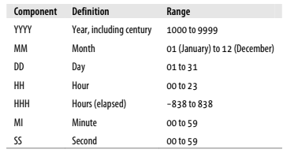
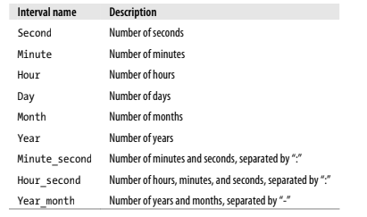

# Data Generation, Conversion and Manipulation

The SQL standard does not include commands covering this functionlity. Rather, built-in functions are used to facilitate data generation, conversion, and manipulation. While the SQL standard does specify some functions, database vendors often do not comply with the function specifications.

We'll cover MySQL specifics, it's on your own to search for your database vendor's reference.

## String

### String Generation

Remember that if a string's length exceeds the maximum size for the character column, the server will thrown an exception. You can configure MySQL to silently truncate the string instead of throwing an exception (no "strict" mode).

To check in which mode you are in:
```sql
SELECT @@session.sql_mode;
```

And to change it to truncate:
```sql
SELECT @@session.sql_mode;
```

If you now do an statement that gets a string truncated, the column will be modified but the following warning is generated.
```sql
SHOW WARNINGS;
```

### Escaping, including snigle quotes

To make the server ignore the apostrophe in words, you can escape a single quote by adding another single quote directly before:
```sql
UPDATE string_tbl
SET text_fld = 'This string didn''t work, but it does now';
```
Oracle and MySQL users may also choose to escape a single quote by adding a backslash `\` character immediately before.

If you want to retrieve the string to add to a file that another program will read, you may want to include the escape as part of the retrieved string.

```sql
SELECT quote(text_fld)
FROM string_tbl;
```

### Special Characters

If you need to include special characters, SQL Server and MySQL servers include the built-in function `char()` so that you can build strings from any of the255 characters in the ASCII character set. Oracle Database userds can use the `chr()` function.

```SQL
SELECT 'abcdefg', CHAR(97,98,99,100,101,102,103);
```
```SQL
SELECT CHAR(148,149,150,151,152,153,154,155,156,157);
```

If you have a character and need to find its ASCII equivalent, you can use the `ascii()` function.
```SQL
SELECT ASCII('ö');
```

### Concatenation

Building strings by character can be quite tedious...
```SQL
SELECT CONCAT('danke sch', CHAR(148), 'n');
```

### String functions that return numbers

Get character length
```sql
SELECT LENGTH(char_fld) char_length,
    LENGTH(varchar_fld) varchar_length,
    LENGTH(text_fld) text_length,
    FROM string_tbl;
```

Find a substring
```sql
SELECT POSITION('characters' IN vchar_fld)
FROM string_tbl;
```

Find a substring starting from an offset
```sql
SELECT LOCATE('is', vchar_fld, 5)
FROM string_tbl;
```

Compare string sort order (-1, 0, 1)
```sql
SELECT STRCMP('abcd', 'xyz') AS 'abcd_xyz';
SELECT STRCMP('12345', '12345') AS '12345_12345';
```

Compare stings with `like` and `regexp` operators, the following returns all department names, along with an expression that returns 1 if the department name ends in "ns" or 0 otherwise.
```sql
SELECT name, name LIKE '%ns' ends_in_ns
FROM department;
```
The following performs more complex pattern matches:
```sql
SELECT cust_id, cust_type_cd, fed_id,
    fed_id REGEXP '.{3}-.{2}-.{4}' is_ss_no_format
FROM customer;
```

### String functons that return strings

Concatenation
```SQL
UPDATE string_tbl
SET text_fld = CONCAT(text_fld, ', longer');
```

Replacing characters with `insert` that receives four arguments, the original strnig, position at which to start, number of characters to replace, replacement string.
```SQL
SELECT INSERT('goodbye world', 9, 0, 'cruel ') string;
```

Extract a substring, of specific number of characters, starting at a specific position.
```SQL
SELECT SUBSTRING('goodbye cruel world', 9, 5)
```

---

## Numeric 

You can type a number, retrieve it from another column, or generate it via calculation.

All usual arithmetic operators (+, -, *, /) are available for performing calculations, and parentheses may be used to dictate precedence.

### Arithmetic Functions

| Function name | Description |
| ------------- | ----------- |
| Acos(x) | Calculates the arc cosine of x |
| Asin(x) | Calculates the arc sine of x | |
| Atan(x) | Calculates the arc tangent of x |
| Cos(x) | Calculates the cosine of x |
| Cot(x) | Calculates the cotangent of x |
| Exp(x) | Calculates ex |
| Ln(x) | Calculates the natural log of x |
| Sin(x) | Calculates the sine of x |
| Sqrt(x) | Calculates the square root of x |
| Tan(x) | Calculates the tangent of x |

* `MOD(number, divider)`
* `POW(number, raise_to)`

### Controlling Number Precision

Sometimes you may want to store data with a higher precision than you want to display it with.

Four functions are useful when limiting the precision of floating-point numbers:
* `CEIL(num)`
* `FLOOR(num)`
* `ROUND(num, precision)`
* `TRUNCATE(num, precision)`
You can use negative precisiond, so numbers _left_ to the decimal place are truncated or rounded too.

### Handling Signed Data

* `SIGN(num)`: -1, 0, 1
* `ABS(num)`

---

## Temporal Data

### Dealing with Time Zones

MySQL provides `UTC_TIMESTAMP()` which will return the current UTC timestamp.

MySQL keeps two different time zone settings: a global time zone, and a session time zone, which may be different for each user logged in to a database.

```sql
SELECT @@globa.time_zone, @@session.time_zone;
```

A value of `system` tells you that the server is using the time zone setting from the server on which the database resides.

If you are sitting at a computer in Zurich, Switzerland, and you open a session across the network to a MySQL server in New York, you may want to change the time zone setting for your session, which you can do via the following command:

```sql
SET time_zone = 'Europe/Zurich';
```

This will make all date displayed in your session, to conform to Zurich time.

### Generating Temporal Data

* Copying data from existing `date`, `datetime` or `time` column.
* Executing a built-in function that return those types.
* Building a string representation of temporal data to be evaluated by the server.

#### String Representations of Temporal Data




If the server is expecting a `datetime` value, you can provide a properly formatted string with the required date components, and the server will do the conversion for you.

MySQL is quite lenient about the separators used between the components. For example, MySQL will accept all of the following strings as valid representations:

```
'2008-09-17 15:30:00'
'2008/09/17 15:30:00'
'2008,09,17,15,30,00'
'20080917153000'
```

#### String-to-Date conversions

If the server is _not_ expecting a `datetime` value, or if you would like to represent the `datetime` using a nondefault format, you will need to tell the server to convert the string to a `datetime`.

```sql
SELECT CAST('2008-09-17 15:30:00' AS DATETIME);)
```

#### Functions for generating dates

`str_to_date()` helps when string is not in the proper form to use the `cast()` function, you can provide a format string alogn with the date string. It returns a `datetime`, `date` or `time` value depending on the contents of the format string. For example, if the format string includes only `%H`, `%i`, and `%s`, then a `time` value will be returned.

```sql
UPDATE individual
SET birth_date = STR_TO_DATE('September 17, 2008', '%M %d, %Y')
WHERE cust_id = 9999;
```


If you are trying to generate the current date/time, you don't need to build a string:
```sql
SELECT CURRENT_DATE(), CURRENT_TIME(), CURRENT_TIMESTAMP();
```

### Manipualting Temporal Data

#### Returning Dates

MySQL's `date_add()` function allows you to add any kind of interval to a specified date to generate another date.

```SQL
SELECT DATE_ADD(CURRENT_DATE(), INTERVAL 5 DAY);
```



There are more usefull functions, like `LAST_DAY()` which returns the last day of the current month.

```sql
SELECT LAST_DAY('2008-09-17');
```

`CONVERT_TZ()` converts a `datetime` value from one time zone to anoter.

```sql
SELECT CURRENT_TIMESTAMP() current_est,
    CONVERT_TZ(CURRENT_TIMESTAMP(), 'US/Eastern', 'UTC') current_utc;
```

#### Returning Strings

Most of those are used to extract a portion of a date or time.

```SQL
SELECT DAYNAME('2008-09-18');
```

```SQL
SELECT EXTRACT(YEAR FROM '2008-09-18 22:19:05');
// uses same interval types as the `date_add()` function
```

#### Returning Numbers

Useful for trying to determine the number of intervals between two dates.

```SQL
SELECT DATEDIFF('2009-09-03', '2009-06-24');
// returns number of fully days between two dates
```

---

## Conversion Functions

Every database server includes a number of proprietary functions used to convert data from one type to another.

`CAST()` function is included in te SQL:2003 standard and has been implemented y MySQL, Oracle Database, and Microsoft SQL Server.

```SQL
SELECT CAST('14567430' AS SIGNED INTEGER);
```

When converting a string to a number, it will attempt to convert the entire string from left ot right.

```SQL
SELECT CAST('123asdija54' AS SIGNED INTEGER);
// 123
SHOW WARNINGS;
```