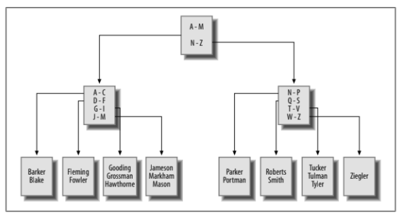
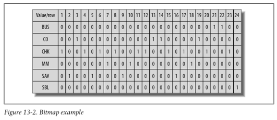

# Indexes & Constraints

When you insert a row into a tale, the server simply places the data in the next available location within the file. When you query a table, therefore, the server will need to inspect every row of the table to answer the query. This type of access is known as a __table scan__.

An _index_ is simply a mechanism for finding a specific item within a resource. Indexes are special tables that unlike normal data tables, _are_ kept in a specific order. Instead of containing _all_ of the data about an entity, however, an index contains only the column/s used to locate rows in the data table, along with information describing where the rows are physically located. Therefore, the role of indexes is to __facilitate the retrieval of a subset of a table's rows and columns without the need to inspect every row in the table__.

## Index Creation

Returning to the `department` table, you might decide to add an index on the `name` column to speed up any queries that specify a full or partial department name, you can add an index to any column:
```sql
ALTER TABLE department
ADD INDEX dept_name_idx (name);
```

With the index in place, the _query optimizer_ can choose to use the index if it is deemed beneficial to do so.

All database servers allow you to look at the available indexes. MySQL users can use the `show` command:

```sql
SHOW INDEX FROM department \G;
```

We can remove our created indexes like this:
```sql
ALTER TABLE department
DROP INDEX dept_name_idx;
```

### Unique Indexes

A unique index plays multiple roles in that along with providing all the benefits of a regular index, it also serves as a mechanism for disallowing duplicate values in the indexed column. 

```sql
ALTER TABLE department
ADD UNIQUE dept_name idx (name);
```

### Multicolumn Indexes

```sql
ALTER TABLE employee
ADD INDEX emp_names_idx (lname, fname);
```

This index will be useful only for queries that specify the first and last names or just the last name.

## Types of Indexes

### B-Tree indexes

This is the default for MySQL, Oracle and SQL Server. As you might expect, B-tree indexes are organized as trees, with one or more levels of _branch nodes_ leading to a single level of _leaf nodes_. Branch nodes are used for navigating the tree, while leaf nodes hold the actual values and location information.

Following example is a B-tree index built on the employe.lname column.


As rows are inserted/updated/deleted, the server will attempt to keep the tree balanced, being able to traverse quickly to the leaf nodes to find the desired values without having to navigate through many levels of branch nodes.

### Bitmap indexes

B-tree can become unwieldy when built on a column that allows only a small number of values. For example, you may decide to generate an index on the `account.product_cd` column, so that you can quickly retrieve all accounts of a specific type.

Because there are only eight different products, however, and because some products are far more popular than others, it can be difficult to maintain a balanced B-tree index as the number of accounts grows.

For columns that contain a small number of values across a large number of rows (known as _low-cardianality data_), a different indexing strategy is needed.



Bitmap indexes are commonly used in data warehousing environments, where large amounts of data are generally indexed on columns containing relatively few values (e.g., sales quarters, geographic regions, products, salespeople).

MySQL hasn't implemented this yet.

### Text indexes

If your database stores documents, you may need to allow users to search for words or phrases in the documents. You certainly don't want the server to open each document and scan for desired text.

There are specialized indexing and search mechanisms for documents.

Both SQL Server and MySQL include what they call __full-text indexes__ (MySQL only has it available with its MyISAM storage engine), and Oracle Database includes a powerful set of tools known as _Oracle Text_.

## How Indexes Are Used

Indexes are generally used by the server to quickly locate rows in a particular table, after which the server visits the associated table to extract the additional information requested by the user.

If the index contains everything to satisfy the query, however, the server doesn't need to visit the associated table. 

You can see how MySQL's query optimizer decides to execute the query with the `explain` statement.

```sql
EXPLAIN SELECT cust_id, SUM(avail_balance) tot_bal
FROM account
WHERE cust_id IN (1,5,9,11)
GROUP BY cust_id;
```

* The `fk_a_cust_id` index is used to find the rows in the `account` table that satisfy the `where` clause.
* After reading the index, the server expects to read all 24 rows of the `account` table to gather the available balance data, since it doesn't know that there might be other customers besides IDs 1,5,9 and 11.

Let's add a new index on both `cust_id` and `avail_balance` columns.

```sql
ALTER TABLE account
ADD INDEX acc_bal_idx (cust_id, avail_balance);
```

Wit this index in pace, we can see again how the query optimizer approaches the same query:

* Optimizer is using the new `acc_bal_idx` instead of the `fk_a_cust_id` index.
* Optimizer anticipates needing only 8 rows instead of 24.
* `account` table is not needed to satisfy the query results.

## Downside of Indexes

Why not index everything? Keep in mind every index is a special type of _table_. Therefore, every time a row is added to or removed from a table, all indexes on that table must be modified. When a row is updated, any indexes on the column or columns that were affected need to be modified as well.

Therefore, the more indexes you have, the more work the server needs to do to keep all schema objects up-to-date, which tends to slow things down.

Indexes also _require disk space_ as well as some amount of care from your administrators, so the best strategy is to add an index where a clear need arises.

You can add the index for a special routine, such as monthly maintenance routine, and then drop it.

#### Default strategy

* All Primary Key columns are indexed (most servers automatically create unique indexes when you create _Primary Key Constraints_).
* For multicolumn primary keys, consider building additional indexes on a subset of the primary key columns, or on all the primary key columns but in a different order.
* Build indexes on all columns that are references in foreign key constraints.
* Index any columns that will frequently be used to retrieve data. Most date columns are good candidates, along with short (3- to 50-character) string columns.

After you have built your initial set of indexes, try to capture actual queries against your tables, and modify your indexing strategy to fit the most-common access paths.

## Constraints

A Constraint is simply a __restriction placed on one or more columns__ of a table.

This protects from rows pointing to no longer valid records (_orphaned rows_), and will make server either raise an error if an attempt is made to modify/delete data that is referenced by other tables, or propagate the changes to other tables for you.

#### Primary Key Constraints

Identify the column/s that guarantee uniqueness within a table.

#### Foreign Key Constraints

* Restrict one or more columns to contain only values found in another table's Primary Key columns, and may also restrict the allowable values in other tables if `UPDATE CASCADE` or `DELETE CASCADE` rules are established.

#### Unique Constraints

Restrict one or more columns to contain unique values within a table (PK is a special type of Unique constraint).

#### Check Constraints

Restrict the allowable values for a column.

## Constraint Creation

Constraints are generally created at the same time as the associated table.

```sql
CREATE TABLE product
(
	product_cd VARCHAR(10) NOT NULL,
	name VARCHAR(50) NOT NULL,
	product_type_cd VARCHAR(10) NOT NULL,
	data_offered DATE,
	data_retired DATE,
	CONSTRAINT fk_product_type_cd FOREIGN KEY (product_type_cd)
		REFERENCES product_type (product_type_cd),
	CONSTRAINT pk_product PRIMARY KEY (product_cd)
)
```

The `product` table includes two constraints: one to specify that the `product_cd` column serves as the primary key for the table, and another to specify that the `product_type_cd` column serves as a foreign key to the `product_type` table. Alternatively you can create the table without constraints and add the primary and foreign key constraints later:

```sql
ALTER TABLE product
ADD CONSTRAINT pk_product PRIMARY KEY (product_cd);

ALTER TABLE product
ADD CONSTRAINT fk_product_type_cd FOREIGN KEY (product_type_cd)
REFERENCES product_type (product_type_cd);
```

And you can remove the constraints too:
```sql
ALTER TABLE product
DROP PRIMARY KEY;

ALTER TABLE product
DROP FOREIGN KEY fk_product_type_cd;
```

Foreign Key constraints are sometimes dropped during certain maintenance operations and then reestablished.

## Constraints & Indexes

Constraint creation sometimes involves the automatic generation of an index. Database servers behave differently regarding this relationship.

In MySQL:
* Primary Key Constraints -> generates unique index
* Foreign Key Constraints -> generates index
* Unique constraints -> generates unique index

MySQL, therefore, generates a new index to enforce primary key, foreign key, and unique constraints.

## Cascading Constraints

With foreign key constraints in place, if a user attempts to insert a new row or change an existing row such that a foreign key column doesn't have a matching value in the parent table, the server raises an error.

You can instruct the server to propagate changes to all child rows for you, thus preserving the integrity of the data. Known as a _cascading update_,, this variation can be installed by removing the existing FK and adding a new one:

```sql
ALTER TABLE product
DROP FOREIGN KEY fk_product_type_cd;

ALTER TABLE product
ADD CONSTRAINT fk_product_type_cd FOREIGN KEY (product_type_cd)
	REFERENCES product_type (product_type_cd)
	ON UPDATE CASCADE
	ON DELETE CASCADE;
```


