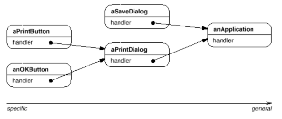

# Chain of Responsibility

## Intent

Avoid coupling the sender of a request to its receiver by giving more than one object a chance to handle the request. Chain the receiving objects and pass the request along the chain until an object handles it.

## Applicability

Use _Chain of Responsibility_ when:

* More than one object may handle a request, and the handler isn't known a priori. Handler should be ascertained automatically.

* You want to issue a request to one of several objects without specifying the receiver explicitly.

* Set of objects that can handle a request should be specified dynamically.

## Collaborations


When a client issues a request, the request propagates along the chain until a `ConcreteHandler` object takes responsibility for handling it.

## Consequences

1. __Reduced coupling__. The pattern frees an object from knowing which other object handles a request. An object only has to know that a request will be handled "appropriately". Both the receiver and the sender have no explicit knowledge of each other, and an object in the chain doesn't have to know about the chain's structure.

2. __Added flexibility in assigning responsibilities to objects__. You can add or change responsibilities for handling a request by adding to or otherwise changing the chain at run-time. You can combine this with subclassing to specialize handlers statically.

3. __Receipt isn't guaranteed__. Since a request has no explicit receiver, there's no _guarantee_ it'll be handled. The request can fall off the end of the chain without ever being handled. A request can also go unhandled when the chain is not configured properly.

## Related Patterns

Chain of Responsibiltiy is often applied in conjunction with _Composite_. There, a component's parent can act as its successor.

## Implementation

1. __Implementing the successor chain__. There are two possible ways to do so:
  A. Define new links (usually in the `Handler`, but `ConcreteHandlers` could define them instead).
  B. Use existing links (existing object references, for example, parent referneces in a part-whole hierarchy).

2. __Connecting successors__. If there are no preexisintg references for defining a chain, then you'll have to introduce them yourself. In that case, the `Handler` does not only defines the interface for the requests but usually maintains the successor as well. That lets the handler provide a default implementation of `HandleRequest` that forwards the request to the successor (if any). If a `ConcreteHandler` subclass isn't interested in the request, it doesn't have to override the forwarding operation, since it will forward unconditionally.

3. __Representing requests__.
  * In the simplest form, the request is a hard-coded operation invocation, as in the case of `HandleHelp`. This is convenient and safe, but you can forward only the fixed set of requests that the `Handler` class defines.
  * An alternative is to use a single handler function that takes a request code (e.g., an integer cosntant or a string) as parameter. This supports an open-ended set of requests. The only requirement is that te sender and receiver agree on how the request should be encoded. This approach is more flexible, but it requires conditional statements for dispatching the request based on its code. Moreover, there's no type-safe way to pass the parameters, so they must be packed and unpacked manually. To address the parameter-passing problem, we can use separate request _objects_.
  * A `Request` class can represent requests explicitly, and new kinds of requests can be defined by subclassing. Subclasses can define different parameters but Handlers must know the kind of `Request` subclass they're using to access these parameters. `Request` can define an accessor function that returns an identifier for the class.

4. __Automatic forwarding in Smalltalk__. You can use `doesNotUnderstand` mechanism in Smalltalk to forward requests. Messages that have no corresponding methods are trapped in the implementation of `doesNotUnderstand`, which can be overriden to forwad the mssage to an object's successor.

## Motivation

Consider a context-sensitive help facility for a graphical user interface. The user can obtain help information on any part of the interface just by clicking on it. The help that's provided depends on the part of the interface that's selected and its context, for example, a button widget in a dialog box might have different help information than a similar button in the main window. If no specific help information exists for that part of the interface, then the help system should display a more general help message about the immediate context.

Hence it's natural to organize the help information according to its generality (from the most specific to the most general). Furthermore, it's clear that a help request is handled by one of several user interface objects, which one depends on the context and how specific the available help is.

The problem here is that the object that ultimately _provides_ the help isn't known explicitly to the object (e.g., the button) that _initiates_ the help request. What we need is a way to decouple the button that initiates the help request from the objects that might provide help information. The _Chain of Responsibility_ pattern defines how that happens.

The idea of this pattern is to decouple senders and receivers by giving multiple objects a chance to handle a request. The request gets passed along a chain of objects until one of them handles it.



> The first object in the chain receives the request and either handles it or forwards it to the next candidate on the chain, which does likewise.

> The object that made the request has no explicit knowledge of who will handle it, we say the request has an __implicit receiver__.

Let's assume the user clicks for help on a button widget marked _"Print"_. The button is contained in an instance of _PrintDialog_, which knows the application object it belongs to. The following interaction happens, so the request gets forwarded along the chain:

```
aPrintButton->HandleHelp()->aPrintDialog->HandleHelp()->anApplication
```

In this case, neither `aPrintButton` nor `aPrintDialog` handles the request, it stops at `anApplication`, which can handle it or ignore it. The client that issued the request has no direct reference to the object that ultimately fulfills it.

> To forward the request along the chain, and to ensure receivers remain implicit, each object on the chain shares a common interface for handling requests and for accessing its __successor__ on the chain.

For example, the help system ight define a `HelpHandler` class with a corresponding `HandleHelp` operation. `HelpHandler` can be the parent class for candidate object classes, or it can be defined as a _mixin_ class. Then classes that want to handle help requests can inherit from `HelpHandler`: 


The `Button`, `Dialog`, and `Application` classes use `HelpHandler` operations to handle help requests. `HelpHandler`'s `HandleHelp` operation forwards the request to the successor by default. Subclasses can override this operation to provide help under the right circumstances.
