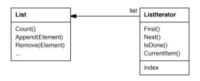

# Interpreter

Also known as __Cursor__.

## Intent

Provide a way to access the elements of an aggregate object sequentially without exposing its underlying representation.

## Applicability

Use the __Iterator__ pattern:

* To access an aggregate object's contents without exposing its internal representation.

* To support multiple traversals of aggregate objects.

* To provide a uniform interface for traversing different aggregate structures (_polymorphic iteration_).

## Collaborations

A `ConcreteIterator` keeps track of the current object in the aggregate and can compute the succeeding object in the traversal.

## Consequences

1. __It supports variations in the traversal of an aggregate.__ Complex aggregates may be traversed in many ways. Iterators make it easy to change the traversal algorithm, you only need to replace the iterator instance with a different one. You can also define `Iterator` subclasses to support new traversals.

2. __Iterators simplify the Aggregate interface.__ `Iterator`'s traversal interface obviates the need for a similar interface in `Aggregate`, thereby simplifying the agregate's interface.

3. __More than one traversal can be pending on an aggregate.__ An iterator keeps track of its own traversal state. Therefore you can have more than one traversal in progress at once.

## Related Patterns

* _Composite_: Iterators are often applied to recursive structures such as Composites.

* _Factory Method_: Polymorphic iterators rely on factory methods to instantiate the appropriate `Iterator` subclass.

* _Memento_: An iterator can use a memento to capture the state of an iteration. The iterator stores the memento internally.

## Implementation

Iterator has many implementation variants and alternatives. Some important ones follow. The trade-offs often depend on the control structures your language provides. Some languages even support this pattern directly.

1. __Who controls the iteration?__ When the client controls the iteration, the iteratoir is called an __external iterator__, and when the iterator controls it, the iterator is an __interal iterator__. Clients that use an external iterator must advance the traversal and request the next element explicitly from the iterator. In contrast, the client hands an internal iterator an operation to perform, and the iterator applies that operation to every element in the aggregate. External iterators are more flexible than internal iterators. It's easy to compare two collections for equality with an external interator for example. On the other hand, internal iterators are easier to use, because they define the iteration logic for you.

2. __Who defines the traversal algorithm?__ The aggregate might define the traversal algorithm and use the iterator to store just the state of the iteration. We call this kind of iterator a __Cursor__, since it merely points to the current position in the aggregate. A client will invoke the `Next` operation on the aggregate with the cursor as an argument, and the `Next` operation will change the state of the cursor.

3. __How robust is the iterator?__ It can be dangerous to modify an aggregate while you're traversing it. If elements are added or deleted from the aggregate, you might end up accessing an element twice or missing it completely. A simple solution is to copy the aggregate and traverse the copy, but that's too expensive to do in general. A __robust iterator__ ensures that insertions and removals won't interfere with traversal, and it does it without copying the aggregate. Most rely on registering the iterator with the aggregate. On insertion or removal, the aggregate either adjusts the internal state of iterators it has produced, or it maintains information internally to ensure proper traversal.

4. __Additional Iterator Operations__. The minimal interface to `Iterator` consists of the operations `First`, `Next`, `isDone`, and `CurrentItem`. Some additional operations might prove useful. For example, ordered aggregates can have a `Previous` operation that positions the iterator to the previous element. A `SkipTo` operation is useful for sorted or indexed collections. `SkipTo` positions the iterator to an object matching specific criteria.

5. __Using polymorphic iterators in C++__. Polymorphic iterators have their cost. They require the iterator object to be allocated dynamically by a factory method. Hence they should be used only when there's a need for polymorphism. Otherwise use concrete iterators, which can be allocated on the stack. Also, the client is responsible for deleting them. This is error-prone. We can use a _stack-allocated proxy_ as a stand-in for the real iterator as a remedy, which could ensure proper cleanup, even in the face of exceptions.

6. __Iterators may have privileged access__. An iterator can be viewed as an extension of the aggregate that created it. The iterator and the aggregate are tightly coupled. We can express this close relationship in C++ by making the iterator a `friend` of its aggregate. Then you don't need to define aggregate operations whose sole purpose is to let iterators implement traversal efficiently. However, such privileged access can make defining new traversals difficult since it'll require changing the aggregate interface to add another friend. To avoid this problem, the `Iterator` class can include `protected` operations for accessing important but publicly unavailable members of the aggregate. `Iterator` subclasses (and _only_ `Iterator` subclasses) may use these protected operations to gain privileged access to the aggregate.

7. __Iterators for composites__. External interators can be difficult to implement over recursive aggregate structures like those in the _Composite_ pattern, because a position in the structure may span many levels of nested aggregates. Therefore an external iterator has to store a path through the _Composite_ to keep track of the current object. Sometimes it's easier just to use an internal iterator. If the nodes in a _Composite_ have an interface for moving from a node to its sibilings, parents, and children, then a __cursor-based iterator__ may offer a better alternative. The cursor only needs to keep track of the current node, it can rely on the node interface to traverse the _Composite_.

8. __Null iterators__. A `NullIterator` is a degenerate iterator that's helpful for handling boundary conditions. By definition, a `NullIterator` is a _always done_ with traversal. It can make traversing tree-structured aggregates (like _Composites_) easier. At each point in the traversal, we ask the current element for an iterator for its children. Aggregate elements return a concrete iterator as usual. But leaf elements return an instance of `NullIterator`. That lets us implement traversal over the entire structure in a uniform way.

## Motivation

An aggregate object such as a list should give you a way to access its elements without exposing its internal structure. Moreover, you might want to traverse the list in different ways, depending on what you want to accomplish. But you probably don't want to bloat the `List` interface with operations for different traversals, even if you could anticipate the ones you will need. You might also need to have more than one traversal pending on the same list.

The _Iterator_ pattern lets you do all this. The key idea in this pattern is to take the responsibility for access and traversal out of the list object and put it into an __iterator object__. The `Iterator` class defines an interface for accessing the list's elements. An iterator object is responsible for keeping track of the current elmeent, that is, it knows which elements have been traversed already.

For example, a `List` class would call for a `ListIterator` with the following relationship between them:

y

Separing the traversal mechanism from the `List` object lets us define iterators for different traversal policies without enumerating them in the `List` interface. For example, `FilteringListIterator` might provide access only to those elements that satisfy specific filtering constraints.

Notice that the iterator and the list are coupled, and the client must know that it is a _list_ that's traversed as opposed to some other aggregate structure. Hence the client commits to a particular aggregate structure. It would be better if we could change the aggregate class without changing client code. We can do this by generalizing the iterator concept to support __polymorphic iteration__.

As an example, let's assume that we also have a `SkipList` implementation of a list. A skiplist is a probabilistic data structure with characteristics similar to balanced trees. We want to be able to write code that works for both `List` and `SkipList` objects.

We define an `AbstractList` class that provides a common interface for manipulating lists. Similarly, we need an `AbstractIterator` class that defines a common iteration interface. Then we can define concrete `Iterator` subclasses for the different list implementations. As a result, the iteration mechanism becomes independent of concrete aggregate classes.

The remianing problem is how to create the iterator. Since we want to write code that's independent of the concrete `List` subclasses, we cannot simply instantiate a specific class. Instead, we make the list objects responsible for creating their corresponding iterator. This requires an operation like `CreateIterator` through which clients request an iterator object.

`CreateIterator` is an example of a factory method (_Factory Method_ pattern). We use it here to "connect" the lists and iterators hierarchies.
