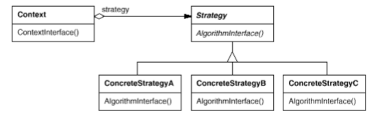

# Strategy

Also known as __Policy__.

## Intent

Define a family of algorithms, encapsulate each one, and make them interchangeable. Strategy lets the algorithm vary independently from clients that use it.

## Applicability

Use the __Strategy__ pattern when:

* Many related classes differ only in their behavior. Strategies provide a way to configure one class, with one of many behaviors.

* You need different variants of an algorithm. For example, you might define algorithms reflecting different space/time trade-offs.

* An algorithm uses data that clients shouldn't know about. _Strategy_ pattern can be used to avoid exposing complex, algorithm-specific data structures.

* A class defines many behaviors, and these appear as multiple conditional statements in its operations. Instead of any conditionals, move related conditional branches into their own `Strategy` class.

## Collaborations

1. `Strategy` and `Context` interact to implement the chosen algorithm. A context may pass all data required by the algorithm to the strategy when is called. Alternatively, the context can pass itself as an argument.

* A context forwards requests from its clients to its strategy. Clients usually create and pass a `ConcreteStrategy` object to the context, thereafter, clients interact with the context exclusively.

## Consequences

1. __Families of related algorithms__. Hierarchies of `Strategy` classes define a family of algorithms or behaviors for contexts to reuse. Inheritance can help factor out common functionality of the algorithms.

2. __An alternative to subclassing__. Inheritance offers another way to support a variety of algorithms and behaviors. You can subclass a `Context` class directly to give it different behaviors. But this hard-wires the behavior into `Context`. You wind up with many related classes whose only difference is the algorithm or behavior they employ. Encapsulating the algorithm in separate `Strategy` classes lets you vary the algorithm independently of its context, making it easier to switch, understand and extend.

3. __Strategies eliminate conditional statements__. This pattern offers an alternative to conditional statements for selecting desired behavior by delegating the behavior to a `Strategy` object.

4. __A choice of implementation__. Strategies can provide different implementations of the _same_ behavior. The client can choose among strategies with different time and space trade-offs.

5. __Clients must be aware of different Strategies.__ The pattern has a potential drawback in that a client must understand how Strategies differ before it can select the appropriate one. Clients might be exposed to implementation issues. Therefore you should use the _Strategy_ pattern only when the variation in behavior is relevant to clients.

6. __Communication overhead between Strategy and Context__. The `Strategy` interface is shared by all `ConcreteStrategy` classes. Hence it's likely that some `ConcreteStrategies` won't use all the information passed to them through this interface. That means there will be times when the context creates and initializes parameters that never get used. If this is an issue, then you'll need tighter coupling between `Strategy` and `Context`.

7. __Increased number of objects__. Strategies increase the number of objects in an application. Sometimes you can reduce this overhead by implementing strategies as stateless objects that contexts can share (_Flyweight_ pattern).

## Related Patterns

* _Flyweight_: `Strategy` objects often make good flyweights.

## Implementation

1. __Defining the Strategy and Context interfaces__. They both must give a `ConcreteStrategy` efficient access to any data it needs from a context, and vice versa. One approach is to have `Context` pass data in parameters to `Strategy` operations, this keeps them decoupled but `Context` might pass data the `Strategy` doesn't need. Another technique has a context pass _itself_ as an argument, and the strategy requests data from the context explicitly. Alternatively, the strategy can store a reference to its context. But now, `Context` must define a more elaborate interface to its data, which couples `Strategy` and `Context` more closely. The needs of the particular algorithm and its data requirements will determine the best technique.

2. __Strategies as template parameters__. In C++ templates can be used to configure a class with a strategy if (1) the `Strategy` can be selected at compile-time, and (2) it does not have to be changed at run-time.

3. __Making Strategy objects optimal__. The `Context` class may be simplified if it's meaningful _not_ to have a `Strategy` object. `Context` checks to see if it has a `Strategy` object before accessing it. If there is one, then `Context` uses it normally IF there isn't a strategy, then `Context` carries out default behavior. The benefit of this approach is that clients don't have to deal with `Strategy` objects at all _unless_ they don't like the default behavior.

## Motivation

Many algorithms exist for breaking a stream of text into lines. Hard-wiring all such algorithms into the classes that require them isn't desirable for several reasons:

* Clients that need linebreaking get more complex if they include the linebreaking code. That makes clients bigger and harder to maintain, especially if they support multiple linebreaking algorithms.

* Different algorithms will be appropriate at different times. We don't want to support multiple linebreaking algorithms if we don't use them all.

* It's difficult to add new algorithms and vary existing ones when linebreaking is an integral part of a client.

We can avoid these problems by defining classes that encapsulates different algorithms. An algorithm that's encapsulated in this way is called a __strategy__.

Suppose a `Composition` class is responsible for maintaining and updating the linebreaks of text displayed in a text viewer. Linebreaking strategies aren't implemented by the class `Composition`. Instead, they are implemented separately by subclasses of the abstract `Compositor` class.

A `Composition` maintains a reference to a `Compositor` object. Whenever a `Composition` reformats its text, it forwards this responsibility to its `Compositor` object. The client of `Composition` specifies which `Compositor` should be used.
