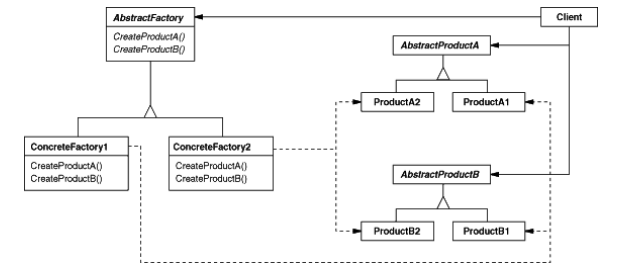

# Abstract Factory

## Intent

Provide an interface for __creating families of related or dependent objects__ without specifying their concrete classes.

## Applicability

* A system should be independent of how its products are created, composed, and represented.

* A system should be configured with one of multiple families of products.

* A family of related product objects is designed to be used together, and you need to enforce this constraint.

* You want to provide a class library of products, and you want to reveal just their interfaces, not their implementations.

## Collaborations

* Normally a single instance of a `ConcreteFactory` class is created at run-time. This concrete factory creates product objects having a particular implementation. To create different product objects, clients should use a different concrete factory.

* `AbstractFactory` defers creation of product objects to its `ConcreteFactory` subclass. 

## Consequences

1. __Isolates concrete classes__. Factory encapsulates responsibility and the process of creating product objects. Client manipulate instances through their abstract interfaces.

2. __Makes exchanging product families easy__. It can use different product configurations simply by changing the concrete factory.

3. __Promotes consistency among products__. It enforces the use of objects from only one family.

4. __Supporting new kinds of products is difficult__. Extending abstract factories to produce new kinds of Products isn't easy. That's because the `AbstractFactory` interface fixes the set of products that can be created. Supporting new kinds of products requires extending the factory interface, which involves changing the `AbstractFactory` class and all of its subclasses.

## Related Patterns

_Abstract Factory_ classes are often implemented with factory methods (_Factory Method_ pattern), but they can also be implemented using _Prototype_.

A concrete factory is often a _Singleton_.

## Implementation

Here are some useful techniques for implementing this pattern:

1. __Factories as Singletons__. An application typically needs only one instance of a `ConcreteFactory`.

2. __Creating the products__. It's up to `ConcreteProduct` subclasses to actually create products.
  
  * The most common way to do this is to define a __Factory Method__ for each. A concrete factory will specify its products by overriding the factory method for each. While this implementation is simple, it requires a new concrete factory subclass for each product family, even if the product families differ only slighly.
  
  * If many product families are possible, the concrete factory can be implemented using the __Prototype__ pattern. The concrete factory is initialized with a prototypical instance of each product in the family, and it creates a new product by cloning its prototype. This apprach eliminates the need for a new concrete factory class for each product family.

  * A __variation of the Prototype-based__ approach is possible in languages that treat classes as first-class objects. You can store _classes_ inside a concrete factory that create the various concrete products in variables, much like prototypes. These classes create new instances on behalf of the concrete factory. You define a new factory by initializing an instance of a concrete factory with _classes_ of products rather than by subclassing.

3. __Defining extensible factories__. Adding a new kind of product requires changing the `AbstractFactory` interface and all the classes that depend on it. A more flexbile but less safe design is to add a parameter to operations that create objects. This parameter specifies the kind of object to be created. It could be a class identifier, an integer, or anything else that identifies the kind of product. With this approach, `AbstractFactory` only needs a single "Make" operation with a parameter indicating the kind of object to create. The problem is that all products are returned to the client with the _same_ abstract interface as given by the return type, so if clients need to perform subclass-specific operations, they won't be accessible through the abstract interface.

## Motivation

Consider a user interface toolkit that supports multiple look-and-feel standards, such as Motif and Presentation Manager. Different look-and-feels define different appearances and behaviors for user interface "widgets" like scroll bars, windows, and buttons. To be portable across look-and-feel standards, an application should not hard-core its widgets for a particular look and feel as it makes it hard to change it later.

We can solve this problem by defining an abstract `WidgetFactory` class that declares an interface for creating each basic kind of widget. There's also an abstract class for each kind of widget, and concrete subclasses implement widgets for specific look-and-feel situations. Clients call `WidgetFactory` to obtain widget instances, but clients aren't aware of the concrete classes they're using. Thus clients stay independent of the prevailing look and feel.

A `Widget Factory` also enforces dependencies between the concrete widget classes. A `MotifScrollbar` should be used with a `MotifButton` and that constraint is enforced automatically as a consequence of using a `MotifWidgetFactory`.
