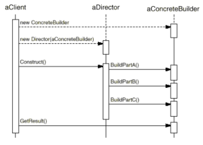

# Builder

## Intent

Separate the construction of a complex object from its representation so that the same construction process can create different representations.

## Applicability

* The algorithm for creating a complex object should be independent of the parts that make up the object and how they're assembled.

* The construction process must allow different representations for the object that's constructed.

## Collaborations

* The client creates the `Director` object and configures it with the desired `Builder` object.

* `Director` notifies the `Builder` whenever a part of the product should be built.

* `Builder` handles requests from the `Director` and adds parts to the product.

* The client retrieves the product from the builder.

## Consequences

1. __It lets you vary a product's internal representation__. The `Builder` hides the implementation and internal structure of the product and how it gets assembled. You can vary the `Product`'s internal representation by defining a new kind of `Builder`.

2. __It isolates code for construction and representation__. Client's don't know anything about classes that define the product's internal structure, such classes don't appear in `Builder`'s interface. Each `ConcreteBuilder` contains all the code to create and assemble a particular kind of product. The code is wrirten once, then different `Director` can reuse it to build `Product` variants from the same set of parts.

3. __It gives you finer control over the construction process__. Unlike creational patterns that construct products in one shot, the _Builder_ pattern constructs the product step by step under the `Director`'s control. Only when the product is finished does the `Director` retrieve it from the builder. This gives you finer control over the construction process and consequently the internal structure of the resulting product.

## Related Patterns

_Abstract Factory_ is similar to _Builder_ in that it too may construct complex objects. The primary difference is that the _Builder_ pattern focuses on constructing a complex object step by step. _Abstract Factory_'s emphasis is on families of product objects. _Builder_ returns the product as a final step, but as far as the _Abstract Factory_ pattern is concerned, the product gets returned immediately.

A _Composite_ is what the builder often builds.

## Implementation

Typically there's an abstract `Builder` class that defines an operation for each component that a `Director` may ask it to create. A `ConcreteBuilder` class overrides operations for components it's interested in creating.

Here are other implementation issues to consider:

1. __Assembly and construction interface__. `Builder` class interface must be general enough to allow construction of products for all kinds of `ConcreteBuilder`s. A model where the results of construction requests are simply appended to the product is usually sufficient. But sometimes you might need to access to parts of the product constructed earlier.

2. __Why no abstract class for products?__. In the common case, the products produced by the concrete builders differ so greatly in their representations that there is little to gain from giving different products a common parent class. Because the client usually configures the `Director` with the proper `ConcretBuilder`, the client is in a position to know which concrete subclass of `Builder` is in use and can handle its products accordingly.

3. __Empty methods as default in Builder__. Let clients override only the operations they're interested in.

## Motivation

A reader for the RTF (Rich Text Format) document exchange exchange format should be able to convert RTF to many text formats. The problem is that the number of possible conversions is open-ended. So it should be easy to add a new conversion without modifying the reader.

A solution is to configure the `RTFReader` class with a `TextConverter` object that converts RTF to another textual representation. As the `RTFReader` parses the RTF document, it uses the `TextConverter` to perform the conversion. Whenever the `RTFReader` recognizes an RTF token (either plain text or an RTF control word), it issues a request to the `TextConverter` to convert the token. `TextConverter` objects are responsible both for performing the data conversion and for representing the token in a particular format.

Subclasses of `TextConverter` specialize in different conversions and formats. For example, an `ASCIIConverter` ignores requests to convert anything except plain text. A `TeXConvertere`, on the other hand, will implement operations for all requests in order to produce a TeX representation. A `TextWidgetConverter` will produce a complex user interface object that lets the user see and edit the text.

Each kind of converter class takes the mechanism for creating and assembling a complex object and puts it behind an abstract interface. The converter is separate from the reader, which is responsible for parsing an RTF document.

The _Builder_ pattern captures all these relationships. Each __converter class is called a builder__ in the pattern, and the __reader is called the directior__.

Applied to this example, the _Builder_ pattern separates the algorithm for interpreting a textual format (that is, the parser for RTF documents) from how a converted format gets created and represented. This lets us reuse the `RTFReader`'s parsing algorithm to create different text representations, just by configuring the `RTFReader` with different subclasses of `TextConverter`.
