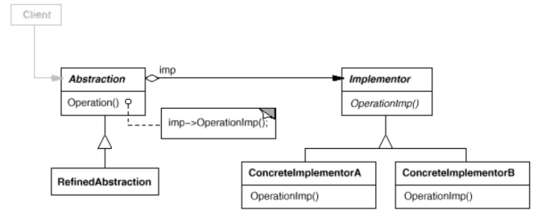

# Bridge

Also known as __Handle/Body__.

## Intent

Decouple an abstraction from its implementation so that the two can vary independently.

## Applicability

Use the _Bridge_ pattern when:

* You want to avoid a permanent binding between an abstraction and its implementation. For example, when the implementation must be selected or switched at run-time.

* Both the abstractions and their implementations should be extensible by subclassing.

* Changes in the implementation of an abstraction should have no impact on clients, that is, their code should not have to be recompiled.

* (C++) You want to hide the implementation of an abstraction completely from clients.

* You have a proliferation of classes as shown in the `Window` example later. Such a class hierarchy indicates the need for splitting an object into two parts. _Rumbaugh_ uses the term "__nested generalizations__" to refer to such class hierarchies.

* You want to share an implementation among multiple objects, and this fact should be hidden from the client.

## Collaborations

* `Abstraction` forwards client requests to its `Implementor` object.

## Consequences

1. __Decoupling interface and implementation__. An implementation is not bound permanently to an interface. The implementation of an abstraction can be configured at run-time. It's even possible for an object to change its implementation at run-time. This also eliminates compile-time dependencies on the implementation.

2. __Improved extensibility__. You can extend the `Abstration` and `Implementor` hierarchies independently.

3. __Hiding implementation details from clients__. You can shield clients from implementation details, like the sharing of Implementor objects and the accompanying reference count mechanism (if any).

## Related Patterns

* An _Abstract Factory_ can create and configure a particular _Bridge_.

* _Adapter_ pattern is geared toward making unrelated classes work together. It is usually applied to systems after they're designed. Bridge, on the othey hand, is used up-front in a design to let abstractions and implementations vary independently.

## Implementation

1. __Only one Implementor__. It situations where there's only one implementation, creating an abstract `Implementor` isn't necessary. Nevertheless, this separation is still useful when a change in the implementation of a class must not affect its existing clients, that is, they shouldn't have to be recompiled. just relinked.

2. __Creating the right Implementor object__. How, when, and where do you decide which `Implementor` class to instantiate when there's more than one? If `Abstraction` knows about all `ConcreteImplementor` classes, then it can instantiate one of them in its constructor, it can decide between them based on parameters passed to its constructor. Another approach is to choose a default implementation initially and change it later according to usage. It's also possible to delegate the decision to another object altogether, such as a factory object whose sole duty is to encapsulate platform-specifics and knows what kind of object to create for the platform in use. A benefit of this approach is that `Abstraction` is not coupled directly to any of the `Implementor` classes.

3. __Sharing implementors__. You can share implementations among several objects.

4. __Using multiple inheritance__. For example in C++, you can use multiple inheritance to combine an interface with its implementation, by inheriting publicly from `Abstraction` and privately from a `ConcreteImplementor`. But because this approach relies on static inheritance, it binds an implementation permanently to its interface. Therefore, you can't implement a "true" _Bridge_ with multiple inheritance, at least not in C++.

## Motivation

When an abstraction can have one of several possible implementations, the usual way to accommodate them is to use inheritance. An abstract class defines the interface to the abstraction, and concrete subclasses implement it in different ways. But this approach binds an implementation to the abstraction permanently, which makes it difficult to modify, extend, and reuse abstractions and implementations independently.

Consider the implementation of a portable `Window` abstraction in a user interface toolkit. This abstraction should enable us to write applications that work on both the X Window System and IBM's Presentation Manager (PM), for example. Using inheritance, we could define an abstract class `Window` and subclasses `XWindow` and `PMWindow` that implement the `Window` interface for the different platforms.

But this approach has two drawbacks:

1. It's inconvenient to extend the `Window` abstraction to cover different kinds of windows or new platforms. Imagine an `IconWindow` subclass of `Window` that specializes the `Window` abstraction for icons. To support `IconWindows` for both platforms, we have to implement _two_ new classes, `XIconWindow` and `PMIconWindow`. Worse, we'll have to define two classes for _every_ kind of window. Supporting a third platform requires yet another new `Window` subclass for every kind of window.

2. It makes client code platform-dependent. Whenever a client creates a window, it instantiates a concrete class that has a specific implementation. This, in turn, makes it harder to port the client code to other platforms. Clients should be able to create a window without commiting to a concrete implementation. Only the window implementation should depend on the platform on which the application runs. Therefore client code should instantiate windows without mentioning specifc platforms.

The Bridge pattern addresses these problems by putting the `Window` abstraction and its implementation in separate class hierarchies. There is one class hierarchy for window interfaces (`Window`, `IconWindow`, `TransientWindow`) and a separate hierarchy for platform-specific window impemetations, with `WindowImp` as its root. The `XWindowImp` subclass, for example, provides an implementation based on the X Window System.

All operations on `Window` subclasses are implemented in terms of abstract operations from the `WindowImp` interface. This decouples the window abstractions from the various platform-specific implementations. We refer to the relationship between `Window` and `WindowImp` as a __bridge__, because it bridges the abstraction and its implementation, letting them vary independently.
