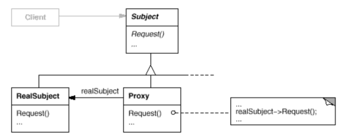
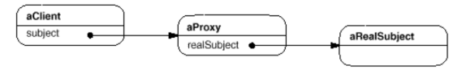
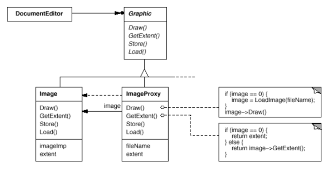

# Proxy

Also known as __Surrogate__.

## Intent

Provide a surrogate or placeholder for another object to control access to it

## Applicability

Proxy is applicable whenever there is a need for a more versatile reference to an object than a simple pointer.

* __Remote proxy__ provides a local representative for an object in a different address space.

* __Virtual proxy__ creates expensive objects on demand.

* __Protection proxy__ controls access to the original object (useful for objects with different access rights).

* __Smart reference__ is a replacement for a bare pointer that performs additional actions to operating system objects.
    * Counting number of references to the real object so that it can be freed automatically (_Smart Pointers_).
    * Loading a persistent object into memory when it's first referenced.
    * Checking that the real object is locked before it's accessed to ensure immutability.

## Collaborations

* Proxy forwards requests to `RealSubject` when appropriate, depending on the kind of proxy.

## Consequences

The _Proxy_ pattern introduces a level of indirection when accessing an object. The additional indirection has many uses, depending on the kind of proxy:

1. A __remote proxy__ can hide the fact that an object resides in a different address space.

2. A __virtual proxy__ can perform optimizations such as creating an object on-demand.

3. Both __protection proxies__ and __smart references__ allow additional housekeeping tasks when an object is accessed.

There's another optimization that the _Proxy_ pattern can hide from the client. It's called __copy-on-write__ and it's related to creation o demand. Copying a large and complicated object can be an expensive operation. If the copy is never modified, then there's no need to incur this cost. By using a proxy to postpone the copying process, we ensure that we pay the price of copying the object only if it's modified.

To make copy-on-write work, the subjcet must be reference counted. Copying the proxy will do nothing more than increment this reference count. Only when the client requests an operation that modifies the subject does the proxy actually copy it. In that case, the proxy must also decrement the subject's reference count.

## Related Patterns

* _Adapter_: An adapter provides a different interface to the object it adapts. In contrast, a proxy provides the same interface as its subject. However, a proxy used for access protection might refuse to perform an operation that the subject will perform, so its interface may be effectively a subset of the subject's.

* _Decorator_: Although decorators can have similar implementations as proxies, decorators have a different purpose. A decorator adds one or more responsibilities to an object, whereas a proxy controls access to an object.

Proxies vary in the degree to which they are implemented like a decorator. A protection proxy might be implemented exactly like a decorator. On the other hand, a remote proxy will not contain a direct reference to its real subject but only an indirect reference, such as "host ID and local address on host". A virtual proxy will start off with an indirect reference such as a file name but will eventually obtain and use a direct reference.

## Implementation

The proxy pattern can exploit the following language features:

1. __Overloading the member access operator in C++__. C++ supports overloading operator `->`, the member access operator. Overloading this operator lets you perform additional work whenever an object is derreferenced.

2. __Using `doesNotUnderstand` in Smalltalk__. This hook can be used to support automatic forwarding of requests. Smalltalk calls `doesNotUnderstand: aMessage` when a client sends a message to a receiver that has no corresponding method. The Proxy class can redefine `doesNotUnderstand` so that the message is forwarded to its subject.

3. __Proxy doesn't always have to know the type of real subject__. If a Proxy class can deal with its subject solely through an abstract interface, then there's no need to make a Proxy class for each `RealSubject` class. The proxy can deal with all `RealSubject` classes uniformly. But if Proxies are going to instantiate `RealSubjects` (such as in a virtual proxy), then they have to know the concrete class.

## Motivation

One reason for controlling access to an object is to defer the full cost of its creation and initialization until we actually need to use it.

Consider a document editor that can embed graphical objects in a document. Some graphical objects, like large raster images, can be expensive to create. But opening a document should be fast, so we should avoid creating all the expensive objects at once when the document is opened. This isn't necessary anyway, because not all of these objects will be visible in the document at the same time.

These constraints would suggest creating each expensive object on demand, which in this case occurs when an image becomes visible. But what do we put in the document in place of the image? And how can we hide the fact that the image is created on demand so that we don't complicate the editor's implementation? This optimization shouldn't impact the rendering and formatting code, for example.

The solution is to use another object, an image __proxy__, that acts as a stand-in for the real image. The proxy acts just like the image and takes care of instantiating it when it's required.

The image proxy creates the real image only when the document editor asks it to display itself by invoking its Draw operation. The proxy forwards subsequent requests directly to the image. It must therefore keep a reference to the image after creating it.

Let's assume that images are stored in separate files. In this case we can use the file name as the reference to the real object. The proxy also stores its extent, that is, its width and height. The extent lets the proxy respond to requests for its size from the formatter without actually instantiating the image.

The document editor accesses embedded images through the interface defined by the abstract `Graphic` class. `ImageProxy` is a class for images that are created on demand, and it maintains the file name as a reference to the image on disk. `ImageProxy` also stores the bounding box of the image and a reference to the real `Image` instance. This reference won't be valid until the proxy instantiates the real image. The `Draw` operation makes sure the image is instantiated before forwarding it the request.
