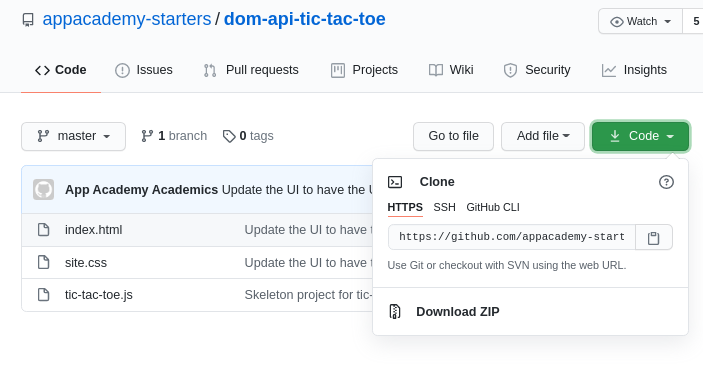
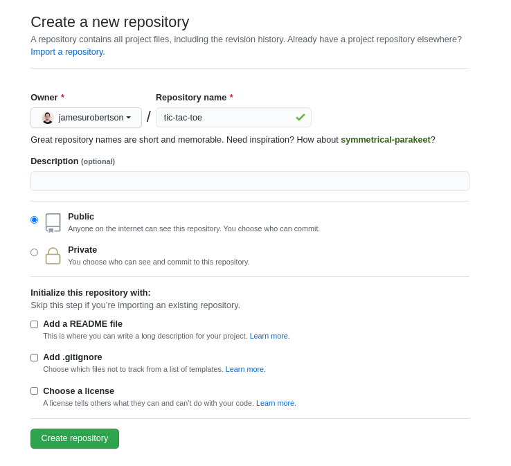
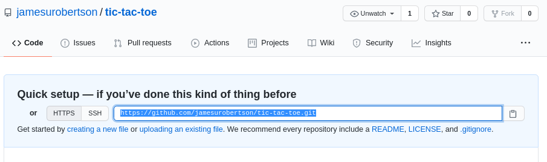
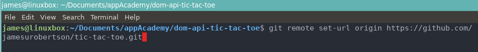

# Git Flow

## Table of Contents

**[Cloning a repo and changing the remote url](#Cloning-a-repo-and-changing-the-remote-url)** 
**[Basic Git Workflow](#Basic-git-work-flow)**

## Cloning a repo and changing the remote url

(These steps are only for when you initially clone a project repo. Not when you clone your partners repo to collaborate together. To do that, you only have to complete step 1!)

### 1. The first step is to clone the repo!

- Navigate to the repo you want to clone and hit the big green code button. Copy the link given.

- Navigate in your terminal to the directory where you want this repo to live. I chose ~/Documents/appAcademy
- `git clone HTTPS://LINKTOURL/THATYOUCOPIED`

### 2. Sweet, you have the cloned repo in your preferred directory. Now lets make your own repo. On github, create a new repository.

- Default settings are fine. Hit the big green button `Create Repository`

### 3. Next, copy the .git link that is on the next page. Do not do any other steps on this page - That is for when you do not clone a repo.

### 4. Whenver you clone a repo it already has a .git directory with certain configurations set up. To be able to push this repo to your newly created GitHub repo we have to change the remote origin.

- To do that, just run this command: (Make sure you are inside the repo you cloned)

  - `git remote set-url origin https://LINK/TO/YOUR/GIT/THAT/YOU/COPIED/FROM/PREVIOUS/STEP.git`

  

### 5. Thats its! You can now run `git push` and it will push to your newly created repo. Try it out :)

---

## Basic Git work flow.

- After making changes to a file and you are ready to commit / push to your repo you can run the following commands:

  - `git add .` - stages modifed files to be committed.
  - `git status` - displays files that have been modified
  - `git commit -m 'A hopefully helpful commit message'` - commits the changes to your local repo. Get in the habit now of making helpfull commit messages
  - `git push` - pushes your local commits to your github repo!

- To pull down changes that your partner pushed to the repo you simply have to run:
  - `git pull` - this will fetch the most recent updates!
