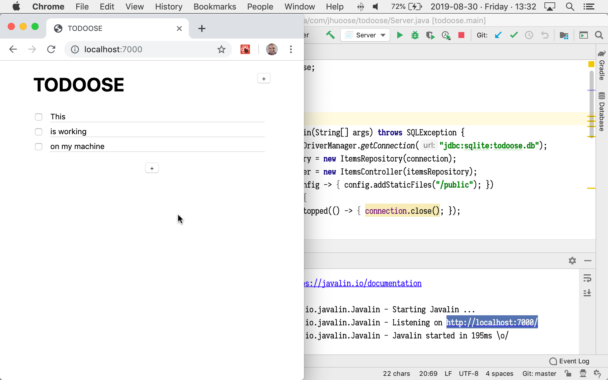
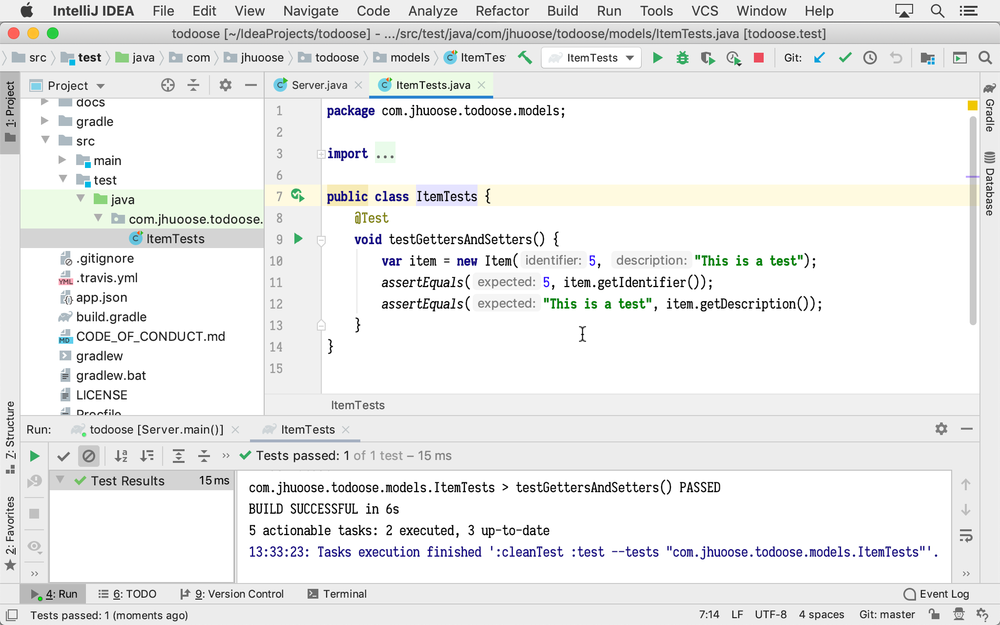
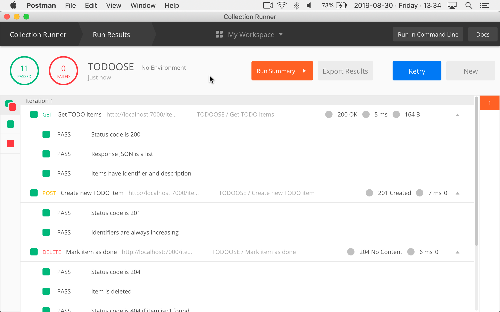

---
tools:
  - IntelliJ IDEA
  - Postman
  - Google Chrome
  - Git
  - GitHub
  - Paper & Pencil
  - Java
  - Gradle
  - Javalin
  - Jackson
  - JUnit
  - SQLite
  - JavaScript
  - Hypertext Markup Language (HTML) & Cascading Style Sheets (CSS)
  - React
  - JavaScript Object Notation (JSON)
  - Heroku
  - Travis CI
  - Markdown
---

# Assignment 0: Project Proposal

# Onboarding

**Welcome to OOSE!**

One of the points of this course is that we aren’t using only pedagogical tools, but tools actually used by software engineers. To bring this point home, we run the course similar to how a software project is run, using the tools that software engineers use to coordinate their work. You’ll use [GitHub](https://github.com) throughout the course to submit assignments, ask questions, collaborate with the other members of your group in the [group projects](/group-projects), and so forth. If you don’t have a GitHub account, [create one now](https://github.com/join). Then register for the course using the form below:

<video src="https://archive.org/download/jhu-oose/onboarding-and-assignment-submission.mp4" controls preload="none"></video>

<form method="POST" action="https://roboose.herokuapp.com/roboose/students">
<fieldset markdown="1">

<legend>Student Registration</legend>

<label>
**GitHub Identifier**  
<input type="text" name="github" required pattern="[A-Za-z0-9][A-Za-z0-9-]*[A-Za-z0-9]">  
</label>
<small>
For example, [`jhu-oose-example-student`](https://github.com/jhu-oose-example-student).  
Don’t include an `@` sign at the beginning—this isn’t a [mention](https://help.github.com/en/articles/basic-writing-and-formatting-syntax#mentioning-people-and-teams).  
GitHub identifiers **do not** start with `2019-student-`.  
</small>

<label>
**Hopkins Identifier**  
<input type="text" name="hopkins" required pattern="[0-9A-F]{6}">  
</label>
<small>
For example, `7B4EF0`.  
This is the 6-character “Hopkins ID” in [SIS](https://sis.jhu.edu/), **not** your email.
</small>

**<small>⚠️</small>  Don’t submit this form multiple times.**

<button>Register</button>

</fieldset>
</form>

If you run into problems, send an email to <student-registration@jhu-oose.com>. Include all the information from the form above.

After you register, you are invited via email to the GitHub organization for the course, [`jhu-oose`](https://github.com/jhu-oose), joining the team `jhu-oose/{{site.course}}-students`, which grants you access to the [Students Area](https://github.com/jhu-oose/{{site.course}}-students){:data-proofer-ignore="true"} <small title="You must be a registered student logged into GitHub to see this.">🔒</small>, where you may find a public forum (visible only to other students in the course), announcements, videos of the lectures, and so forth.

After you register, you are also invited via email to a repository at `https://github.com/jhu-oose/{{site.course}}-student-<identifier>`. This is your individual repository in which you’ll submit the [assignments](/#individual-assignments), receive grades, ask questions visible only to the staff, and so forth.

## Profile

<small>
**10 points**
</small>

<small>
Submit your profile as a [Markdown](/toolbox#authoring-language-markdown) document at `README.md` in the `master` branch of your personal repository at `https://github.com/jhu-oose/{{site.course}}-student-<identifier>`.
</small>

Fill in the template below (parts marked with `<!-- -->` are placeholders that you must fill in):

```
# <!-- Name -->


**Personal Pronoun (Optional):** <!-- See https://www.mypronouns.org to understand more about this question. Answer (if you wish) in the form of a link, for example, [She/her](https://www.mypronouns.org/she-her) -->

# Background

<!-- Are you fresh out of a data structures course? Do you have years of experience in industry? What technologies do you usually work with? What are your interests? And anything else you want to share. -->

# Expectations

<!-- Why did you sign up for the course? What do you expect to learn? And anything else you want to share. -->
```

# Project Ideas

<small>
Submit your project ideas (as well as all the rest below) as a [Markdown](/toolbox#authoring-language-markdown) document at `assignments/0.md` in the `master` branch of your personal repository at `https://github.com/jhu-oose/{{site.course}}-student-<identifier>`.
</small>

<small>
**15 points**
</small>

Come up with at least 3 [project ideas](/lectures/0#project-ideas). They may be silly—in fact, it may be better if they are.

# Project Proposal

<small>
**50 points**
</small>

Choose one of your [project ideas](#project-ideas) and develop it into a [project proposal](/iterations/0#project-proposal). Your project proposal doesn’t have to be fully developed, but you definitely need more than something at level of [the sample project proposal we did in Lecture 0](/lectures/0#the-project-proposal-we-wrote-together-in-class). Also, you must acknowledge the parts that are missing by saying, for example, “My project requires integration with the [GitHub API](https://developer.github.com/v3/), but I don’t know yet if it has all the features I need—further study required.”

Your goal is to have something solid enough to discuss with your group members when you start working on your [group project](/group-projects).

# Software Engineering

<small>
**10 points**
</small>

We didn’t have the time to cover this in class, but see [the corresponding lecture notes](/lectures/0#welcome-to-oose).

Answer the following questions:

1. Do you see software engineering as a science or an art? Or a mix of both? If so, to what degree?

2. What makes a software engineer? Do you feel you are a software engineer?

# Technology

<small>
**15 points**
</small>

<video src="https://archive.org/download/todoose/todoose--getting-started.mp4" controls preload="none"></video>

1. Go through the tools in the [Toolbox](/toolbox) and install them.

2. Visit [TODOOSE](https://github.com/jhu-oose/todoose) and play with the [live version](https://todoose.herokuapp.com){:data-proofer-ignore="true"} to learn how the application works (it’s a simple to-do application).

3. Import TODOOSE as a project in [IntelliJ IDEA](/toolbox#integrated-development-environmentide-intellijidea).

4. Run the server.

5. Interact with the application locally in [Google Chrome](/toolbox#browser-googlechrome). **Take a screenshot of the application open locally in Google Chrome and include in your submission (for example, see the screenshot below).**

   

6. Run the [JUnit](/toolbox#testing-framework-junit) tests in IntelliJ IDEA. **Take a screenshot of the tests passing locally and include in your submission (for example, see the screenshot below).**

   

7. Open the API specification in [Postman](/toolbox#application-programming-interfaceapi-development-environmentade-postman).

8. Run the Postman tests. **Take a screenshot of the tests passing and include in your submission (for example, see the screenshot below).**

   

9. See the [tests running](https://travis-ci.com/jhu-oose/todoose) on [Travis CI](/toolbox#continuous-integrationci-server-travisci).

10. Deploy the application to [Heroku](/toolbox#platform-heroku) with the application name `todoose-<identifier>`. For example, if you were [`jhu-oose-example-student`](https://github.com/jhu-oose-example-student) on GitHub, then your application name would be `todoose-jhu-oose-example-student`. **We’ll look at your deployed version when grading, so make sure you get the name right and don’t remove the application from Heroku until after you received your grade.**

11. Start watching the [video series showing us buidling TODOOSE](/todoose). You have about one month before we’ll dive deeper into the implementation, and by then you must have a fair understanding of the technology. One or two videos every day will get you there.

# Submission

**<small>⚠️</small>  Your assignment is submitted only when you submit the form below.**

<video src="https://archive.org/download/jhu-oose/onboarding-and-assignment-submission.mp4" controls preload="none"></video>

First, push your assignment to your individual repository at `https://github.com/jhu-oose/{{site.course}}-student-<identifier>`. Make sure you follow the naming conventions established in this page, for example, your [profile](#profile) must go in `README.md` and the rest of the answers must go in `assignments/0.md`. [Roboose](/staff#robot-roboose) already put starter files in place for you.

After your assignment is pushed, you must submit the form below.

Submissions are final. You may only submit this form once, but you may push to your individual repository however many times you want.

The time of the submission, which we use to calculate [late days](/policies#late-submissions), is the time when you submit this form, _not the time of the commit you’re submitting_.

<form method="POST" action="https://roboose.herokuapp.com/roboose/assignments" markdown="1">
<fieldset markdown="1">

<legend>Assignment</legend>

<input type="hidden" name="assignment" value="0">

<label>
**GitHub Identifier**  
<input type="text" name="github" required pattern="[A-Za-z0-9][A-Za-z0-9-]*[A-Za-z0-9]">  
</label>
<small>
For example, [`jhu-oose-example-student`](https://github.com/jhu-oose-example-student).  
Don’t include an `@` sign at the beginning—this isn’t a [mention](https://help.github.com/en/articles/basic-writing-and-formatting-syntax#mentioning-people-and-teams).  
GitHub identifiers **do not** start with `2019-student-`.  
</small>

<label>
**Commit Identifier**  
<input type="text" name="commit" required pattern="[0-9a-f]{40}">  
</label>
<small>
For example, [`48092726db45fd4bcde21e3712ac2d8e4a094797`](https://github.com/jhu-oose/www.jhu-oose.com/commit/48092726db45fd4bcde21e3712ac2d8e4a094797).  
Graders will look at the code base as of this commit.  
You may find the commit identifier on the commits page at `https://github.com/jhu-oose/{{site.course}}-student-<identifier>/commits/master`. Usually you want the most recent commit.  
</small>

</fieldset>

<fieldset markdown="1">

<legend markdown="1">Anonymous Feedback on [Lecture 0](/lectures/0)</legend>

**Confidence**  
<label>
<input type="radio" name="feedback[lecture][confidence]" value="decreased" required>
The lecture **decreased** my confidence in the material that was covered.
</label>  
<label>
<input type="radio" name="feedback[lecture][confidence]" value="no-effect" required>
The lecture **didn’t affect** my confidence in the material that was covered.
</label>  
<label>
<input type="radio" name="feedback[lecture][confidence]" value="increased" required>
The lecture **increased** my confidence in the material that was covered.
</label>

**Relevance**  
<label>
<input type="radio" name="feedback[lecture][relevance]" value="irrelevant" required>
The lecture covered material that seemed **irrelevant**.
</label>  
<label>
<input type="radio" name="feedback[lecture][relevance]" value="cant-tell" required>
The lecture covered material that I **can’t tell** whether is relevant or not.
</label>  
<label>
<input type="radio" name="feedback[lecture][relevance]" value="relevant" required>
The lecture covered material that I can tell is **relevant**.
</label>

**Difficulty**  
<label>
<input type="radio" name="feedback[lecture][difficulty]" value="too-difficult" required>
The lecture was **too difficult** and I had trouble following.
</label>  
<label>
<input type="radio" name="feedback[lecture][difficulty]" value="right-level" required>
The lecture was **at the right level** of difficulty for me.
</label>  
<label>
<input type="radio" name="feedback[lecture][difficulty]" value="too-easy" required>
The lecture was **too easy** and I got bored.
</label>

**Pace**  
<label>
<input type="radio" name="feedback[lecture][pace]" value="too-fast" required>
The lecture was **too fast** and I had trouble following.
</label>  
<label>
<input type="radio" name="feedback[lecture][pace]" value="right-pace" required>
The lecture was **at the right pace** for me.
</label>  
<label>
<input type="radio" name="feedback[lecture][pace]" value="too-slow" required>
The lecture was **too slow** and I got bored.
</label>

<label for="feedback--lecture--liked">
**At Least One Specific Thing That You Liked**
</label>
<textarea name="feedback[lecture][liked]" id="feedback--lecture--liked" required></textarea>

<label for="feedback--lecture--improved">
**At Least One Specific Thing That You Think Should Be Improved**
</label>
<textarea name="feedback[lecture][improved]" id="feedback--lecture--improved" required></textarea>

</fieldset>

<fieldset markdown="1">

<legend markdown="1">Anonymous Feedback on [Assignment 0](/assignments/0)</legend>

<label>
**Approximate Number of Hours Spent**  
<input type="number" name="feedback[assignment][hours]" min="1" max="100" required>
</label>

**Confidence**  
<label>
<input type="radio" name="feedback[assignment][confidence]" value="decreased" required>
The assignment **decreased** my confidence in the material that was covered.
</label>  
<label>
<input type="radio" name="feedback[assignment][confidence]" value="no-effect" required>
The assignment **didn’t affect** my confidence in the material that was covered.
</label>  
<label>
<input type="radio" name="feedback[assignment][confidence]" value="increased" required>
The assignment **increased** my confidence in the material that was covered.
</label>

**Relevance**  
<label>
<input type="radio" name="feedback[assignment][relevance]" value="irrelevant" required>
The assignment covered material that seemed **irrelevant** or **didn’t connect well** with the lecture.
</label>  
<label>
<input type="radio" name="feedback[assignment][relevance]" value="cant-tell" required>
The assignment covered material that I **can’t tell** whether is relevant or not or whether it connects with the lecture or not.
</label>  
<label>
<input type="radio" name="feedback[assignment][relevance]" value="relevant" required>
The assignment covered material that I can tell is **relevant** and **connects well** with the lecture.
</label>

**Difficulty**  
<label>
<input type="radio" name="feedback[assignment][difficulty]" value="too-difficult" required>
The assignment was **too difficult** and I had trouble completing it.
</label>  
<label>
<input type="radio" name="feedback[assignment][difficulty]" value="right-level" required>
The assignment was **at the right level** of difficulty for me.
</label>  
<label>
<input type="radio" name="feedback[assignment][difficulty]" value="too-easy" required>
The assignment was **too easy** and I got bored.
</label>

**Load**  
<label>
<input type="radio" name="feedback[assignment][load]" value="too-much-work" required>
The assignment was **too much work** and I had trouble completing it.
</label>  
<label>
<input type="radio" name="feedback[assignment][load]" value="right-amount" required>
The assignment was **the right amount of work** for me.
</label>  
<label>
<input type="radio" name="feedback[assignment][load]" value="too-little-work" required>
The assignment was **too little work** and I got bored.
</label>

<label for="feedback--assignment--liked">
**At Least One Specific Thing That You Liked**
</label>
<textarea name="feedback[assignment][liked]" id="feedback--assignment--liked" required></textarea>

<label for="feedback--assignment--improved">
**At Least One Specific Thing That You Think Should Be Improved**
</label>
<textarea name="feedback[assignment][improved]" id="feedback--assignment--improved" required></textarea>

</fieldset>

<fieldset markdown="1">

<legend markdown="1">Anonymous Prior Experience with the Tools in the [Toolbox](/toolbox)</legend>


**{{tool}}**  
<label>
<input type="radio" name="feedback[toolbox][{{ tool | slugify }}][experience]" value="never-heard" required>
I’ve **never heard** of it.
</label>  
<label>
<input type="radio" name="feedback[toolbox][{{ tool | slugify }}][experience]" value="heard-of" required>
I’ve **only heard of** it, or have **used it only a little**.
</label>  
<label>
<input type="radio" name="feedback[toolbox][{{ tool | slugify }}][experience]" value="comfortable" required>
I’m **comfortable** with it.
</label>

<label>
<input type="radio" name="feedback[toolbox][{{ tool | slugify }}][taste]" value="dread" required>
I **dread** it.
</label>  
<label>
<input type="radio" name="feedback[toolbox][{{ tool | slugify }}][taste]" value="indifferent" required>
I’m **indifferent** to it.
</label>  
<label>
<input type="radio" name="feedback[toolbox][{{ tool | slugify }}][taste]" value="like" required>
I **like** it.
</label>


</fieldset>

**<small>⚠️</small>  Don’t submit this form multiple times.**

<button>Submit</button>

</form>

If you run into problems, send an email to <assignment-submission@jhu-oose.com>. Include the information about the submission: your GitHub Identifier and the Commit Identifier. Don’t include any information about the feedback—it’s anonymous.
