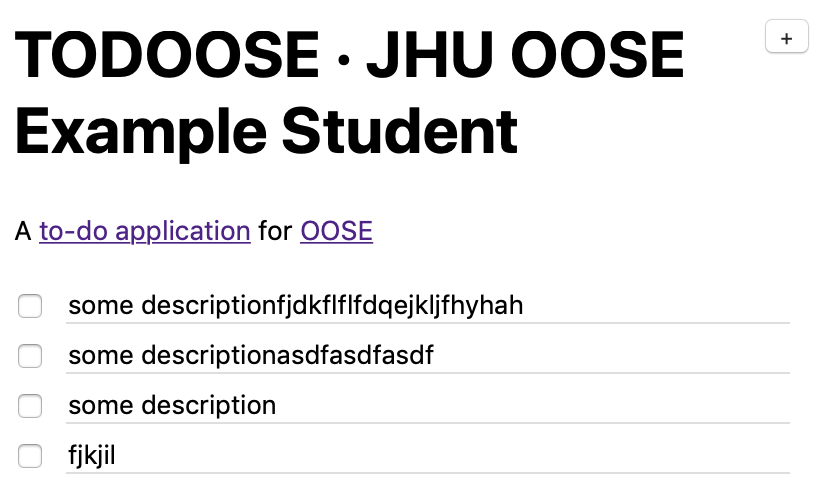

# Assignment 1: Design Rudiments

<small>
Submit your assignment as a [Markdown](/toolbox#authoring-language-markdown) document at `assignments/1.md` in the `master` branch of your personal repository at `https://github.com/jhu-oose/{{site.course}}-student-<identifier>`.
</small>

# Working on Assignment

<video src="https://archive.org/download/jhu-oose/oose--assignments--1.mp4" controls preload="none"></video>

# Class Diagram

Before the Internet, one of the most interesting things you could do on a computer was playing Minesweeper. Remember the old times:

<figure>

<!-- minesweeper game initializes here -->

<figcaption markdown="1">
A clone of Minesweeper from Windows XP.  
A copyright infringement courtesy of <https://codepen.io/joelbyrd/pen/hdHKF>{:data-proofer-ignore="true"}.
</figcaption>
</figure>
<link rel="stylesheet" type="text/css" href="minesweeper.css" />

## Diagram

<small>
**65 points**
</small>

Draw a high-level class diagram to communicate the logic of Minesweeper.

Include new games, different board sizes, flags (which you can test by right clicking), the flag counter (top left), marks (`?`) (which you can test by right clicking twice), mines, tiles that are open or closed, the timer (top right), opening tiles, creating a new game, wining the game, losing the game, and everything else you find the game.

Don’t include things like _controllers_, _repositories_, a _server_ and so forth. Your diagram could be implemented as a web server, as a desktop application, as a mobile application, and so forth.

## Implementation

<small>
**15 points**
</small>

Implement in Java at least two classes from the diagram you [drew above](#diagram). These classes must share some form of relationship (dependence, association, whole-part, inheritance, and so forth).

Your implementation must include the details that you omitted in the class diagram, for example, identifiers, getters and setters, the actual implementation of the methods, and so forth.

It’s okay if your code doesn’t compile because it depends on other parts of the application that you aren’t implementing in this exercise.

# Architecture

<small>
**10 points**
</small>

An HTTP request arrives at the [TODOOSE](https://github.com/jhu-oose/todoose) server asking for the list of items (see the `Get TODO items` request in Postman). Several parts of the server will be activated to respond to this request. Put the parts in the order in which they’ll be activated (that is, trace the request through the server):

- Model.
- View ([JSON Mapper](/toolbox#json-mapper-jackson)).
- Router.
- Repository.
- Controller.

# Technology

Continue watching the [TODOOSE video series](/todoose). We’re three weeks away from diving deep into the implementation, and by then you’ll have to know the basics.

## Server

<small>
**5 points**
</small>

Point out in the [code base](https://github.com/jhu-oose/todoose) where is the implementation for each of the server parts we discussed in the [Architecture](#architecture):

- Model.
- View ([JSON Mapper](/toolbox#json-mapper-jackson)).
- Router.
- Repository.
- Controller.

Your answer must be a range of lines of code, for example, if asked about where in the implementation the server connects to the database, you’d answer with [`todoose/src/main/java/com/jhuoose/todoose/Server.java:15-15`](https://github.com/jhu-oose/todoose/blob/90ca0901e09095460845eae20218bc5189bec565/src/main/java/com/jhuoose/todoose/Server.java#L15-15).

## Client

<small>
**5 points**
</small>

Which lines of code would you have to modify in the client part of TODOOSE so that it displays your name in the header? For example, if your name were `JHU OOSE Example Student`, then TODOOSE would look like this:

<figure markdown="1">
{:width="408"}
</figure>

# Submission

**<small>⚠️</small>  Your assignment is submitted only when you submit the form below.**

<form method="POST" action="https://roboose.herokuapp.com/roboose/assignments" markdown="1">
<fieldset markdown="1">

<legend>Assignment</legend>

<input type="hidden" name="assignment" value="1">

<label>
**GitHub Identifier**  
<input type="text" name="github" required pattern="[A-Za-z0-9][A-Za-z0-9-]*[A-Za-z0-9]">  
</label>
<small>
For example, [`jhu-oose-example-student`](https://github.com/jhu-oose-example-student).  
Don’t include an `@` sign at the beginning—this isn’t a [mention](https://help.github.com/en/articles/basic-writing-and-formatting-syntax#mentioning-people-and-teams).  
GitHub identifiers **do not** start with `2019-student-`.  
</small>

<label>
**Commit Identifier**  
<input type="text" name="commit" required pattern="[0-9a-f]{40}">  
</label>
<small>
For example, [`48092726db45fd4bcde21e3712ac2d8e4a094797`](https://github.com/jhu-oose/www.jhu-oose.com/commit/48092726db45fd4bcde21e3712ac2d8e4a094797).  
Graders will look at the code base as of this commit.  
You may find the commit identifier on the commits page at `https://github.com/jhu-oose/{{site.course}}-student-<identifier>/commits/master`. Usually you want the most recent commit.  
</small>

</fieldset>

<fieldset markdown="1">

<legend markdown="1">Anonymous Feedback on [Lecture 1](/lectures/1)</legend>

**Confidence**  
<label>
<input type="radio" name="feedback[lecture][confidence]" value="decreased" required>
The lecture **decreased** my confidence in the material that was covered.
</label>  
<label>
<input type="radio" name="feedback[lecture][confidence]" value="no-effect" required>
The lecture **didn’t affect** my confidence in the material that was covered.
</label>  
<label>
<input type="radio" name="feedback[lecture][confidence]" value="increased" required>
The lecture **increased** my confidence in the material that was covered.
</label>

**Relevance**  
<label>
<input type="radio" name="feedback[lecture][relevance]" value="irrelevant" required>
The lecture covered material that seemed **irrelevant**.
</label>  
<label>
<input type="radio" name="feedback[lecture][relevance]" value="cant-tell" required>
The lecture covered material that I **can’t tell** whether is relevant or not.
</label>  
<label>
<input type="radio" name="feedback[lecture][relevance]" value="relevant" required>
The lecture covered material that I can tell is **relevant**.
</label>

**Difficulty**  
<label>
<input type="radio" name="feedback[lecture][difficulty]" value="too-difficult" required>
The lecture was **too difficult** and I had trouble following.
</label>  
<label>
<input type="radio" name="feedback[lecture][difficulty]" value="right-level" required>
The lecture was **at the right level** of difficulty for me.
</label>  
<label>
<input type="radio" name="feedback[lecture][difficulty]" value="too-easy" required>
The lecture was **too easy** and I got bored.
</label>

**Pace**  
<label>
<input type="radio" name="feedback[lecture][pace]" value="too-fast" required>
The lecture was **too fast** and I had trouble following.
</label>  
<label>
<input type="radio" name="feedback[lecture][pace]" value="right-pace" required>
The lecture was **at the right pace** for me.
</label>  
<label>
<input type="radio" name="feedback[lecture][pace]" value="too-slow" required>
The lecture was **too slow** and I got bored.
</label>

<label for="feedback--lecture--liked">
**At Least One Specific Thing That You Liked**
</label>
<textarea name="feedback[lecture][liked]" id="feedback--lecture--liked" required></textarea>

<label for="feedback--lecture--improved">
**At Least One Specific Thing That You Think Should Be Improved**
</label>
<textarea name="feedback[lecture][improved]" id="feedback--lecture--improved" required></textarea>

</fieldset>

<fieldset markdown="1">

<legend markdown="1">Anonymous Feedback on [Assignment 1](/assignments/1)</legend>

<label>
**Approximate Number of Hours Spent**  
<input type="number" name="feedback[assignment][hours]" min="1" max="100" required>
</label>

**Confidence**  
<label>
<input type="radio" name="feedback[assignment][confidence]" value="decreased" required>
The assignment **decreased** my confidence in the material that was covered.
</label>  
<label>
<input type="radio" name="feedback[assignment][confidence]" value="no-effect" required>
The assignment **didn’t affect** my confidence in the material that was covered.
</label>  
<label>
<input type="radio" name="feedback[assignment][confidence]" value="increased" required>
The assignment **increased** my confidence in the material that was covered.
</label>

**Relevance**  
<label>
<input type="radio" name="feedback[assignment][relevance]" value="irrelevant" required>
The assignment covered material that seemed **irrelevant** or **didn’t connect well** with the lecture.
</label>  
<label>
<input type="radio" name="feedback[assignment][relevance]" value="cant-tell" required>
The assignment covered material that I **can’t tell** whether is relevant or not or whether it connects with the lecture or not.
</label>  
<label>
<input type="radio" name="feedback[assignment][relevance]" value="relevant" required>
The assignment covered material that I can tell is **relevant** and **connects well** with the lecture.
</label>

**Difficulty**  
<label>
<input type="radio" name="feedback[assignment][difficulty]" value="too-difficult" required>
The assignment was **too difficult** and I had trouble completing it.
</label>  
<label>
<input type="radio" name="feedback[assignment][difficulty]" value="right-level" required>
The assignment was **at the right level** of difficulty for me.
</label>  
<label>
<input type="radio" name="feedback[assignment][difficulty]" value="too-easy" required>
The assignment was **too easy** and I got bored.
</label>

**Load**  
<label>
<input type="radio" name="feedback[assignment][load]" value="too-much-work" required>
The assignment was **too much work** and I had trouble completing it.
</label>  
<label>
<input type="radio" name="feedback[assignment][load]" value="right-amount" required>
The assignment was **the right amount of work** for me.
</label>  
<label>
<input type="radio" name="feedback[assignment][load]" value="too-little-work" required>
The assignment was **too little work** and I got bored.
</label>

<label for="feedback--assignment--liked">
**At Least One Specific Thing That You Liked**
</label>
<textarea name="feedback[assignment][liked]" id="feedback--assignment--liked" required></textarea>

<label for="feedback--assignment--improved">
**At Least One Specific Thing That You Think Should Be Improved**
</label>
<textarea name="feedback[assignment][improved]" id="feedback--assignment--improved" required></textarea>

</fieldset>

**<small>⚠️</small>  Don’t submit this form multiple times.**

<button>Submit</button>

</form>

If you run into problems, send an email to <assignment-submission@jhu-oose.com>. Include the information about the submission: your GitHub Identifier and the Commit Identifier. Don’t include any information about the feedback—it’s anonymous.
