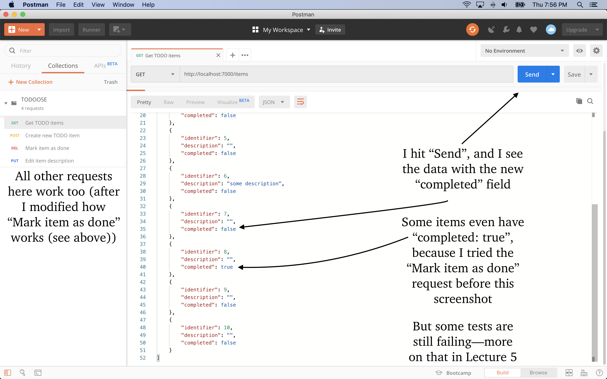

# Assignment 4: Implementation · Server

In [Lecture 4](/lectures/4) we started to implement a new feature in [TODOOSE](https://github.com/jhu-oose/todoose/): the ability to see items that were marked as completed, as opposed to just removing them from the list forever.

For this assignment you must complete the implementation of the server.

Watch the [video of the lecture](/lectures/4). Go through the [Issue](https://github.com/jhu-oose/todoose/issues/24), its corresponding [Pull Request](https://github.com/jhu-oose/todoose/pull/25), and the [project board](https://github.com/jhu-oose/todoose/projects/3) (look at Iteration 4). Go through the code base on the [`show-completed` branch](https://github.com/jhu-oose/todoose/tree/show-completed), which contains `TODO` comments you must fill in.

Here’s a video on how to work on TODOOSE and submit your assignment, now that we need to do more substantial changes to the code base:

<video src="https://archive.org/download/jhu-oose/oose--programming-assignment.mp4" controls preload="none"></video>

Here’s checklist of what you need to do:

- Check out the [`show-completed` branch](https://github.com/jhu-oose/todoose/tree/show-completed).

- Remove the `todoose.db` file if you have one. We changed the database schema to include a `completed` column in the `items` table, and deleting the database is our poor excuse for a data migration plan.

- [Rename the `update()` method in `ItemsRepository` to `updateDescription()`](https://github.com/jhu-oose/todoose/blob/46d406a0a4246f77a615e5ae939b4a6de25d2095/src/main/java/com/jhuoose/todoose/repositories/ItemsRepository.java#L65).

- Fix the compilation errors: [part 1](https://github.com/jhu-oose/todoose/blob/46d406a0a4246f77a615e5ae939b4a6de25d2095/src/main/java/com/jhuoose/todoose/repositories/ItemsRepository.java#L23) and [part 2](https://github.com/jhu-oose/todoose/blob/46d406a0a4246f77a615e5ae939b4a6de25d2095/src/main/java/com/jhuoose/todoose/repositories/ItemsRepository.java#L39).

- (Optional) Consider improving [the `if/then/else` situation on the controller](https://github.com/jhu-oose/todoose/blob/46d406a0a4246f77a615e5ae939b4a6de25d2095/src/main/java/com/jhuoose/todoose/controllers/ItemsController.java#L28-L29). Can you unify the methods `markAsCompleted()` and `update()` (which at this point you renamed to `updateDescription()`) in the `ItemsRepository`? The new unified method must update an `Item` regardless of what changed: either `description`, or `completed`, or both.

- Run the server, wait for it to start, then stop it. The `todoose.db` file you deleted above is back, and it has the new schema including the `completed` column on the `items` table.

- Open the database in IntelliJ like we did in lecture and add _real_ fake data for testing locally. Include a screenshot (see example below). For now, the client part of the application is broken because we changed how the server works, so looking at the database in IntelliJ is the only reliable way to see the data. We’ll fix this in [Lecture 5](/lectures/5) when we talk about the client.

  

- In Postman, if you still have the `TODOOSE` collection you imported in [Assignment 0](/assignments/0), delete it and import it again, because it changed.

- [Update the Postman request “Mark items as done” and its corresponding example](https://github.com/jhu-oose/todoose/blob/46d406a0a4246f77a615e5ae939b4a6de25d2095/src/main/java/com/jhuoose/todoose/Server.java#L27-L30).

- Add a new Postman request called “Mark items as incomplete” to the TODOOSE collection. It must include an example.

- You can run requests manually in Postman hitting by the `Send` button. The server must be doing the right thing, including marking items as completed and marking them as incomplete when using the new “Mark items as incomplete” request you just added. You can see the new data, including the `completed` field, _but the Postman tests still won’t pass_ (we need to fix the tests—that’s the subject of the [next lecture](/lectures/5)).

  

- Export the Postman collection and replace `docs/TODOOSE.postman_collection.json`.

- Commit and push **to your student repository** (see video above).

- Deploy this new version to Heroku. **Create a new Heroku application with an unpredictable name as explained in the video above; don’t reuse the Heroku application from [Assignment 0](/assignments/0).**

# Submission

**<small>⚠️</small>  Your assignment is submitted only when you submit the form below.**

<form method="POST" action="https://roboose.herokuapp.com/roboose/assignments" markdown="1">
<fieldset markdown="1">

<legend>Assignment</legend>

<input type="hidden" name="assignment" value="4">

<label>
**GitHub Identifier**  
<input type="text" name="github" required pattern="[A-Za-z0-9][A-Za-z0-9-]*[A-Za-z0-9]">  
</label>
<small>
For example, [`jhu-oose-example-student`](https://github.com/jhu-oose-example-student).  
Don’t include an `@` sign at the beginning—this isn’t a [mention](https://help.github.com/en/articles/basic-writing-and-formatting-syntax#mentioning-people-and-teams).  
GitHub identifiers **do not** start with `2019-student-`.  
</small>

<label>
**Commit Identifier**  
<input type="text" name="commit" required pattern="[0-9a-f]{40}">  
</label>
<small>
For example, [`48092726db45fd4bcde21e3712ac2d8e4a094797`](https://github.com/jhu-oose/www.jhu-oose.com/commit/48092726db45fd4bcde21e3712ac2d8e4a094797).  
Graders will look at the code base as of this commit.  
You may find the commit identifier on the commits page at `https://github.com/jhu-oose/{{site.course}}-student-<identifier>/commits/master`. Usually you want the most recent commit.  
</small>

</fieldset>

<fieldset markdown="1">

<legend markdown="1">Anonymous Feedback on [Lecture 4](/lectures/4)</legend>

**Confidence**  
<label>
<input type="radio" name="feedback[lecture][confidence]" value="decreased" required>
The lecture **decreased** my confidence in the material that was covered.
</label>  
<label>
<input type="radio" name="feedback[lecture][confidence]" value="no-effect" required>
The lecture **didn’t affect** my confidence in the material that was covered.
</label>  
<label>
<input type="radio" name="feedback[lecture][confidence]" value="increased" required>
The lecture **increased** my confidence in the material that was covered.
</label>

**Relevance**  
<label>
<input type="radio" name="feedback[lecture][relevance]" value="irrelevant" required>
The lecture covered material that seemed **irrelevant**.
</label>  
<label>
<input type="radio" name="feedback[lecture][relevance]" value="cant-tell" required>
The lecture covered material that I **can’t tell** whether is relevant or not.
</label>  
<label>
<input type="radio" name="feedback[lecture][relevance]" value="relevant" required>
The lecture covered material that I can tell is **relevant**.
</label>

**Difficulty**  
<label>
<input type="radio" name="feedback[lecture][difficulty]" value="too-difficult" required>
The lecture was **too difficult** and I had trouble following.
</label>  
<label>
<input type="radio" name="feedback[lecture][difficulty]" value="right-level" required>
The lecture was **at the right level** of difficulty for me.
</label>  
<label>
<input type="radio" name="feedback[lecture][difficulty]" value="too-easy" required>
The lecture was **too easy** and I got bored.
</label>

**Pace**  
<label>
<input type="radio" name="feedback[lecture][pace]" value="too-fast" required>
The lecture was **too fast** and I had trouble following.
</label>  
<label>
<input type="radio" name="feedback[lecture][pace]" value="right-pace" required>
The lecture was **at the right pace** for me.
</label>  
<label>
<input type="radio" name="feedback[lecture][pace]" value="too-slow" required>
The lecture was **too slow** and I got bored.
</label>

<label for="feedback--lecture--liked">
**At Least One Specific Thing That You Liked**
</label>
<textarea name="feedback[lecture][liked]" id="feedback--lecture--liked" required></textarea>

<label for="feedback--lecture--improved">
**At Least One Specific Thing That You Think Should Be Improved**
</label>
<textarea name="feedback[lecture][improved]" id="feedback--lecture--improved" required></textarea>

</fieldset>

<fieldset markdown="1">

<legend markdown="1">Anonymous Feedback on [Assignment 4](/assignments/4)</legend>

<label>
**Approximate Number of Hours Spent**  
<input type="number" name="feedback[assignment][hours]" min="1" max="100" required>
</label>

**Confidence**  
<label>
<input type="radio" name="feedback[assignment][confidence]" value="decreased" required>
The assignment **decreased** my confidence in the material that was covered.
</label>  
<label>
<input type="radio" name="feedback[assignment][confidence]" value="no-effect" required>
The assignment **didn’t affect** my confidence in the material that was covered.
</label>  
<label>
<input type="radio" name="feedback[assignment][confidence]" value="increased" required>
The assignment **increased** my confidence in the material that was covered.
</label>

**Relevance**  
<label>
<input type="radio" name="feedback[assignment][relevance]" value="irrelevant" required>
The assignment covered material that seemed **irrelevant** or **didn’t connect well** with the lecture.
</label>  
<label>
<input type="radio" name="feedback[assignment][relevance]" value="cant-tell" required>
The assignment covered material that I **can’t tell** whether is relevant or not or whether it connects with the lecture or not.
</label>  
<label>
<input type="radio" name="feedback[assignment][relevance]" value="relevant" required>
The assignment covered material that I can tell is **relevant** and **connects well** with the lecture.
</label>

**Difficulty**  
<label>
<input type="radio" name="feedback[assignment][difficulty]" value="too-difficult" required>
The assignment was **too difficult** and I had trouble completing it.
</label>  
<label>
<input type="radio" name="feedback[assignment][difficulty]" value="right-level" required>
The assignment was **at the right level** of difficulty for me.
</label>  
<label>
<input type="radio" name="feedback[assignment][difficulty]" value="too-easy" required>
The assignment was **too easy** and I got bored.
</label>

**Load**  
<label>
<input type="radio" name="feedback[assignment][load]" value="too-much-work" required>
The assignment was **too much work** and I had trouble completing it.
</label>  
<label>
<input type="radio" name="feedback[assignment][load]" value="right-amount" required>
The assignment was **the right amount of work** for me.
</label>  
<label>
<input type="radio" name="feedback[assignment][load]" value="too-little-work" required>
The assignment was **too little work** and I got bored.
</label>

<label for="feedback--assignment--liked">
**At Least One Specific Thing That You Liked**
</label>
<textarea name="feedback[assignment][liked]" id="feedback--assignment--liked" required></textarea>

<label for="feedback--assignment--improved">
**At Least One Specific Thing That You Think Should Be Improved**
</label>
<textarea name="feedback[assignment][improved]" id="feedback--assignment--improved" required></textarea>

</fieldset>

**<small>⚠️</small>  Don’t submit this form multiple times.**

<button>Submit</button>

</form>

If you run into problems, send an email to <assignment-submission@jhu-oose.com>. Include the information about the submission: your GitHub Identifier and the Commit Identifier. Don’t include any information about the feedback—it’s anonymous.
